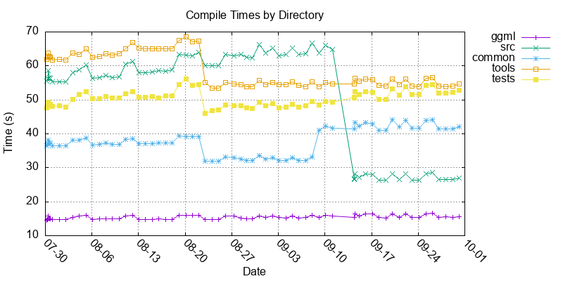

# llama.cpp Compile Times

Auto-generated on 2026-10-02 03:35:54 UTC

## Configuration

- **Commit:** [5fc4f3c](https://github.com/ggml-org/llama.cpp/commit/5fc4f3c) (hexagon: install rebuilt HTP skels (#29828))
- **CMake flags:** `-DGGML_CCACHE=OFF -DGGML_METAL=OFF -DLLAMA_BUILD_TESTS=ON -DLLAMA_BUILD_EXAMPLES=OFF -DLLAMA_BUILD_UI=OFF -DCMAKE_DISABLE_PRECOMPILE_HEADERS=ON`
- **Files measured:** 275

## Compile Times Over Commits

## Cumulative Times by Directory

| Directory | Time |
|-----------|------|
| [ggml/](https://github.com/ggml-org/llama.cpp/tree/5fc4f3c/ggml)     | 15.6s     |
| [src/](https://github.com/ggml-org/llama.cpp/tree/5fc4f3c/src)      | 27.0s      |
| [common/](https://github.com/ggml-org/llama.cpp/tree/5fc4f3c/common)   | 42.3s    |
| [tools/](https://github.com/ggml-org/llama.cpp/tree/5fc4f3c/tools)    | 54.2s    |
| [tests/](https://github.com/ggml-org/llama.cpp/tree/5fc4f3c/tests)   | 52.6s    |

## Compile Times by Directory

### ggml/

| Time | File |
|------|------|
| 2.6s | [ggml/src/ggml-cpu/ops.cpp](https://github.com/ggml-org/llama.cpp/blob/5fc4f3c/ggml/src/ggml-cpu/ops.cpp) |
| 1.3s | [ggml/src/ggml-quants.c](https://github.com/ggml-org/llama.cpp/blob/5fc4f3c/ggml/src/ggml-quants.c) |
| 1.3s | [ggml/src/ggml-cpu/repack.cpp](https://github.com/ggml-org/llama.cpp/blob/5fc4f3c/ggml/src/ggml-cpu/repack.cpp) |
| 0.9s | [ggml/src/ggml-cpu/binary-ops.cpp](https://github.com/ggml-org/llama.cpp/blob/5fc4f3c/ggml/src/ggml-cpu/binary-ops.cpp) |
| 0.8s | [ggml/src/ggml-cpu/unary-ops.cpp](https://github.com/ggml-org/llama.cpp/blob/5fc4f3c/ggml/src/ggml-cpu/unary-ops.cpp) |
| 0.8s | [ggml/src/gguf.cpp](https://github.com/ggml-org/llama.cpp/blob/5fc4f3c/ggml/src/gguf.cpp) |
| 0.8s | [ggml/src/ggml-backend-meta.cpp](https://github.com/ggml-org/llama.cpp/blob/5fc4f3c/ggml/src/ggml-backend-meta.cpp) |
| 0.6s | [ggml/src/ggml-cpu/llamafile/sgemm.cpp](https://github.com/ggml-org/llama.cpp/blob/5fc4f3c/ggml/src/ggml-cpu/llamafile/sgemm.cpp) |
| 0.5s | [ggml/src/ggml-blas/ggml-blas.cpp](https://github.com/ggml-org/llama.cpp/blob/5fc4f3c/ggml/src/ggml-blas/ggml-blas.cpp) |
| 0.5s | [ggml/src/ggml-cpu/arch/arm/repack.cpp](https://github.com/ggml-org/llama.cpp/blob/5fc4f3c/ggml/src/ggml-cpu/arch/arm/repack.cpp) |
| 0.5s | [ggml/src/ggml-cpu/vec.cpp](https://github.com/ggml-org/llama.cpp/blob/5fc4f3c/ggml/src/ggml-cpu/vec.cpp) |
| 0.4s | [ggml/src/ggml-backend.cpp](https://github.com/ggml-org/llama.cpp/blob/5fc4f3c/ggml/src/ggml-backend.cpp) |
| 0.4s | [ggml/src/ggml-cpu/ggml-cpu.c](https://github.com/ggml-org/llama.cpp/blob/5fc4f3c/ggml/src/ggml-cpu/ggml-cpu.c) |
| 0.4s | [ggml/src/ggml.c](https://github.com/ggml-org/llama.cpp/blob/5fc4f3c/ggml/src/ggml.c) |
| 0.3s | [ggml/src/ggml-cpu/quants.c](https://github.com/ggml-org/llama.cpp/blob/5fc4f3c/ggml/src/ggml-cpu/quants.c) |
| 0.3s | [ggml/src/ggml-opt.cpp](https://github.com/ggml-org/llama.cpp/blob/5fc4f3c/ggml/src/ggml-opt.cpp) |
| 0.3s | [ggml/src/ggml-backend-reg.cpp](https://github.com/ggml-org/llama.cpp/blob/5fc4f3c/ggml/src/ggml-backend-reg.cpp) |
| 0.2s | [ggml/src/ggml-cpu/ggml-cpu.cpp](https://github.com/ggml-org/llama.cpp/blob/5fc4f3c/ggml/src/ggml-cpu/ggml-cpu.cpp) |
| 0.2s | [ggml/src/ggml.cpp](https://github.com/ggml-org/llama.cpp/blob/5fc4f3c/ggml/src/ggml.cpp) |
| 0.2s | [ggml/src/ggml-cpu/amx/amx.cpp](https://github.com/ggml-org/llama.cpp/blob/5fc4f3c/ggml/src/ggml-cpu/amx/amx.cpp) |
| 0.2s | [ggml/src/ggml-cpu/tiled/tiled.cpp](https://github.com/ggml-org/llama.cpp/blob/5fc4f3c/ggml/src/ggml-cpu/tiled/tiled.cpp) |
| 0.2s | [ggml/src/ggml-cpu/amx/mmq.cpp](https://github.com/ggml-org/llama.cpp/blob/5fc4f3c/ggml/src/ggml-cpu/amx/mmq.cpp) |
| 0.2s | [ggml/src/ggml-cpu/arch/arm/quants.c](https://github.com/ggml-org/llama.cpp/blob/5fc4f3c/ggml/src/ggml-cpu/arch/arm/quants.c) |
| 0.2s | [ggml/src/ggml-backend-dl.cpp](https://github.com/ggml-org/llama.cpp/blob/5fc4f3c/ggml/src/ggml-backend-dl.cpp) |
| 0.1s | [ggml/src/ggml-cpu/traits.cpp](https://github.com/ggml-org/llama.cpp/blob/5fc4f3c/ggml/src/ggml-cpu/traits.cpp) |
| 0.1s | [ggml/src/ggml-cpu/tiled/tiled-kernel.cpp](https://github.com/ggml-org/llama.cpp/blob/5fc4f3c/ggml/src/ggml-cpu/tiled/tiled-kernel.cpp) |
| 0.1s | [ggml/src/ggml-threading.cpp](https://github.com/ggml-org/llama.cpp/blob/5fc4f3c/ggml/src/ggml-threading.cpp) |
| 0.1s | [ggml/src/ggml-alloc.c](https://github.com/ggml-org/llama.cpp/blob/5fc4f3c/ggml/src/ggml-alloc.c) |
| 0.0s | [ggml/src/ggml-cpu/hbm.cpp](https://github.com/ggml-org/llama.cpp/blob/5fc4f3c/ggml/src/ggml-cpu/hbm.cpp) |

### src/

| Time | File |
|------|------|
| 1.8s | [src/llama-model.cpp](https://github.com/ggml-org/llama.cpp/blob/5fc4f3c/src/llama-model.cpp) |
| 1.5s | [src/llama-kv-cache.cpp](https://github.com/ggml-org/llama.cpp/blob/5fc4f3c/src/llama-kv-cache.cpp) |
| 1.4s | [src/unicode.cpp](https://github.com/ggml-org/llama.cpp/blob/5fc4f3c/src/unicode.cpp) |
| 1.2s | [src/llama-vocab.cpp](https://github.com/ggml-org/llama.cpp/blob/5fc4f3c/src/llama-vocab.cpp) |
| 1.2s | [src/llama-sampler.cpp](https://github.com/ggml-org/llama.cpp/blob/5fc4f3c/src/llama-sampler.cpp) |
| 1.1s | [src/llama-model-loader.cpp](https://github.com/ggml-org/llama.cpp/blob/5fc4f3c/src/llama-model-loader.cpp) |
| 1.1s | [src/llama-quant.cpp](https://github.com/ggml-org/llama.cpp/blob/5fc4f3c/src/llama-quant.cpp) |
| 1.0s | [src/llama-grammar.cpp](https://github.com/ggml-org/llama.cpp/blob/5fc4f3c/src/llama-grammar.cpp) |
| 1.0s | [src/llama-kv-cache-dsv4.cpp](https://github.com/ggml-org/llama.cpp/blob/5fc4f3c/src/llama-kv-cache-dsv4.cpp) |
| 0.9s | [src/llama-context.cpp](https://github.com/ggml-org/llama.cpp/blob/5fc4f3c/src/llama-context.cpp) |
| 0.8s | [src/llama-graph.cpp](https://github.com/ggml-org/llama.cpp/blob/5fc4f3c/src/llama-graph.cpp) |
| 0.7s | build/src/CMakeFiles/llama.dir/Unity/unity_1_cxx.cxx |
| 0.7s | build/src/CMakeFiles/llama.dir/Unity/unity_3_cxx.cxx |
| 0.7s | build/src/CMakeFiles/llama.dir/Unity/unity_8_cxx.cxx |
| 0.6s | build/src/CMakeFiles/llama.dir/Unity/unity_5_cxx.cxx |
| 0.6s | [src/llama-batch.cpp](https://github.com/ggml-org/llama.cpp/blob/5fc4f3c/src/llama-batch.cpp) |
| 0.6s | build/src/CMakeFiles/llama.dir/Unity/unity_4_cxx.cxx |
| 0.6s | [src/llama-memory-hybrid-idx.cpp](https://github.com/ggml-org/llama.cpp/blob/5fc4f3c/src/llama-memory-hybrid-idx.cpp) |
| 0.5s | build/src/CMakeFiles/llama.dir/Unity/unity_2_cxx.cxx |
| 0.5s | build/src/CMakeFiles/llama.dir/Unity/unity_0_cxx.cxx |
| 0.5s | [src/llama-memory-recurrent.cpp](https://github.com/ggml-org/llama.cpp/blob/5fc4f3c/src/llama-memory-recurrent.cpp) |
| 0.4s | [src/llama-adapter.cpp](https://github.com/ggml-org/llama.cpp/blob/5fc4f3c/src/llama-adapter.cpp) |
| 0.4s | build/src/CMakeFiles/llama.dir/Unity/unity_7_cxx.cxx |
| 0.4s | build/src/CMakeFiles/llama.dir/Unity/unity_9_cxx.cxx |
| 0.4s | build/src/CMakeFiles/llama.dir/Unity/unity_6_cxx.cxx |
| 0.4s | [src/llama-model-saver.cpp](https://github.com/ggml-org/llama.cpp/blob/5fc4f3c/src/llama-model-saver.cpp) |
| 0.4s | [src/llama-chat.cpp](https://github.com/ggml-org/llama.cpp/blob/5fc4f3c/src/llama-chat.cpp) |
| 0.3s | [src/llama.cpp](https://github.com/ggml-org/llama.cpp/blob/5fc4f3c/src/llama.cpp) |
| 0.3s | [src/llama-kv-cache-msa.cpp](https://github.com/ggml-org/llama.cpp/blob/5fc4f3c/src/llama-kv-cache-msa.cpp) |
| 0.3s | [src/llama-memory-hybrid.cpp](https://github.com/ggml-org/llama.cpp/blob/5fc4f3c/src/llama-memory-hybrid.cpp) |
| 0.3s | [src/llama-kv-cache-dsa-iswa.cpp](https://github.com/ggml-org/llama.cpp/blob/5fc4f3c/src/llama-kv-cache-dsa-iswa.cpp) |
| 0.3s | [src/llama-memory-hybrid-iswa.cpp](https://github.com/ggml-org/llama.cpp/blob/5fc4f3c/src/llama-memory-hybrid-iswa.cpp) |
| 0.3s | [src/llama-kv-cache-iswa.cpp](https://github.com/ggml-org/llama.cpp/blob/5fc4f3c/src/llama-kv-cache-iswa.cpp) |
| 0.3s | [src/llama-kv-cache-dsa.cpp](https://github.com/ggml-org/llama.cpp/blob/5fc4f3c/src/llama-kv-cache-dsa.cpp) |
| 0.3s | [src/unicode-data.cpp](https://github.com/ggml-org/llama.cpp/blob/5fc4f3c/src/unicode-data.cpp) |
| 0.3s | [src/llama-arch.cpp](https://github.com/ggml-org/llama.cpp/blob/5fc4f3c/src/llama-arch.cpp) |
| 0.2s | [src/llama-mmap.cpp](https://github.com/ggml-org/llama.cpp/blob/5fc4f3c/src/llama-mmap.cpp) |
| 0.2s | [src/llama-impl.cpp](https://github.com/ggml-org/llama.cpp/blob/5fc4f3c/src/llama-impl.cpp) |
| 0.2s | [src/llama-memory.cpp](https://github.com/ggml-org/llama.cpp/blob/5fc4f3c/src/llama-memory.cpp) |
| 0.1s | [src/llama-io.cpp](https://github.com/ggml-org/llama.cpp/blob/5fc4f3c/src/llama-io.cpp) |
| 0.1s | [src/llama-hparams.cpp](https://github.com/ggml-org/llama.cpp/blob/5fc4f3c/src/llama-hparams.cpp) |
| 0.1s | [src/llama-cparams.cpp](https://github.com/ggml-org/llama.cpp/blob/5fc4f3c/src/llama-cparams.cpp) |

### common/

| Time | File |
|------|------|
| 3.0s | [common/arg.cpp](https://github.com/ggml-org/llama.cpp/blob/5fc4f3c/common/arg.cpp) |
| 2.0s | [common/jinja/value.cpp](https://github.com/ggml-org/llama.cpp/blob/5fc4f3c/common/jinja/value.cpp) |
| 2.0s | [common/peg-parser.cpp](https://github.com/ggml-org/llama.cpp/blob/5fc4f3c/common/peg-parser.cpp) |
| 1.8s | [common/chat-diff-analyzer.cpp](https://github.com/ggml-org/llama.cpp/blob/5fc4f3c/common/chat-diff-analyzer.cpp) |
| 1.4s | [common/download.cpp](https://github.com/ggml-org/llama.cpp/blob/5fc4f3c/common/download.cpp) |
| 1.3s | [common/chat.cpp](https://github.com/ggml-org/llama.cpp/blob/5fc4f3c/common/chat.cpp) |
| 1.3s | [common/preset.cpp](https://github.com/ggml-org/llama.cpp/blob/5fc4f3c/common/preset.cpp) |
| 1.3s | [common/json-schema-to-grammar.cpp](https://github.com/ggml-org/llama.cpp/blob/5fc4f3c/common/json-schema-to-grammar.cpp) |
| 1.2s | [common/json.cpp](https://github.com/ggml-org/llama.cpp/blob/5fc4f3c/common/json.cpp) |
| 1.1s | [common/speculative.cpp](https://github.com/ggml-org/llama.cpp/blob/5fc4f3c/common/speculative.cpp) |
| 1.1s | [common/chat-peg-parser.cpp](https://github.com/ggml-org/llama.cpp/blob/5fc4f3c/common/chat-peg-parser.cpp) |
| 1.1s | [common/common.cpp](https://github.com/ggml-org/llama.cpp/blob/5fc4f3c/common/common.cpp) |
| 0.9s | [common/jinja/runtime.cpp](https://github.com/ggml-org/llama.cpp/blob/5fc4f3c/common/jinja/runtime.cpp) |
| 0.9s | [common/jinja/caps.cpp](https://github.com/ggml-org/llama.cpp/blob/5fc4f3c/common/jinja/caps.cpp) |
| 0.9s | [common/parsers/deepseek.cpp](https://github.com/ggml-org/llama.cpp/blob/5fc4f3c/common/parsers/deepseek.cpp) |
| 0.8s | [common/parsers/minimax-m3.cpp](https://github.com/ggml-org/llama.cpp/blob/5fc4f3c/common/parsers/minimax-m3.cpp) |
| 0.8s | [common/chat-auto-parser-generator.cpp](https://github.com/ggml-org/llama.cpp/blob/5fc4f3c/common/chat-auto-parser-generator.cpp) |
| 0.8s | [common/parsers/gemma4.cpp](https://github.com/ggml-org/llama.cpp/blob/5fc4f3c/common/parsers/gemma4.cpp) |
| 0.7s | [common/hf-cache.cpp](https://github.com/ggml-org/llama.cpp/blob/5fc4f3c/common/hf-cache.cpp) |
| 0.7s | [common/parsers/qwen3-coder.cpp](https://github.com/ggml-org/llama.cpp/blob/5fc4f3c/common/parsers/qwen3-coder.cpp) |
| 0.7s | [common/parsers/ling3.cpp](https://github.com/ggml-org/llama.cpp/blob/5fc4f3c/common/parsers/ling3.cpp) |
| 0.7s | [common/parsers/muse-glimmer.cpp](https://github.com/ggml-org/llama.cpp/blob/5fc4f3c/common/parsers/muse-glimmer.cpp) |
| 0.7s | [common/parsers/kimi-k3.cpp](https://github.com/ggml-org/llama.cpp/blob/5fc4f3c/common/parsers/kimi-k3.cpp) |
| 0.7s | [common/parsers/minicpm5.cpp](https://github.com/ggml-org/llama.cpp/blob/5fc4f3c/common/parsers/minicpm5.cpp) |
| 0.7s | [common/parsers/gpt-oss.cpp](https://github.com/ggml-org/llama.cpp/blob/5fc4f3c/common/parsers/gpt-oss.cpp) |
| 0.7s | [common/parsers/llm-jp-harmony.cpp](https://github.com/ggml-org/llama.cpp/blob/5fc4f3c/common/parsers/llm-jp-harmony.cpp) |
| 0.6s | [common/jinja/parser.cpp](https://github.com/ggml-org/llama.cpp/blob/5fc4f3c/common/jinja/parser.cpp) |
| 0.6s | [common/parsers/cohere2moe.cpp](https://github.com/ggml-org/llama.cpp/blob/5fc4f3c/common/parsers/cohere2moe.cpp) |
| 0.6s | [common/parsers/kimi-k2.cpp](https://github.com/ggml-org/llama.cpp/blob/5fc4f3c/common/parsers/kimi-k2.cpp) |
| 0.6s | [common/parsers/ministral3.cpp](https://github.com/ggml-org/llama.cpp/blob/5fc4f3c/common/parsers/ministral3.cpp) |
| 0.6s | [common/debug.cpp](https://github.com/ggml-org/llama.cpp/blob/5fc4f3c/common/debug.cpp) |
| 0.6s | [common/sampling.cpp](https://github.com/ggml-org/llama.cpp/blob/5fc4f3c/common/sampling.cpp) |
| 0.6s | [common/parsers/lfm2.cpp](https://github.com/ggml-org/llama.cpp/blob/5fc4f3c/common/parsers/lfm2.cpp) |
| 0.6s | [common/parsers/gigachat-v3.cpp](https://github.com/ggml-org/llama.cpp/blob/5fc4f3c/common/parsers/gigachat-v3.cpp) |
| 0.6s | [common/parsers/functionary-v3-2.cpp](https://github.com/ggml-org/llama.cpp/blob/5fc4f3c/common/parsers/functionary-v3-2.cpp) |
| 0.5s | [common/fit.cpp](https://github.com/ggml-org/llama.cpp/blob/5fc4f3c/common/fit.cpp) |
| 0.5s | [common/chat-auto-parser-helpers.cpp](https://github.com/ggml-org/llama.cpp/blob/5fc4f3c/common/chat-auto-parser-helpers.cpp) |
| 0.5s | [common/json-schema.cpp](https://github.com/ggml-org/llama.cpp/blob/5fc4f3c/common/json-schema.cpp) |
| 0.4s | [common/parsers/parsers.cpp](https://github.com/ggml-org/llama.cpp/blob/5fc4f3c/common/parsers/parsers.cpp) |
| 0.4s | [common/console.cpp](https://github.com/ggml-org/llama.cpp/blob/5fc4f3c/common/console.cpp) |
| 0.4s | [common/jinja/lexer.cpp](https://github.com/ggml-org/llama.cpp/blob/5fc4f3c/common/jinja/lexer.cpp) |
| 0.3s | [common/ngram-cache.cpp](https://github.com/ggml-org/llama.cpp/blob/5fc4f3c/common/ngram-cache.cpp) |
| 0.3s | [common/reasoning-budget.cpp](https://github.com/ggml-org/llama.cpp/blob/5fc4f3c/common/reasoning-budget.cpp) |
| 0.3s | [common/imatrix-loader.cpp](https://github.com/ggml-org/llama.cpp/blob/5fc4f3c/common/imatrix-loader.cpp) |
| 0.3s | [common/trie.cpp](https://github.com/ggml-org/llama.cpp/blob/5fc4f3c/common/trie.cpp) |
| 0.3s | [common/jinja/string.cpp](https://github.com/ggml-org/llama.cpp/blob/5fc4f3c/common/jinja/string.cpp) |
| 0.3s | [common/ngram-map.cpp](https://github.com/ggml-org/llama.cpp/blob/5fc4f3c/common/ngram-map.cpp) |
| 0.3s | [common/log.cpp](https://github.com/ggml-org/llama.cpp/blob/5fc4f3c/common/log.cpp) |
| 0.2s | [common/llguidance.cpp](https://github.com/ggml-org/llama.cpp/blob/5fc4f3c/common/llguidance.cpp) |
| 0.1s | [common/subproc.cpp](https://github.com/ggml-org/llama.cpp/blob/5fc4f3c/common/subproc.cpp) |
| 0.1s | [common/ngram-mod.cpp](https://github.com/ggml-org/llama.cpp/blob/5fc4f3c/common/ngram-mod.cpp) |
| 0.1s | [common/unicode.cpp](https://github.com/ggml-org/llama.cpp/blob/5fc4f3c/common/unicode.cpp) |

### tools/

| Time | File |
|------|------|
| 2.7s | [tools/mtmd/mtmd-helper.cpp](https://github.com/ggml-org/llama.cpp/blob/5fc4f3c/tools/mtmd/mtmd-helper.cpp) |
| 2.7s | [tools/server/server-models.cpp](https://github.com/ggml-org/llama.cpp/blob/5fc4f3c/tools/server/server-models.cpp) |
| 2.7s | [tools/server/server-context.cpp](https://github.com/ggml-org/llama.cpp/blob/5fc4f3c/tools/server/server-context.cpp) |
| 2.0s | [tools/server/server-tools.cpp](https://github.com/ggml-org/llama.cpp/blob/5fc4f3c/tools/server/server-tools.cpp) |
| 1.9s | [tools/llama-bench/llama-bench.cpp](https://github.com/ggml-org/llama.cpp/blob/5fc4f3c/tools/llama-bench/llama-bench.cpp) |
| 1.8s | [tools/mtmd/clip.cpp](https://github.com/ggml-org/llama.cpp/blob/5fc4f3c/tools/mtmd/clip.cpp) |
| 1.6s | [tools/server/server-task.cpp](https://github.com/ggml-org/llama.cpp/blob/5fc4f3c/tools/server/server-task.cpp) |
| 1.4s | [tools/imatrix/imatrix.cpp](https://github.com/ggml-org/llama.cpp/blob/5fc4f3c/tools/imatrix/imatrix.cpp) |
| 1.4s | [tools/server/server.cpp](https://github.com/ggml-org/llama.cpp/blob/5fc4f3c/tools/server/server.cpp) |
| 1.3s | [tools/server/server-common.cpp](https://github.com/ggml-org/llama.cpp/blob/5fc4f3c/tools/server/server-common.cpp) |
| 1.2s | [tools/server/server-schema.cpp](https://github.com/ggml-org/llama.cpp/blob/5fc4f3c/tools/server/server-schema.cpp) |
| 1.2s | [tools/cli/cli-context.cpp](https://github.com/ggml-org/llama.cpp/blob/5fc4f3c/tools/cli/cli-context.cpp) |
| 1.0s | [tools/server/server-queue.cpp](https://github.com/ggml-org/llama.cpp/blob/5fc4f3c/tools/server/server-queue.cpp) |
| 0.9s | [tools/perplexity/perplexity.cpp](https://github.com/ggml-org/llama.cpp/blob/5fc4f3c/tools/perplexity/perplexity.cpp) |
| 0.9s | [tools/mtmd/mtmd.cpp](https://github.com/ggml-org/llama.cpp/blob/5fc4f3c/tools/mtmd/mtmd.cpp) |
| 0.9s | [tools/server/server-mcp.cpp](https://github.com/ggml-org/llama.cpp/blob/5fc4f3c/tools/server/server-mcp.cpp) |
| 0.9s | [tools/server/server-stream.cpp](https://github.com/ggml-org/llama.cpp/blob/5fc4f3c/tools/server/server-stream.cpp) |
| 0.8s | [tools/server/server-chat.cpp](https://github.com/ggml-org/llama.cpp/blob/5fc4f3c/tools/server/server-chat.cpp) |
| 0.7s | [tools/completion/completion.cpp](https://github.com/ggml-org/llama.cpp/blob/5fc4f3c/tools/completion/completion.cpp) |
| 0.7s | [tools/mtmd/mtmd-image.cpp](https://github.com/ggml-org/llama.cpp/blob/5fc4f3c/tools/mtmd/mtmd-image.cpp) |
| 0.7s | [tools/mtmd/mtmd-cli.cpp](https://github.com/ggml-org/llama.cpp/blob/5fc4f3c/tools/mtmd/mtmd-cli.cpp) |
| 0.7s | [tools/mtmd/mtmd-audio.cpp](https://github.com/ggml-org/llama.cpp/blob/5fc4f3c/tools/mtmd/mtmd-audio.cpp) |
| 0.6s | [tools/cli/cli.cpp](https://github.com/ggml-org/llama.cpp/blob/5fc4f3c/tools/cli/cli.cpp) |
| 0.6s | [tools/cvector-generator/cvector-generator.cpp](https://github.com/ggml-org/llama.cpp/blob/5fc4f3c/tools/cvector-generator/cvector-generator.cpp) |
| 0.5s | [tools/mtmd/mtmd-helper-gen.cpp](https://github.com/ggml-org/llama.cpp/blob/5fc4f3c/tools/mtmd/mtmd-helper-gen.cpp) |
| 0.5s | [tools/cli/cli-client.cpp](https://github.com/ggml-org/llama.cpp/blob/5fc4f3c/tools/cli/cli-client.cpp) |
| 0.5s | [tools/quantize/quantize.cpp](https://github.com/ggml-org/llama.cpp/blob/5fc4f3c/tools/quantize/quantize.cpp) |
| 0.4s | [tools/server/server-http.cpp](https://github.com/ggml-org/llama.cpp/blob/5fc4f3c/tools/server/server-http.cpp) |
| 0.4s | [tools/export-lora/export-lora.cpp](https://github.com/ggml-org/llama.cpp/blob/5fc4f3c/tools/export-lora/export-lora.cpp) |
| 0.4s | [tools/mtmd/models/qwen3tts-gen.cpp](https://github.com/ggml-org/llama.cpp/blob/5fc4f3c/tools/mtmd/models/qwen3tts-gen.cpp) |
| 0.4s | [tools/mtmd/debug/mtmd-debug.cpp](https://github.com/ggml-org/llama.cpp/blob/5fc4f3c/tools/mtmd/debug/mtmd-debug.cpp) |
| 0.4s | [tools/mtmd/models/pockettts-gen.cpp](https://github.com/ggml-org/llama.cpp/blob/5fc4f3c/tools/mtmd/models/pockettts-gen.cpp) |
| 0.3s | [tools/results/results.cpp](https://github.com/ggml-org/llama.cpp/blob/5fc4f3c/tools/results/results.cpp) |
| 0.3s | [tools/batched-bench/batched-bench.cpp](https://github.com/ggml-org/llama.cpp/blob/5fc4f3c/tools/batched-bench/batched-bench.cpp) |
| 0.3s | [tools/tts/tts.cpp](https://github.com/ggml-org/llama.cpp/blob/5fc4f3c/tools/tts/tts.cpp) |
| 0.3s | [tools/mtmd/models/mimo-audio.cpp](https://github.com/ggml-org/llama.cpp/blob/5fc4f3c/tools/mtmd/models/mimo-audio.cpp) |
| 0.3s | [tools/tokenize/tokenize.cpp](https://github.com/ggml-org/llama.cpp/blob/5fc4f3c/tools/tokenize/tokenize.cpp) |
| 0.3s | [tools/mtmd/models/granite4-vision.cpp](https://github.com/ggml-org/llama.cpp/blob/5fc4f3c/tools/mtmd/models/granite4-vision.cpp) |
| 0.3s | [tools/mtmd/models/mobilenetv5.cpp](https://github.com/ggml-org/llama.cpp/blob/5fc4f3c/tools/mtmd/models/mobilenetv5.cpp) |
| 0.3s | [tools/fit-params/fit-params.cpp](https://github.com/ggml-org/llama.cpp/blob/5fc4f3c/tools/fit-params/fit-params.cpp) |
| 0.3s | [tools/mtmd/models/deepseekocr.cpp](https://github.com/ggml-org/llama.cpp/blob/5fc4f3c/tools/mtmd/models/deepseekocr.cpp) |
| 0.3s | [tools/mtmd/models/llava.cpp](https://github.com/ggml-org/llama.cpp/blob/5fc4f3c/tools/mtmd/models/llava.cpp) |
| 0.3s | [tools/gguf-split/gguf-split.cpp](https://github.com/ggml-org/llama.cpp/blob/5fc4f3c/tools/gguf-split/gguf-split.cpp) |
| 0.3s | [tools/mtmd/models/gemma4v.cpp](https://github.com/ggml-org/llama.cpp/blob/5fc4f3c/tools/mtmd/models/gemma4v.cpp) |
| 0.3s | [tools/mtmd/models/qwen3tts-spkenc.cpp](https://github.com/ggml-org/llama.cpp/blob/5fc4f3c/tools/mtmd/models/qwen3tts-spkenc.cpp) |
| 0.3s | [tools/mtmd/models/muse-glimmer.cpp](https://github.com/ggml-org/llama.cpp/blob/5fc4f3c/tools/mtmd/models/muse-glimmer.cpp) |
| 0.3s | [tools/mtmd/models/minimax-m3.cpp](https://github.com/ggml-org/llama.cpp/blob/5fc4f3c/tools/mtmd/models/minimax-m3.cpp) |
| 0.3s | [tools/mtmd/models/kimik25.cpp](https://github.com/ggml-org/llama.cpp/blob/5fc4f3c/tools/mtmd/models/kimik25.cpp) |
| 0.3s | [tools/mtmd/models/step3vl.cpp](https://github.com/ggml-org/llama.cpp/blob/5fc4f3c/tools/mtmd/models/step3vl.cpp) |
| 0.3s | [tools/mtmd/models/pockettts-seanet.cpp](https://github.com/ggml-org/llama.cpp/blob/5fc4f3c/tools/mtmd/models/pockettts-seanet.cpp) |
| 0.3s | [tools/mtmd/models/granite-speech.cpp](https://github.com/ggml-org/llama.cpp/blob/5fc4f3c/tools/mtmd/models/granite-speech.cpp) |
| 0.3s | [tools/mtmd/models/dots3note.cpp](https://github.com/ggml-org/llama.cpp/blob/5fc4f3c/tools/mtmd/models/dots3note.cpp) |
| 0.3s | [tools/mtmd/models/paddleocr.cpp](https://github.com/ggml-org/llama.cpp/blob/5fc4f3c/tools/mtmd/models/paddleocr.cpp) |
| 0.3s | [tools/mtmd/models/parakeet.cpp](https://github.com/ggml-org/llama.cpp/blob/5fc4f3c/tools/mtmd/models/parakeet.cpp) |
| 0.3s | [tools/mtmd/models/minicpmv.cpp](https://github.com/ggml-org/llama.cpp/blob/5fc4f3c/tools/mtmd/models/minicpmv.cpp) |
| 0.3s | [tools/mtmd/models/glm4v.cpp](https://github.com/ggml-org/llama.cpp/blob/5fc4f3c/tools/mtmd/models/glm4v.cpp) |
| 0.3s | [tools/mtmd/models/gemma4a.cpp](https://github.com/ggml-org/llama.cpp/blob/5fc4f3c/tools/mtmd/models/gemma4a.cpp) |
| 0.3s | [tools/mtmd/models/pockettts-spkenc.cpp](https://github.com/ggml-org/llama.cpp/blob/5fc4f3c/tools/mtmd/models/pockettts-spkenc.cpp) |
| 0.3s | [tools/mtmd/models/mimovl.cpp](https://github.com/ggml-org/llama.cpp/blob/5fc4f3c/tools/mtmd/models/mimovl.cpp) |
| 0.3s | [tools/mtmd/models/dotsocr.cpp](https://github.com/ggml-org/llama.cpp/blob/5fc4f3c/tools/mtmd/models/dotsocr.cpp) |
| 0.3s | [tools/mtmd/models/yasa2.cpp](https://github.com/ggml-org/llama.cpp/blob/5fc4f3c/tools/mtmd/models/yasa2.cpp) |
| 0.3s | [tools/mtmd/models/conformer.cpp](https://github.com/ggml-org/llama.cpp/blob/5fc4f3c/tools/mtmd/models/conformer.cpp) |
| 0.3s | [tools/mtmd/models/siglip.cpp](https://github.com/ggml-org/llama.cpp/blob/5fc4f3c/tools/mtmd/models/siglip.cpp) |
| 0.3s | [tools/mtmd/models/deepseekocr2.cpp](https://github.com/ggml-org/llama.cpp/blob/5fc4f3c/tools/mtmd/models/deepseekocr2.cpp) |
| 0.3s | [tools/mtmd/models/deepseek4v.cpp](https://github.com/ggml-org/llama.cpp/blob/5fc4f3c/tools/mtmd/models/deepseek4v.cpp) |
| 0.3s | [tools/mtmd/models/pixtral.cpp](https://github.com/ggml-org/llama.cpp/blob/5fc4f3c/tools/mtmd/models/pixtral.cpp) |
| 0.3s | [tools/mtmd/models/ling3vl.cpp](https://github.com/ggml-org/llama.cpp/blob/5fc4f3c/tools/mtmd/models/ling3vl.cpp) |
| 0.3s | [tools/mtmd/models/llama4.cpp](https://github.com/ggml-org/llama.cpp/blob/5fc4f3c/tools/mtmd/models/llama4.cpp) |
| 0.3s | [tools/mtmd/models/kimivl.cpp](https://github.com/ggml-org/llama.cpp/blob/5fc4f3c/tools/mtmd/models/kimivl.cpp) |
| 0.3s | [tools/mtmd/models/qwen3vl.cpp](https://github.com/ggml-org/llama.cpp/blob/5fc4f3c/tools/mtmd/models/qwen3vl.cpp) |
| 0.3s | [tools/mtmd/models/hunyuanvl.cpp](https://github.com/ggml-org/llama.cpp/blob/5fc4f3c/tools/mtmd/models/hunyuanvl.cpp) |
| 0.3s | [tools/mtmd/models/youtuvl.cpp](https://github.com/ggml-org/llama.cpp/blob/5fc4f3c/tools/mtmd/models/youtuvl.cpp) |
| 0.3s | [tools/mtmd/models/gemma4ua.cpp](https://github.com/ggml-org/llama.cpp/blob/5fc4f3c/tools/mtmd/models/gemma4ua.cpp) |
| 0.3s | [tools/mtmd/models/whisper-enc.cpp](https://github.com/ggml-org/llama.cpp/blob/5fc4f3c/tools/mtmd/models/whisper-enc.cpp) |
| 0.3s | [tools/mtmd/models/qwen2vl.cpp](https://github.com/ggml-org/llama.cpp/blob/5fc4f3c/tools/mtmd/models/qwen2vl.cpp) |
| 0.3s | [tools/mtmd/models/qwen3a.cpp](https://github.com/ggml-org/llama.cpp/blob/5fc4f3c/tools/mtmd/models/qwen3a.cpp) |
| 0.3s | [tools/mtmd/models/internvl.cpp](https://github.com/ggml-org/llama.cpp/blob/5fc4f3c/tools/mtmd/models/internvl.cpp) |
| 0.3s | [tools/mtmd/models/exaone4_5.cpp](https://github.com/ggml-org/llama.cpp/blob/5fc4f3c/tools/mtmd/models/exaone4_5.cpp) |
| 0.3s | [tools/mtmd/models/nemotron-v2-vl.cpp](https://github.com/ggml-org/llama.cpp/blob/5fc4f3c/tools/mtmd/models/nemotron-v2-vl.cpp) |
| 0.3s | [tools/mtmd/models/cogvlm.cpp](https://github.com/ggml-org/llama.cpp/blob/5fc4f3c/tools/mtmd/models/cogvlm.cpp) |
| 0.3s | [tools/mtmd/models/gemma4uv.cpp](https://github.com/ggml-org/llama.cpp/blob/5fc4f3c/tools/mtmd/models/gemma4uv.cpp) |
| 0.1s | [tools/mtmd/deprecation-warning.cpp](https://github.com/ggml-org/llama.cpp/blob/5fc4f3c/tools/mtmd/deprecation-warning.cpp) |
| 0.1s | [tools/mtmd/deprecation-warning.cpp](https://github.com/ggml-org/llama.cpp/blob/5fc4f3c/tools/mtmd/deprecation-warning.cpp) |
| 0.1s | [tools/mtmd/deprecation-warning.cpp](https://github.com/ggml-org/llama.cpp/blob/5fc4f3c/tools/mtmd/deprecation-warning.cpp) |
| 0.1s | [tools/mtmd/deprecation-warning.cpp](https://github.com/ggml-org/llama.cpp/blob/5fc4f3c/tools/mtmd/deprecation-warning.cpp) |
| 0.0s | [tools/server/main.cpp](https://github.com/ggml-org/llama.cpp/blob/5fc4f3c/tools/server/main.cpp) |
| 0.0s | [tools/quantize/main.cpp](https://github.com/ggml-org/llama.cpp/blob/5fc4f3c/tools/quantize/main.cpp) |
| 0.0s | [tools/fit-params/main.cpp](https://github.com/ggml-org/llama.cpp/blob/5fc4f3c/tools/fit-params/main.cpp) |
| 0.0s | [tools/completion/main.cpp](https://github.com/ggml-org/llama.cpp/blob/5fc4f3c/tools/completion/main.cpp) |
| 0.0s | [tools/cli/main.cpp](https://github.com/ggml-org/llama.cpp/blob/5fc4f3c/tools/cli/main.cpp) |
| 0.0s | [tools/perplexity/main.cpp](https://github.com/ggml-org/llama.cpp/blob/5fc4f3c/tools/perplexity/main.cpp) |
| 0.0s | [tools/llama-bench/main.cpp](https://github.com/ggml-org/llama.cpp/blob/5fc4f3c/tools/llama-bench/main.cpp) |
| 0.0s | [tools/batched-bench/main.cpp](https://github.com/ggml-org/llama.cpp/blob/5fc4f3c/tools/batched-bench/main.cpp) |

### tests/

| Time | File |
|------|------|
| 7.8s | [tests/test-chat.cpp](https://github.com/ggml-org/llama.cpp/blob/5fc4f3c/tests/test-chat.cpp) |
| 4.5s | [tests/test-backend-ops.cpp](https://github.com/ggml-org/llama.cpp/blob/5fc4f3c/tests/test-backend-ops.cpp) |
| 2.7s | [tests/test-jinja.cpp](https://github.com/ggml-org/llama.cpp/blob/5fc4f3c/tests/test-jinja.cpp) |
| 2.5s | [tests/test-chat-auto-parser.cpp](https://github.com/ggml-org/llama.cpp/blob/5fc4f3c/tests/test-chat-auto-parser.cpp) |
| 2.4s | [tests/test-chat-peg-parser.cpp](https://github.com/ggml-org/llama.cpp/blob/5fc4f3c/tests/test-chat-peg-parser.cpp) |
| 1.8s | [tests/peg-parser/test-gbnf-generation.cpp](https://github.com/ggml-org/llama.cpp/blob/5fc4f3c/tests/peg-parser/test-gbnf-generation.cpp) |
| 1.8s | [tests/peg-parser/test-basic.cpp](https://github.com/ggml-org/llama.cpp/blob/5fc4f3c/tests/peg-parser/test-basic.cpp) |
| 1.6s | [tests/test-batch-alloc.cpp](https://github.com/ggml-org/llama.cpp/blob/5fc4f3c/tests/test-batch-alloc.cpp) |
| 1.6s | [tests/peg-parser/test-unicode.cpp](https://github.com/ggml-org/llama.cpp/blob/5fc4f3c/tests/peg-parser/test-unicode.cpp) |
| 1.3s | [tests/peg-parser/test-python-dict-parser.cpp](https://github.com/ggml-org/llama.cpp/blob/5fc4f3c/tests/peg-parser/test-python-dict-parser.cpp) |
| 1.3s | [tests/test-json-schema.cpp](https://github.com/ggml-org/llama.cpp/blob/5fc4f3c/tests/test-json-schema.cpp) |
| 1.2s | [tests/gguf-model-data.cpp](https://github.com/ggml-org/llama.cpp/blob/5fc4f3c/tests/gguf-model-data.cpp) |
| 0.9s | [tests/test-model-resolution.cpp](https://github.com/ggml-org/llama.cpp/blob/5fc4f3c/tests/test-model-resolution.cpp) |
| 0.9s | [tests/peg-parser/test-json-parser.cpp](https://github.com/ggml-org/llama.cpp/blob/5fc4f3c/tests/peg-parser/test-json-parser.cpp) |
| 0.9s | [tests/test-chat-template.cpp](https://github.com/ggml-org/llama.cpp/blob/5fc4f3c/tests/test-chat-template.cpp) |
| 0.9s | [tests/test-backend-sampler.cpp](https://github.com/ggml-org/llama.cpp/blob/5fc4f3c/tests/test-backend-sampler.cpp) |
| 0.9s | [tests/test-mtmd-impl.cpp](https://github.com/ggml-org/llama.cpp/blob/5fc4f3c/tests/test-mtmd-impl.cpp) |
| 0.9s | [tests/test-llama-archs.cpp](https://github.com/ggml-org/llama.cpp/blob/5fc4f3c/tests/test-llama-archs.cpp) |
| 0.8s | [tests/test-save-load-state.cpp](https://github.com/ggml-org/llama.cpp/blob/5fc4f3c/tests/test-save-load-state.cpp) |
| 0.8s | [tests/test-peg-parser.cpp](https://github.com/ggml-org/llama.cpp/blob/5fc4f3c/tests/test-peg-parser.cpp) |
| 0.8s | [tests/test-chat-analysis.cpp](https://github.com/ggml-org/llama.cpp/blob/5fc4f3c/tests/test-chat-analysis.cpp) |
| 0.7s | [tests/test-recurrent-state-rollback.cpp](https://github.com/ggml-org/llama.cpp/blob/5fc4f3c/tests/test-recurrent-state-rollback.cpp) |
| 0.7s | [tests/test-quantize-stats.cpp](https://github.com/ggml-org/llama.cpp/blob/5fc4f3c/tests/test-quantize-stats.cpp) |
| 0.7s | [tests/test-json-schema-to-grammar.cpp](https://github.com/ggml-org/llama.cpp/blob/5fc4f3c/tests/test-json-schema-to-grammar.cpp) |
| 0.7s | [tests/peg-parser/test-json-serialization.cpp](https://github.com/ggml-org/llama.cpp/blob/5fc4f3c/tests/peg-parser/test-json-serialization.cpp) |
| 0.6s | [tests/test-grammar-integration.cpp](https://github.com/ggml-org/llama.cpp/blob/5fc4f3c/tests/test-grammar-integration.cpp) |
| 0.5s | [tests/test-fusion.cpp](https://github.com/ggml-org/llama.cpp/blob/5fc4f3c/tests/test-fusion.cpp) |
| 0.5s | [tests/test-arg-parser.cpp](https://github.com/ggml-org/llama.cpp/blob/5fc4f3c/tests/test-arg-parser.cpp) |
| 0.4s | [tests/test-gguf.cpp](https://github.com/ggml-org/llama.cpp/blob/5fc4f3c/tests/test-gguf.cpp) |
| 0.4s | [tests/test-export-graph-ops.cpp](https://github.com/ggml-org/llama.cpp/blob/5fc4f3c/tests/test-export-graph-ops.cpp) |
| 0.4s | [tests/test-quant-type-selection.cpp](https://github.com/ggml-org/llama.cpp/blob/5fc4f3c/tests/test-quant-type-selection.cpp) |
| 0.4s | [tests/test-thread-safety.cpp](https://github.com/ggml-org/llama.cpp/blob/5fc4f3c/tests/test-thread-safety.cpp) |
| 0.3s | [tests/test-opt.cpp](https://github.com/ggml-org/llama.cpp/blob/5fc4f3c/tests/test-opt.cpp) |
| 0.3s | [tests/test-llama-grammar.cpp](https://github.com/ggml-org/llama.cpp/blob/5fc4f3c/tests/test-llama-grammar.cpp) |
| 0.3s | [tests/test-reasoning-budget.cpp](https://github.com/ggml-org/llama.cpp/blob/5fc4f3c/tests/test-reasoning-budget.cpp) |
| 0.3s | [tests/test-tokenizer-0.cpp](https://github.com/ggml-org/llama.cpp/blob/5fc4f3c/tests/test-tokenizer-0.cpp) |
| 0.3s | [tests/test-state-restore-fragmented.cpp](https://github.com/ggml-org/llama.cpp/blob/5fc4f3c/tests/test-state-restore-fragmented.cpp) |
| 0.3s | [tests/test-alloc.cpp](https://github.com/ggml-org/llama.cpp/blob/5fc4f3c/tests/test-alloc.cpp) |
| 0.3s | [tests/test-grammar-parser.cpp](https://github.com/ggml-org/llama.cpp/blob/5fc4f3c/tests/test-grammar-parser.cpp) |
| 0.3s | [tests/test-sampling.cpp](https://github.com/ggml-org/llama.cpp/blob/5fc4f3c/tests/test-sampling.cpp) |
| 0.2s | [tests/test-tokenizer-1-bpe.cpp](https://github.com/ggml-org/llama.cpp/blob/5fc4f3c/tests/test-tokenizer-1-bpe.cpp) |
| 0.2s | [tests/test-quantize-perf.cpp](https://github.com/ggml-org/llama.cpp/blob/5fc4f3c/tests/test-quantize-perf.cpp) |
| 0.2s | [tests/test-tokenizer-1-spm.cpp](https://github.com/ggml-org/llama.cpp/blob/5fc4f3c/tests/test-tokenizer-1-spm.cpp) |
| 0.2s | [tests/test-gbnf-validator.cpp](https://github.com/ggml-org/llama.cpp/blob/5fc4f3c/tests/test-gbnf-validator.cpp) |
| 0.2s | [tests/test-rset-release.cpp](https://github.com/ggml-org/llama.cpp/blob/5fc4f3c/tests/test-rset-release.cpp) |
| 0.2s | [tests/test-autorelease.cpp](https://github.com/ggml-org/llama.cpp/blob/5fc4f3c/tests/test-autorelease.cpp) |
| 0.2s | [tests/test-model-load-cancel.cpp](https://github.com/ggml-org/llama.cpp/blob/5fc4f3c/tests/test-model-load-cancel.cpp) |
| 0.2s | [tests/test-barrier.cpp](https://github.com/ggml-org/llama.cpp/blob/5fc4f3c/tests/test-barrier.cpp) |
| 0.2s | [tests/test-quantize-fns.cpp](https://github.com/ggml-org/llama.cpp/blob/5fc4f3c/tests/test-quantize-fns.cpp) |
| 0.2s | [tests/test-log.cpp](https://github.com/ggml-org/llama.cpp/blob/5fc4f3c/tests/test-log.cpp) |
| 0.1s | [tests/test-rope.cpp](https://github.com/ggml-org/llama.cpp/blob/5fc4f3c/tests/test-rope.cpp) |
| 0.1s | [tests/test-gguf-model-data.cpp](https://github.com/ggml-org/llama.cpp/blob/5fc4f3c/tests/test-gguf-model-data.cpp) |
| 0.1s | [tests/test-unicode.cpp](https://github.com/ggml-org/llama.cpp/blob/5fc4f3c/tests/test-unicode.cpp) |
| 0.1s | [tests/peg-parser/simple-tokenize.cpp](https://github.com/ggml-org/llama.cpp/blob/5fc4f3c/tests/peg-parser/simple-tokenize.cpp) |
| 0.1s | [tests/test-col2im-1d.cpp](https://github.com/ggml-org/llama.cpp/blob/5fc4f3c/tests/test-col2im-1d.cpp) |
| 0.1s | [tests/peg-parser/simple-tokenize.cpp](https://github.com/ggml-org/llama.cpp/blob/5fc4f3c/tests/peg-parser/simple-tokenize.cpp) |
| 0.0s | [tests/test-tiled-mulmat.cpp](https://github.com/ggml-org/llama.cpp/blob/5fc4f3c/tests/test-tiled-mulmat.cpp) |
| 0.0s | [tests/test-mtmd-c-api.c](https://github.com/ggml-org/llama.cpp/blob/5fc4f3c/tests/test-mtmd-c-api.c) |
| 0.0s | [tests/test-c.c](https://github.com/ggml-org/llama.cpp/blob/5fc4f3c/tests/test-c.c) |

