# llama.cpp - feature development info

Auto-generated on 2026-07-31 03:27:16 UTC

**Repo:** https://github.com/ggml-org/llama.cpp

**Common ancestor:** [7e1e28c](https://github.com/ggml-org/llama.cpp/commit/7e1e28cae36d41fe7bbe9dae7c9625de6565c063)

**Branches:** 2

## Branch Diagram

```mermaid
graph BT
    COMMON["<a href='https://github.com/ggml-org/llama.cpp/pull/22520'>#22520</a><br/><span style='font-size:smaller;color:gray'>mtmd : add Nemotron 3 Nano Omni support (parakeet) (#22520)</span>"]
    COMMON -->|master| C_8190848
    C_8190848["<a href='https://github.com/ggml-org/llama.cpp/pull/26189'>#26189</a><br/><span style='font-size:smaller;color:gray'>opencl: skip the Adreno KQ/KQV image kernels for multi-stream batches (#26189)</span>"]
    C_8190848 --> C_bc71c24
    C_bc71c24["<a href='https://github.com/ggml-org/llama.cpp/pull/25931'>#25931</a><br/><span style='font-size:smaller;color:gray'>ggml-webgpu: Fix some binding alias issues to support all archs, fix recurrent-state-rollback test (#25931)</span>"]
    C_bc71c24 --> C_e9fa078
    C_e9fa078["<a href='https://github.com/ggml-org/llama.cpp/pull/26233'>#26233</a><br/><span style='font-size:smaller;color:gray'>model: Add Laguna-S-2.1 LLM_TYPE (#26233)</span>"]
    C_e9fa078 --> C_7be2c65
    C_7be2c65["<a href='https://github.com/ggml-org/llama.cpp/pull/25980'>#25980</a><br/><span style='font-size:smaller;color:gray'>model: add NextN/MTP speculative decoding support for GLM_DSA (GLM-5.2) (#25980)</span>"]
    C_7be2c65 --> C_60bccc3
    C_60bccc3["<a href='https://github.com/ggml-org/llama.cpp/pull/26199'>#26199</a><br/><span style='font-size:smaller;color:gray'>add rdna3.5, and 3 to mmq configs so they can be tuned independently. (#26199)</span>"]
    C_60bccc3 --> C_f5b9bd3
    C_f5b9bd3["<a href='https://github.com/ggml-org/llama.cpp/pull/25912'>#25912</a><br/><span style='font-size:smaller;color:gray'>RPC: add tensor_memset (#25912)</span>"]
    C_f5b9bd3 --> C_e1af89a
    C_e1af89a["<a href='https://github.com/ggml-org/llama.cpp/pull/26262'>#26262</a><br/><span style='font-size:smaller;color:gray'>conversion: fix Qwen2.5-Omni mmproj conversion regression (#26262)</span>"]
    C_e1af89a --> C_992c325
    C_992c325["<a href='https://github.com/ggml-org/llama.cpp/pull/26271'>#26271</a><br/><span style='font-size:smaller;color:gray'>server : add trace logging for slot similarity checking (#26271)</span>"]
    C_992c325 --> C_e2f59ed
    C_e2f59ed["<a href='https://github.com/ggml-org/llama.cpp/pull/26241'>#26241</a><br/><span style='font-size:smaller;color:gray'>vendor: update BoringSSL to 0.20260728.0 (#26241)</span>"]
    C_e2f59ed --> C_11b068d
    C_11b068d["<a href='https://github.com/ggml-org/llama.cpp/pull/25946'>#25946</a><br/><span style='font-size:smaller;color:gray'>sycl: contiguous fast path + 32-bit index math for unary elementwise ops (#25946)</span>"]
    C_11b068d --> C_caa596a
    C_caa596a["<a href='https://github.com/ggml-org/llama.cpp/pull/26141'>#26141</a><br/><span style='font-size:smaller;color:gray'>ggml-cuda : disable MMQ on devices with less than 48 KiB shared memory (#26141)</span>"]
    C_caa596a --> C_afeebe1
    C_afeebe1["<a href='https://github.com/ggml-org/llama.cpp/pull/26276'>#26276</a><br/><span style='font-size:smaller;color:gray'>llama: move suppress_tokens handling to common/sampling (#26276)</span>"]
    C_afeebe1 --> C_3018a11
    C_3018a11["<a href='https://github.com/ggml-org/llama.cpp/pull/26287'>#26287</a><br/><span style='font-size:smaller;color:gray'>fix: increase greeting spacing on md screens (#26287)</span>"]
    C_3018a11 --> C_64d528b
    C_64d528b["<a href='https://github.com/ggml-org/llama.cpp/pull/26228'>#26228</a><br/><span style='font-size:smaller;color:gray'>mimo2: address MTP review feedback (#26228)</span>"]
    C_64d528b --> C_a6a77bc
    C_a6a77bc["<a href='https://github.com/ggml-org/llama.cpp/pull/25234'>#25234</a><br/><span style='font-size:smaller;color:gray'>[UT] enhance UT to show all real unsupported backends (#25234)</span>"]
    C_a6a77bc --> C_32703b4
    C_32703b4["<a href='https://github.com/ggml-org/llama.cpp/pull/26277'>#26277</a><br/><span style='font-size:smaller;color:gray'>ggml : Fix issue with kleidiai ci and stringop overflow warning (#26277)</span>"]
    C_32703b4 --> C_21a5f5b
    C_21a5f5b["<a href='https://github.com/ggml-org/llama.cpp/pull/26278'>#26278</a><br/><span style='font-size:smaller;color:gray'>ui: IndexedDB and Conversations data fixes (#26278)</span>"]
    C_21a5f5b --> C_d0bfb19
    C_d0bfb19["<a href='https://github.com/ggml-org/llama.cpp/pull/26082'>#26082</a><br/><span style='font-size:smaller;color:gray'>metal: fix memory unwire if model is freed without any GPU operations (#26082)</span>"]
    C_d0bfb19 --> C_b2f2216
    C_b2f2216["<a href='https://github.com/ggml-org/llama.cpp/pull/26297'>#26297</a><br/><span style='font-size:smaller;color:gray'>Remove custom cpu op from the M3 graph, express with stock ops (#26297)</span>"]
    C_b2f2216 --> C_9b2a088
    C_9b2a088["<a href='https://github.com/ggml-org/llama.cpp/pull/25707'>#25707</a><br/><span style='font-size:smaller;color:gray'>CUDA: add Q2_0 support (#25707)</span>"]
    C_9b2a088 --> C_6a4c335
    C_6a4c335["<a href='https://github.com/ggml-org/llama.cpp/commit/6a4c335'>6a4c335</a><br/><span style='font-size:smaller;color:gray'>ggml : bump version to 0.18.0 (ggml/1576)</span>"]
    C_6a4c335 --> C_9ebfc3a
    C_9ebfc3a["<a href='https://github.com/ggml-org/llama.cpp/commit/9ebfc3a'>9ebfc3a</a><br/><span style='font-size:smaller;color:gray'>sync : ggml</span>"]
    C_9ebfc3a --> C_6b36c23
    C_6b36c23["<a href='https://github.com/ggml-org/llama.cpp/pull/26280'>#26280</a><br/><span style='font-size:smaller;color:gray'>readme : refresh (#26280)</span>"]
    C_6b36c23 --> C_e1a1abb
    C_e1a1abb["<a href='https://github.com/ggml-org/llama.cpp/pull/26171'>#26171</a><br/><span style='font-size:smaller;color:gray'>ggml-cuda: Allow transpose-free gemmv computation (#26171)</span>"]
    C_e1a1abb --> C_47f686f
    C_47f686f["<a href='https://github.com/ggml-org/llama.cpp/pull/26317'>#26317</a><br/><span style='font-size:smaller;color:gray'>tests : avoid building get-model.cpp many times (#26317)</span>"]
    C_47f686f --> C_432d7ff
    C_432d7ff["<a href='https://github.com/ggml-org/llama.cpp/pull/25676'>#25676</a><br/><span style='font-size:smaller;color:gray'>llama-context : sync pending async copies before clearing embd_seq (#25676)</span>"]
    C_432d7ff --> C_958d9c0
    C_958d9c0["<a href='https://github.com/ggml-org/llama.cpp/pull/25617'>#25617</a><br/><span style='font-size:smaller;color:gray'>Test support for alternative conv layout (#25617)</span>"]
    C_958d9c0 --> C_ea63b4d
    C_ea63b4d["<a href='https://github.com/ggml-org/llama.cpp/pull/25684'>#25684</a><br/><span style='font-size:smaller;color:gray'>vulkan: Support quantized concat (#25684)</span>"]
    C_ea63b4d --> C_b4ca032
    C_b4ca032["<a href='https://github.com/ggml-org/llama.cpp/pull/26313'>#26313</a><br/><span style='font-size:smaller;color:gray'>server: support inp embd to generate next token (#26313)</span>"]
    C_b4ca032 --> C_5f55650
    C_5f55650["<a href='https://github.com/ggml-org/llama.cpp/pull/26341'>#26341</a><br/><span style='font-size:smaller;color:gray'>mtmd: add lanczos resize method [no release] (#26341)</span>"]
    COMMON -->|dev-metal| C_8ed30a7
    C_8ed30a7["<a href='https://github.com/ggml-org/llama.cpp/pull/24021'>#24021</a><br/><span style='font-size:smaller;color:gray'>metal : per-op source split + parallel compile (#24021)</span>"]
    C_8ed30a7 --> C_2894406
    C_2894406["<a href='https://github.com/ggml-org/llama.cpp/pull/25176'>#25176</a><br/><span style='font-size:smaller;color:gray'>metal: add col2im_1d op (f32/f16/bf16) (#25176)</span>"]
    C_2894406 --> C_6d75564
    C_6d75564["<a href='https://github.com/ggml-org/llama.cpp/pull/25434'>#25434</a><br/><span style='font-size:smaller;color:gray'>metal : add set_rows with src0 f16 (#25434)</span>"]
    C_6d75564 --> C_ccb8445
    C_ccb8445["<a href='https://github.com/ggml-org/llama.cpp/pull/21565'>#21565</a><br/><span style='font-size:smaller;color:gray'>metal : add CONV_2D_DW (depthwise convolution) support (#21565)</span>"]
    C_ccb8445 --> C_70f70ed
    C_70f70ed["<a href='https://github.com/ggml-org/llama.cpp/pull/25419'>#25419</a><br/><span style='font-size:smaller;color:gray'>metal : add Q2_0 support (#25419)</span>"]
    C_70f70ed --> C_a9a5d1d
    C_a9a5d1d["<a href='https://github.com/ggml-org/llama.cpp/pull/25459'>#25459</a><br/><span style='font-size:smaller;color:gray'>metal: fuse snake activation (mul, sin, sqr, mul, add) (#25459)</span>"]
    C_a9a5d1d --> C_7185fef
    C_7185fef["<a href='https://github.com/ggml-org/llama.cpp/pull/25924'>#25924</a><br/><span style='font-size:smaller;color:gray'>ggml-metal: FWHT kernel for metal backend (#25924)</span>"]
    C_7185fef --> C_96ece71
    C_96ece71["<a href='https://github.com/ggml-org/llama.cpp/pull/25750'>#25750</a><br/><span style='font-size:smaller;color:gray'>metal : per-device tuned (Q, NE) for flash-attn vec (#25750)</span>"]
```

