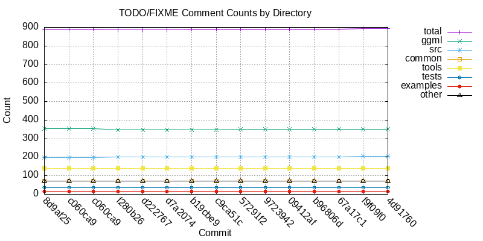

# llama.cpp TODO Comments

Auto-generated on 2026-09-05 03:56:52 UTC

## Configuration

- **Commit:** [4d91760](https://github.com/ggml-org/llama.cpp/commit/4d91760) (sycl : fix test-backend-ops CI break && restore Kronecker product FWHT support (#28016) (#28254))
- **Markers counted:** TODO FIXME XXX HACK
- **Excluded:** vendored code (`vendor/`, `vendors/`, `3rdparty/`), docs (`*.md`, `*.rst`), CI config (`*.yml`, `*.yaml`), assets (`*.json`, `*.lock`), text files except `CMakeLists.txt`
- **Total:** 892 in 295 files

## TODO Counts Over Commits



## Totals by Directory

| Directory | TODO | FIXME | XXX | HACK | Total |
|-----------| ---| ---| ---| ---| ------|
| [ggml/](https://github.com/ggml-org/llama.cpp/tree/4d91760/ggml) | 302 | 41 | 6 | 1 | 350 |
| [src/](https://github.com/ggml-org/llama.cpp/tree/4d91760/src) | 186 | 18 | 0 | 0 | 204 |
| [common/](https://github.com/ggml-org/llama.cpp/tree/4d91760/common) | 66 | 7 | 0 | 0 | 73 |
| [tools/](https://github.com/ggml-org/llama.cpp/tree/4d91760/tools) | 137 | 2 | 0 | 1 | 140 |
| [tests/](https://github.com/ggml-org/llama.cpp/tree/4d91760/tests) | 23 | 14 | 0 | 0 | 37 |
| [examples/](https://github.com/ggml-org/llama.cpp/tree/4d91760/examples) | 14 | 1 | 0 | 0 | 15 |
| other | 69 | 4 | 0 | 0 | 73 |
| **Total** | 797 | 87 | 6 | 2 | 892 |

## TODOs by Directory

### ggml

| Count | File |
|-------|------|
| 28 | [ggml/src/ggml-cpu/ops.cpp](https://github.com/ggml-org/llama.cpp/blob/4d91760/ggml/src/ggml-cpu/ops.cpp) |
| 19 | [ggml/src/ggml-cpu/repack.cpp](https://github.com/ggml-org/llama.cpp/blob/4d91760/ggml/src/ggml-cpu/repack.cpp) |
| 17 | [ggml/include/ggml.h](https://github.com/ggml-org/llama.cpp/blob/4d91760/ggml/include/ggml.h) |
| 17 | [ggml/src/ggml-cpu/ggml-cpu.c](https://github.com/ggml-org/llama.cpp/blob/4d91760/ggml/src/ggml-cpu/ggml-cpu.c) |
| 15 | [ggml/src/ggml-cann/ggml-cann.cpp](https://github.com/ggml-org/llama.cpp/blob/4d91760/ggml/src/ggml-cann/ggml-cann.cpp) |
| 14 | [ggml/src/ggml-backend-meta.cpp](https://github.com/ggml-org/llama.cpp/blob/4d91760/ggml/src/ggml-backend-meta.cpp) |
| 14 | [ggml/src/ggml.c](https://github.com/ggml-org/llama.cpp/blob/4d91760/ggml/src/ggml.c) |
| 13 | [ggml/src/ggml-opencl/ggml-opencl.cpp](https://github.com/ggml-org/llama.cpp/blob/4d91760/ggml/src/ggml-opencl/ggml-opencl.cpp) |
| 11 | [ggml/src/ggml-cuda/ggml-cuda.cu](https://github.com/ggml-org/llama.cpp/blob/4d91760/ggml/src/ggml-cuda/ggml-cuda.cu) |
| 11 | [ggml/src/ggml-sycl/ggml-sycl.cpp](https://github.com/ggml-org/llama.cpp/blob/4d91760/ggml/src/ggml-sycl/ggml-sycl.cpp) |
| 10 | [ggml/src/ggml-backend.cpp](https://github.com/ggml-org/llama.cpp/blob/4d91760/ggml/src/ggml-backend.cpp) |
| 9 | [ggml/src/ggml-webgpu/ggml-webgpu.cpp](https://github.com/ggml-org/llama.cpp/blob/4d91760/ggml/src/ggml-webgpu/ggml-webgpu.cpp) |
| 8 | [ggml/src/ggml-metal/ggml-metal-ops.cpp](https://github.com/ggml-org/llama.cpp/blob/4d91760/ggml/src/ggml-metal/ggml-metal-ops.cpp) |
| 5 | [ggml/src/ggml-cann/aclnn_ops.cpp](https://github.com/ggml-org/llama.cpp/blob/4d91760/ggml/src/ggml-cann/aclnn_ops.cpp) |
| 5 | [ggml/src/ggml-cpu/simd-mappings.h](https://github.com/ggml-org/llama.cpp/blob/4d91760/ggml/src/ggml-cpu/simd-mappings.h) |
| 4 | [ggml/src/ggml-et/ggml-et.cpp](https://github.com/ggml-org/llama.cpp/blob/4d91760/ggml/src/ggml-et/ggml-et.cpp) |
| 4 | [ggml/src/ggml-hexagon/ggml-hexagon.cpp](https://github.com/ggml-org/llama.cpp/blob/4d91760/ggml/src/ggml-hexagon/ggml-hexagon.cpp) |
| 4 | [ggml/src/ggml-metal/ggml-metal-device.m](https://github.com/ggml-org/llama.cpp/blob/4d91760/ggml/src/ggml-metal/ggml-metal-device.m) |
| 4 | [ggml/src/ggml-vulkan/ggml-vulkan.cpp](https://github.com/ggml-org/llama.cpp/blob/4d91760/ggml/src/ggml-vulkan/ggml-vulkan.cpp) |
| 3 | [ggml/src/ggml-cpu/spacemit/ime.cpp](https://github.com/ggml-org/llama.cpp/blob/4d91760/ggml/src/ggml-cpu/spacemit/ime.cpp) |
| 3 | [ggml/src/ggml-cpu/vec.h](https://github.com/ggml-org/llama.cpp/blob/4d91760/ggml/src/ggml-cpu/vec.h) |
| 3 | [ggml/src/ggml-cuda/fattn-tile.cuh](https://github.com/ggml-org/llama.cpp/blob/4d91760/ggml/src/ggml-cuda/fattn-tile.cuh) |
| 3 | [ggml/src/ggml-cuda/lightning-indexer.cu](https://github.com/ggml-org/llama.cpp/blob/4d91760/ggml/src/ggml-cuda/lightning-indexer.cu) |
| 3 | [ggml/src/ggml-cuda/mmq.cuh](https://github.com/ggml-org/llama.cpp/blob/4d91760/ggml/src/ggml-cuda/mmq.cuh) |
| 3 | [ggml/src/ggml-hexagon/htp/htp-ctx.h](https://github.com/ggml-org/llama.cpp/blob/4d91760/ggml/src/ggml-hexagon/htp/htp-ctx.h) |
| 3 | [ggml/src/ggml-metal/kernels/fa.metal](https://github.com/ggml-org/llama.cpp/blob/4d91760/ggml/src/ggml-metal/kernels/fa.metal) |
| 3 | [ggml/src/ggml-rpc/ggml-rpc.cpp](https://github.com/ggml-org/llama.cpp/blob/4d91760/ggml/src/ggml-rpc/ggml-rpc.cpp) |
| 3 | [ggml/src/ggml-zdnn/utils.cpp](https://github.com/ggml-org/llama.cpp/blob/4d91760/ggml/src/ggml-zdnn/utils.cpp) |
| 2 | [ggml/CMakeLists.txt](https://github.com/ggml-org/llama.cpp/blob/4d91760/ggml/CMakeLists.txt) |
| 2 | [ggml/src/CMakeLists.txt](https://github.com/ggml-org/llama.cpp/blob/4d91760/ggml/src/CMakeLists.txt) |
| 2 | [ggml/src/ggml-cpu/amx/mmq.cpp](https://github.com/ggml-org/llama.cpp/blob/4d91760/ggml/src/ggml-cpu/amx/mmq.cpp) |
| 2 | [ggml/src/ggml-cpu/arch/wasm/quants.c](https://github.com/ggml-org/llama.cpp/blob/4d91760/ggml/src/ggml-cpu/arch/wasm/quants.c) |
| 2 | [ggml/src/ggml-cpu/arch/x86/repack.cpp](https://github.com/ggml-org/llama.cpp/blob/4d91760/ggml/src/ggml-cpu/arch/x86/repack.cpp) |
| 2 | [ggml/src/ggml-cpu/binary-ops.cpp](https://github.com/ggml-org/llama.cpp/blob/4d91760/ggml/src/ggml-cpu/binary-ops.cpp) |
| 2 | [ggml/src/ggml-cpu/ggml-cpu-impl.h](https://github.com/ggml-org/llama.cpp/blob/4d91760/ggml/src/ggml-cpu/ggml-cpu-impl.h) |
| 2 | [ggml/src/ggml-cpu/simd-gemm.h](https://github.com/ggml-org/llama.cpp/blob/4d91760/ggml/src/ggml-cpu/simd-gemm.h) |
| 2 | [ggml/src/ggml-cpu/spacemit/ime2_kernels.cpp](https://github.com/ggml-org/llama.cpp/blob/4d91760/ggml/src/ggml-cpu/spacemit/ime2_kernels.cpp) |
| 2 | [ggml/src/ggml-cuda/argsort.cu](https://github.com/ggml-org/llama.cpp/blob/4d91760/ggml/src/ggml-cuda/argsort.cu) |
| 2 | [ggml/src/ggml-cuda/fattn-common.cuh](https://github.com/ggml-org/llama.cpp/blob/4d91760/ggml/src/ggml-cuda/fattn-common.cuh) |
| 2 | [ggml/src/ggml-cuda/fattn-mma-f16.cuh](https://github.com/ggml-org/llama.cpp/blob/4d91760/ggml/src/ggml-cuda/fattn-mma-f16.cuh) |
| 2 | [ggml/src/ggml-cuda/mmf.cuh](https://github.com/ggml-org/llama.cpp/blob/4d91760/ggml/src/ggml-cuda/mmf.cuh) |
| 2 | [ggml/src/ggml-cuda/mmq.cu](https://github.com/ggml-org/llama.cpp/blob/4d91760/ggml/src/ggml-cuda/mmq.cu) |
| 2 | [ggml/src/ggml-cuda/softmax.cu](https://github.com/ggml-org/llama.cpp/blob/4d91760/ggml/src/ggml-cuda/softmax.cu) |
| 2 | [ggml/src/ggml-cuda/top-k.cu](https://github.com/ggml-org/llama.cpp/blob/4d91760/ggml/src/ggml-cuda/top-k.cu) |
| 2 | [ggml/src/ggml-hexagon/htp/main.c](https://github.com/ggml-org/llama.cpp/blob/4d91760/ggml/src/ggml-hexagon/htp/main.c) |
| 2 | [ggml/src/ggml-impl.h](https://github.com/ggml-org/llama.cpp/blob/4d91760/ggml/src/ggml-impl.h) |
| 2 | [ggml/src/ggml-metal/ggml-metal-impl.h](https://github.com/ggml-org/llama.cpp/blob/4d91760/ggml/src/ggml-metal/ggml-metal-impl.h) |
| 2 | [ggml/src/ggml-metal/kernels/wkv.metal](https://github.com/ggml-org/llama.cpp/blob/4d91760/ggml/src/ggml-metal/kernels/wkv.metal) |
| 2 | [ggml/src/ggml-musa/CMakeLists.txt](https://github.com/ggml-org/llama.cpp/blob/4d91760/ggml/src/ggml-musa/CMakeLists.txt) |
| 2 | [ggml/src/ggml-openvino/utils.cpp](https://github.com/ggml-org/llama.cpp/blob/4d91760/ggml/src/ggml-openvino/utils.cpp) |
| 2 | [ggml/src/ggml-sycl/common.hpp](https://github.com/ggml-org/llama.cpp/blob/4d91760/ggml/src/ggml-sycl/common.hpp) |
| 2 | [ggml/src/ggml-sycl/getrows.cpp](https://github.com/ggml-org/llama.cpp/blob/4d91760/ggml/src/ggml-sycl/getrows.cpp) |
| 2 | [ggml/src/ggml-vulkan/vulkan-shaders/topk_nary_search.comp](https://github.com/ggml-org/llama.cpp/blob/4d91760/ggml/src/ggml-vulkan/vulkan-shaders/topk_nary_search.comp) |
| 2 | [ggml/src/ggml-webgpu/wgsl-shaders/flash_attn.wgsl](https://github.com/ggml-org/llama.cpp/blob/4d91760/ggml/src/ggml-webgpu/wgsl-shaders/flash_attn.wgsl) |
| 2 | [ggml/src/ggml-zdnn/ggml-zdnn.cpp](https://github.com/ggml-org/llama.cpp/blob/4d91760/ggml/src/ggml-zdnn/ggml-zdnn.cpp) |
| 1 | [ggml/include/ggml-backend.h](https://github.com/ggml-org/llama.cpp/blob/4d91760/ggml/include/ggml-backend.h) |
| 1 | [ggml/include/ggml-metal.h](https://github.com/ggml-org/llama.cpp/blob/4d91760/ggml/include/ggml-metal.h) |
| 1 | [ggml/include/ggml-opt.h](https://github.com/ggml-org/llama.cpp/blob/4d91760/ggml/include/ggml-opt.h) |
| 1 | [ggml/src/ggml-alloc.c](https://github.com/ggml-org/llama.cpp/blob/4d91760/ggml/src/ggml-alloc.c) |
| 1 | [ggml/src/ggml-backend-reg.cpp](https://github.com/ggml-org/llama.cpp/blob/4d91760/ggml/src/ggml-backend-reg.cpp) |
| 1 | [ggml/src/ggml-blas/ggml-blas.cpp](https://github.com/ggml-org/llama.cpp/blob/4d91760/ggml/src/ggml-blas/ggml-blas.cpp) |
| 1 | [ggml/src/ggml-cann/common.h](https://github.com/ggml-org/llama.cpp/blob/4d91760/ggml/src/ggml-cann/common.h) |
| 1 | [ggml/src/ggml-common.h](https://github.com/ggml-org/llama.cpp/blob/4d91760/ggml/src/ggml-common.h) |
| 1 | [ggml/src/ggml-cpu/CMakeLists.txt](https://github.com/ggml-org/llama.cpp/blob/4d91760/ggml/src/ggml-cpu/CMakeLists.txt) |
| 1 | [ggml/src/ggml-cpu/amx/common.h](https://github.com/ggml-org/llama.cpp/blob/4d91760/ggml/src/ggml-cpu/amx/common.h) |
| 1 | [ggml/src/ggml-cpu/arch/loongarch/quants.c](https://github.com/ggml-org/llama.cpp/blob/4d91760/ggml/src/ggml-cpu/arch/loongarch/quants.c) |
| 1 | [ggml/src/ggml-cpu/arch/x86/cpu-feats.cpp](https://github.com/ggml-org/llama.cpp/blob/4d91760/ggml/src/ggml-cpu/arch/x86/cpu-feats.cpp) |
| 1 | [ggml/src/ggml-cpu/arch/x86/quants.c](https://github.com/ggml-org/llama.cpp/blob/4d91760/ggml/src/ggml-cpu/arch/x86/quants.c) |
| 1 | [ggml/src/ggml-cpu/common.h](https://github.com/ggml-org/llama.cpp/blob/4d91760/ggml/src/ggml-cpu/common.h) |
| 1 | [ggml/src/ggml-cpu/ggml-cpu.cpp](https://github.com/ggml-org/llama.cpp/blob/4d91760/ggml/src/ggml-cpu/ggml-cpu.cpp) |
| 1 | [ggml/src/ggml-cpu/llamafile/sgemm.cpp](https://github.com/ggml-org/llama.cpp/blob/4d91760/ggml/src/ggml-cpu/llamafile/sgemm.cpp) |
| 1 | [ggml/src/ggml-cpu/quants.c](https://github.com/ggml-org/llama.cpp/blob/4d91760/ggml/src/ggml-cpu/quants.c) |
| 1 | [ggml/src/ggml-cpu/unary-ops.cpp](https://github.com/ggml-org/llama.cpp/blob/4d91760/ggml/src/ggml-cpu/unary-ops.cpp) |
| 1 | [ggml/src/ggml-cpu/vec.cpp](https://github.com/ggml-org/llama.cpp/blob/4d91760/ggml/src/ggml-cpu/vec.cpp) |
| 1 | [ggml/src/ggml-cuda/CMakeLists.txt](https://github.com/ggml-org/llama.cpp/blob/4d91760/ggml/src/ggml-cuda/CMakeLists.txt) |
| 1 | [ggml/src/ggml-cuda/convert.cuh](https://github.com/ggml-org/llama.cpp/blob/4d91760/ggml/src/ggml-cuda/convert.cuh) |
| 1 | [ggml/src/ggml-cuda/cumsum.cu](https://github.com/ggml-org/llama.cpp/blob/4d91760/ggml/src/ggml-cuda/cumsum.cu) |
| 1 | [ggml/src/ggml-cuda/gated_delta_net.cu](https://github.com/ggml-org/llama.cpp/blob/4d91760/ggml/src/ggml-cuda/gated_delta_net.cu) |
| 1 | [ggml/src/ggml-cuda/mmf.cu](https://github.com/ggml-org/llama.cpp/blob/4d91760/ggml/src/ggml-cuda/mmf.cu) |
| 1 | [ggml/src/ggml-cuda/mmvf.cu](https://github.com/ggml-org/llama.cpp/blob/4d91760/ggml/src/ggml-cuda/mmvf.cu) |
| 1 | [ggml/src/ggml-cuda/ssm-scan.cu](https://github.com/ggml-org/llama.cpp/blob/4d91760/ggml/src/ggml-cuda/ssm-scan.cu) |
| 1 | [ggml/src/ggml-cuda/vecdotq.cuh](https://github.com/ggml-org/llama.cpp/blob/4d91760/ggml/src/ggml-cuda/vecdotq.cuh) |
| 1 | [ggml/src/ggml-et/et-kernels/CMakeLists.txt](https://github.com/ggml-org/llama.cpp/blob/4d91760/ggml/src/ggml-et/et-kernels/CMakeLists.txt) |
| 1 | [ggml/src/ggml-et/et-kernels/src/get_rows_f32.c](https://github.com/ggml-org/llama.cpp/blob/4d91760/ggml/src/ggml-et/et-kernels/src/get_rows_f32.c) |
| 1 | [ggml/src/ggml-et/et-kernels/src/rms_norm_f32.c](https://github.com/ggml-org/llama.cpp/blob/4d91760/ggml/src/ggml-et/et-kernels/src/rms_norm_f32.c) |
| 1 | [ggml/src/ggml-et/et-kernels/src/solve_tri_f32.c](https://github.com/ggml-org/llama.cpp/blob/4d91760/ggml/src/ggml-et/et-kernels/src/solve_tri_f32.c) |
| 1 | [ggml/src/ggml-et/et-kernels/src/ssm_conv_f32.c](https://github.com/ggml-org/llama.cpp/blob/4d91760/ggml/src/ggml-et/et-kernels/src/ssm_conv_f32.c) |
| 1 | [ggml/src/ggml-hexagon/htp/dma-queue.h](https://github.com/ggml-org/llama.cpp/blob/4d91760/ggml/src/ggml-hexagon/htp/dma-queue.h) |
| 1 | [ggml/src/ggml-hip/CMakeLists.txt](https://github.com/ggml-org/llama.cpp/blob/4d91760/ggml/src/ggml-hip/CMakeLists.txt) |
| 1 | [ggml/src/ggml-metal/ggml-metal-context.m](https://github.com/ggml-org/llama.cpp/blob/4d91760/ggml/src/ggml-metal/ggml-metal-context.m) |
| 1 | [ggml/src/ggml-metal/kernels/conv.metal](https://github.com/ggml-org/llama.cpp/blob/4d91760/ggml/src/ggml-metal/kernels/conv.metal) |
| 1 | [ggml/src/ggml-metal/kernels/misc.metal](https://github.com/ggml-org/llama.cpp/blob/4d91760/ggml/src/ggml-metal/kernels/misc.metal) |
| 1 | [ggml/src/ggml-metal/kernels/reduce.metal](https://github.com/ggml-org/llama.cpp/blob/4d91760/ggml/src/ggml-metal/kernels/reduce.metal) |
| 1 | [ggml/src/ggml-metal/kernels/unary.metal](https://github.com/ggml-org/llama.cpp/blob/4d91760/ggml/src/ggml-metal/kernels/unary.metal) |
| 1 | [ggml/src/ggml-musa/mudnn.cu](https://github.com/ggml-org/llama.cpp/blob/4d91760/ggml/src/ggml-musa/mudnn.cu) |
| 1 | [ggml/src/ggml-opencl/kernels/mul_mv_q4_0_f32_1d_16x_flat.cl](https://github.com/ggml-org/llama.cpp/blob/4d91760/ggml/src/ggml-opencl/kernels/mul_mv_q4_0_f32_1d_16x_flat.cl) |
| 1 | [ggml/src/ggml-opencl/kernels/mul_mv_q4_0_f32_1d_8x_flat.cl](https://github.com/ggml-org/llama.cpp/blob/4d91760/ggml/src/ggml-opencl/kernels/mul_mv_q4_0_f32_1d_8x_flat.cl) |
| 1 | [ggml/src/ggml-opencl/kernels/mul_mv_q4_0_f32_8x_flat.cl](https://github.com/ggml-org/llama.cpp/blob/4d91760/ggml/src/ggml-opencl/kernels/mul_mv_q4_0_f32_8x_flat.cl) |
| 1 | [ggml/src/ggml-openvino/ggml-openvino.cpp](https://github.com/ggml-org/llama.cpp/blob/4d91760/ggml/src/ggml-openvino/ggml-openvino.cpp) |
| 1 | [ggml/src/ggml-openvino/ggml-quants.cpp](https://github.com/ggml-org/llama.cpp/blob/4d91760/ggml/src/ggml-openvino/ggml-quants.cpp) |
| 1 | [ggml/src/ggml-openvino/openvino/op/glu_geglu.cpp](https://github.com/ggml-org/llama.cpp/blob/4d91760/ggml/src/ggml-openvino/openvino/op/glu_geglu.cpp) |
| 1 | [ggml/src/ggml-openvino/utils.h](https://github.com/ggml-org/llama.cpp/blob/4d91760/ggml/src/ggml-openvino/utils.h) |
| 1 | [ggml/src/ggml-sycl/convert.cpp](https://github.com/ggml-org/llama.cpp/blob/4d91760/ggml/src/ggml-sycl/convert.cpp) |
| 1 | [ggml/src/ggml-sycl/fattn-common.hpp](https://github.com/ggml-org/llama.cpp/blob/4d91760/ggml/src/ggml-sycl/fattn-common.hpp) |
| 1 | [ggml/src/ggml-sycl/gated_delta_net.cpp](https://github.com/ggml-org/llama.cpp/blob/4d91760/ggml/src/ggml-sycl/gated_delta_net.cpp) |
| 1 | [ggml/src/ggml-sycl/softmax.cpp](https://github.com/ggml-org/llama.cpp/blob/4d91760/ggml/src/ggml-sycl/softmax.cpp) |
| 1 | [ggml/src/ggml-vulkan/vulkan-shaders/add.comp](https://github.com/ggml-org/llama.cpp/blob/4d91760/ggml/src/ggml-vulkan/vulkan-shaders/add.comp) |
| 1 | [ggml/src/ggml-vulkan/vulkan-shaders/flash_attn_mask_opt.comp](https://github.com/ggml-org/llama.cpp/blob/4d91760/ggml/src/ggml-vulkan/vulkan-shaders/flash_attn_mask_opt.comp) |
| 1 | [ggml/src/ggml-vulkan/vulkan-shaders/multi_add.comp](https://github.com/ggml-org/llama.cpp/blob/4d91760/ggml/src/ggml-vulkan/vulkan-shaders/multi_add.comp) |
| 1 | [ggml/src/ggml-webgpu/wgsl-shaders/mul_mat_subgroup_matrix.wgsl](https://github.com/ggml-org/llama.cpp/blob/4d91760/ggml/src/ggml-webgpu/wgsl-shaders/mul_mat_subgroup_matrix.wgsl) |
| 1 | [ggml/src/ggml-webgpu/wgsl-shaders/rope.wgsl](https://github.com/ggml-org/llama.cpp/blob/4d91760/ggml/src/ggml-webgpu/wgsl-shaders/rope.wgsl) |
| 1 | [ggml/src/ggml-zdnn/mmf.cpp](https://github.com/ggml-org/llama.cpp/blob/4d91760/ggml/src/ggml-zdnn/mmf.cpp) |

### src

| Count | File |
|-------|------|
| 30 | [src/llama-context.cpp](https://github.com/ggml-org/llama.cpp/blob/4d91760/src/llama-context.cpp) |
| 21 | [src/llama-kv-cache.cpp](https://github.com/ggml-org/llama.cpp/blob/4d91760/src/llama-kv-cache.cpp) |
| 20 | [src/llama-graph.cpp](https://github.com/ggml-org/llama.cpp/blob/4d91760/src/llama-graph.cpp) |
| 8 | [src/llama-vocab.cpp](https://github.com/ggml-org/llama.cpp/blob/4d91760/src/llama-vocab.cpp) |
| 7 | [src/llama-graph.h](https://github.com/ggml-org/llama.cpp/blob/4d91760/src/llama-graph.h) |
| 6 | [src/llama-memory-recurrent.cpp](https://github.com/ggml-org/llama.cpp/blob/4d91760/src/llama-memory-recurrent.cpp) |
| 6 | [src/llama-model-saver.cpp](https://github.com/ggml-org/llama.cpp/blob/4d91760/src/llama-model-saver.cpp) |
| 6 | [src/models/qwen3next.cpp](https://github.com/ggml-org/llama.cpp/blob/4d91760/src/models/qwen3next.cpp) |
| 4 | [src/llama-batch.h](https://github.com/ggml-org/llama.cpp/blob/4d91760/src/llama-batch.h) |
| 4 | [src/llama-hparams.h](https://github.com/ggml-org/llama.cpp/blob/4d91760/src/llama-hparams.h) |
| 4 | [src/llama-model.cpp](https://github.com/ggml-org/llama.cpp/blob/4d91760/src/llama-model.cpp) |
| 4 | [src/models/gemma4.cpp](https://github.com/ggml-org/llama.cpp/blob/4d91760/src/models/gemma4.cpp) |
| 3 | [src/llama-context.h](https://github.com/ggml-org/llama.cpp/blob/4d91760/src/llama-context.h) |
| 3 | [src/llama-grammar.h](https://github.com/ggml-org/llama.cpp/blob/4d91760/src/llama-grammar.h) |
| 3 | [src/llama-memory-recurrent.h](https://github.com/ggml-org/llama.cpp/blob/4d91760/src/llama-memory-recurrent.h) |
| 3 | [src/llama-model-loader.cpp](https://github.com/ggml-org/llama.cpp/blob/4d91760/src/llama-model-loader.cpp) |
| 3 | [src/llama-quant.cpp](https://github.com/ggml-org/llama.cpp/blob/4d91760/src/llama-quant.cpp) |
| 3 | [src/models/delta-net-base.cpp](https://github.com/ggml-org/llama.cpp/blob/4d91760/src/models/delta-net-base.cpp) |
| 3 | [src/models/gemma3n.cpp](https://github.com/ggml-org/llama.cpp/blob/4d91760/src/models/gemma3n.cpp) |
| 3 | [src/models/mamba-base.cpp](https://github.com/ggml-org/llama.cpp/blob/4d91760/src/models/mamba-base.cpp) |
| 2 | [src/llama-adapter.cpp](https://github.com/ggml-org/llama.cpp/blob/4d91760/src/llama-adapter.cpp) |
| 2 | [src/llama-kv-cache-dsv4.cpp](https://github.com/ggml-org/llama.cpp/blob/4d91760/src/llama-kv-cache-dsv4.cpp) |
| 2 | [src/llama-kv-cache-dsv4.h](https://github.com/ggml-org/llama.cpp/blob/4d91760/src/llama-kv-cache-dsv4.h) |
| 2 | [src/llama-kv-cache.h](https://github.com/ggml-org/llama.cpp/blob/4d91760/src/llama-kv-cache.h) |
| 2 | [src/llama-memory-hybrid-idx.cpp](https://github.com/ggml-org/llama.cpp/blob/4d91760/src/llama-memory-hybrid-idx.cpp) |
| 2 | [src/llama-sampler.cpp](https://github.com/ggml-org/llama.cpp/blob/4d91760/src/llama-sampler.cpp) |
| 2 | [src/models/cohere2moe.cpp](https://github.com/ggml-org/llama.cpp/blob/4d91760/src/models/cohere2moe.cpp) |
| 2 | [src/models/dflash.cpp](https://github.com/ggml-org/llama.cpp/blob/4d91760/src/models/dflash.cpp) |
| 2 | [src/models/minicpm3.cpp](https://github.com/ggml-org/llama.cpp/blob/4d91760/src/models/minicpm3.cpp) |
| 2 | [src/models/models.h](https://github.com/ggml-org/llama.cpp/blob/4d91760/src/models/models.h) |
| 2 | [src/models/qwen35.cpp](https://github.com/ggml-org/llama.cpp/blob/4d91760/src/models/qwen35.cpp) |
| 2 | [src/models/qwen35moe.cpp](https://github.com/ggml-org/llama.cpp/blob/4d91760/src/models/qwen35moe.cpp) |
| 1 | [src/llama-adapter.h](https://github.com/ggml-org/llama.cpp/blob/4d91760/src/llama-adapter.h) |
| 1 | [src/llama-arch.cpp](https://github.com/ggml-org/llama.cpp/blob/4d91760/src/llama-arch.cpp) |
| 1 | [src/llama-cparams.h](https://github.com/ggml-org/llama.cpp/blob/4d91760/src/llama-cparams.h) |
| 1 | [src/llama-ext.h](https://github.com/ggml-org/llama.cpp/blob/4d91760/src/llama-ext.h) |
| 1 | [src/llama-hparams.cpp](https://github.com/ggml-org/llama.cpp/blob/4d91760/src/llama-hparams.cpp) |
| 1 | [src/llama-impl.h](https://github.com/ggml-org/llama.cpp/blob/4d91760/src/llama-impl.h) |
| 1 | [src/llama-kv-cache-iswa.cpp](https://github.com/ggml-org/llama.cpp/blob/4d91760/src/llama-kv-cache-iswa.cpp) |
| 1 | [src/llama-kv-cells.h](https://github.com/ggml-org/llama.cpp/blob/4d91760/src/llama-kv-cells.h) |
| 1 | [src/llama-memory-hybrid-iswa.cpp](https://github.com/ggml-org/llama.cpp/blob/4d91760/src/llama-memory-hybrid-iswa.cpp) |
| 1 | [src/llama-memory-hybrid.cpp](https://github.com/ggml-org/llama.cpp/blob/4d91760/src/llama-memory-hybrid.cpp) |
| 1 | [src/llama-mmap.cpp](https://github.com/ggml-org/llama.cpp/blob/4d91760/src/llama-mmap.cpp) |
| 1 | [src/llama-model-saver.h](https://github.com/ggml-org/llama.cpp/blob/4d91760/src/llama-model-saver.h) |
| 1 | [src/llama-model.h](https://github.com/ggml-org/llama.cpp/blob/4d91760/src/llama-model.h) |
| 1 | [src/llama-vocab.h](https://github.com/ggml-org/llama.cpp/blob/4d91760/src/llama-vocab.h) |
| 1 | [src/models/baichuan.cpp](https://github.com/ggml-org/llama.cpp/blob/4d91760/src/models/baichuan.cpp) |
| 1 | [src/models/bitnet.cpp](https://github.com/ggml-org/llama.cpp/blob/4d91760/src/models/bitnet.cpp) |
| 1 | [src/models/bloom.cpp](https://github.com/ggml-org/llama.cpp/blob/4d91760/src/models/bloom.cpp) |
| 1 | [src/models/chameleon.cpp](https://github.com/ggml-org/llama.cpp/blob/4d91760/src/models/chameleon.cpp) |
| 1 | [src/models/deepseek2.cpp](https://github.com/ggml-org/llama.cpp/blob/4d91760/src/models/deepseek2.cpp) |
| 1 | [src/models/deepseek32.cpp](https://github.com/ggml-org/llama.cpp/blob/4d91760/src/models/deepseek32.cpp) |
| 1 | [src/models/falcon-h1.cpp](https://github.com/ggml-org/llama.cpp/blob/4d91760/src/models/falcon-h1.cpp) |
| 1 | [src/models/gemma3.cpp](https://github.com/ggml-org/llama.cpp/blob/4d91760/src/models/gemma3.cpp) |
| 1 | [src/models/glm-dsa.cpp](https://github.com/ggml-org/llama.cpp/blob/4d91760/src/models/glm-dsa.cpp) |
| 1 | [src/models/granite-switch.cpp](https://github.com/ggml-org/llama.cpp/blob/4d91760/src/models/granite-switch.cpp) |
| 1 | [src/models/grovemoe.cpp](https://github.com/ggml-org/llama.cpp/blob/4d91760/src/models/grovemoe.cpp) |
| 1 | [src/models/jais.cpp](https://github.com/ggml-org/llama.cpp/blob/4d91760/src/models/jais.cpp) |
| 1 | [src/models/jamba.cpp](https://github.com/ggml-org/llama.cpp/blob/4d91760/src/models/jamba.cpp) |
| 1 | [src/models/minimax-01.cpp](https://github.com/ggml-org/llama.cpp/blob/4d91760/src/models/minimax-01.cpp) |
| 1 | [src/models/minimax-m3.cpp](https://github.com/ggml-org/llama.cpp/blob/4d91760/src/models/minimax-m3.cpp) |
| 1 | [src/models/mistral3.cpp](https://github.com/ggml-org/llama.cpp/blob/4d91760/src/models/mistral3.cpp) |
| 1 | [src/models/mpt.cpp](https://github.com/ggml-org/llama.cpp/blob/4d91760/src/models/mpt.cpp) |
| 1 | [src/models/phi3.cpp](https://github.com/ggml-org/llama.cpp/blob/4d91760/src/models/phi3.cpp) |
| 1 | [src/models/qwen4exp.cpp](https://github.com/ggml-org/llama.cpp/blob/4d91760/src/models/qwen4exp.cpp) |
| 1 | [src/models/refact.cpp](https://github.com/ggml-org/llama.cpp/blob/4d91760/src/models/refact.cpp) |
| 1 | [src/unicode.cpp](https://github.com/ggml-org/llama.cpp/blob/4d91760/src/unicode.cpp) |
| 1 | [src/unicode.h](https://github.com/ggml-org/llama.cpp/blob/4d91760/src/unicode.h) |

### common

| Count | File |
|-------|------|
| 17 | [common/speculative.cpp](https://github.com/ggml-org/llama.cpp/blob/4d91760/common/speculative.cpp) |
| 10 | [common/jinja/value.cpp](https://github.com/ggml-org/llama.cpp/blob/4d91760/common/jinja/value.cpp) |
| 7 | [common/chat.cpp](https://github.com/ggml-org/llama.cpp/blob/4d91760/common/chat.cpp) |
| 6 | [common/arg.cpp](https://github.com/ggml-org/llama.cpp/blob/4d91760/common/arg.cpp) |
| 6 | [common/common.cpp](https://github.com/ggml-org/llama.cpp/blob/4d91760/common/common.cpp) |
| 3 | [common/chat.h](https://github.com/ggml-org/llama.cpp/blob/4d91760/common/chat.h) |
| 2 | [common/chat-diff-analyzer.cpp](https://github.com/ggml-org/llama.cpp/blob/4d91760/common/chat-diff-analyzer.cpp) |
| 2 | [common/common.h](https://github.com/ggml-org/llama.cpp/blob/4d91760/common/common.h) |
| 2 | [common/console.cpp](https://github.com/ggml-org/llama.cpp/blob/4d91760/common/console.cpp) |
| 2 | [common/jinja/runtime.cpp](https://github.com/ggml-org/llama.cpp/blob/4d91760/common/jinja/runtime.cpp) |
| 2 | [common/preset.cpp](https://github.com/ggml-org/llama.cpp/blob/4d91760/common/preset.cpp) |
| 2 | [common/sampling.cpp](https://github.com/ggml-org/llama.cpp/blob/4d91760/common/sampling.cpp) |
| 1 | [common/CMakeLists.txt](https://github.com/ggml-org/llama.cpp/blob/4d91760/common/CMakeLists.txt) |
| 1 | [common/chat-auto-parser-helpers.cpp](https://github.com/ggml-org/llama.cpp/blob/4d91760/common/chat-auto-parser-helpers.cpp) |
| 1 | [common/download.cpp](https://github.com/ggml-org/llama.cpp/blob/4d91760/common/download.cpp) |
| 1 | [common/jinja/lexer.cpp](https://github.com/ggml-org/llama.cpp/blob/4d91760/common/jinja/lexer.cpp) |
| 1 | [common/jinja/parser.cpp](https://github.com/ggml-org/llama.cpp/blob/4d91760/common/jinja/parser.cpp) |
| 1 | [common/jinja/runtime.h](https://github.com/ggml-org/llama.cpp/blob/4d91760/common/jinja/runtime.h) |
| 1 | [common/jinja/value.h](https://github.com/ggml-org/llama.cpp/blob/4d91760/common/jinja/value.h) |
| 1 | [common/json-schema-to-grammar.cpp](https://github.com/ggml-org/llama.cpp/blob/4d91760/common/json-schema-to-grammar.cpp) |
| 1 | [common/llguidance.cpp](https://github.com/ggml-org/llama.cpp/blob/4d91760/common/llguidance.cpp) |
| 1 | [common/preset.h](https://github.com/ggml-org/llama.cpp/blob/4d91760/common/preset.h) |
| 1 | [common/sampling.h](https://github.com/ggml-org/llama.cpp/blob/4d91760/common/sampling.h) |
| 1 | [common/speculative.h](https://github.com/ggml-org/llama.cpp/blob/4d91760/common/speculative.h) |

### tools

| Count | File |
|-------|------|
| 30 | [tools/server/server-context.cpp](https://github.com/ggml-org/llama.cpp/blob/4d91760/tools/server/server-context.cpp) |
| 12 | [tools/mtmd/mtmd.cpp](https://github.com/ggml-org/llama.cpp/blob/4d91760/tools/mtmd/mtmd.cpp) |
| 10 | [tools/mtmd/clip.cpp](https://github.com/ggml-org/llama.cpp/blob/4d91760/tools/mtmd/clip.cpp) |
| 7 | [tools/perplexity/perplexity.cpp](https://github.com/ggml-org/llama.cpp/blob/4d91760/tools/perplexity/perplexity.cpp) |
| 6 | [tools/server/server-common.cpp](https://github.com/ggml-org/llama.cpp/blob/4d91760/tools/server/server-common.cpp) |
| 5 | [tools/cvector-generator/cvector-generator.cpp](https://github.com/ggml-org/llama.cpp/blob/4d91760/tools/cvector-generator/cvector-generator.cpp) |
| 5 | [tools/server/server-models.cpp](https://github.com/ggml-org/llama.cpp/blob/4d91760/tools/server/server-models.cpp) |
| 5 | [tools/server/server-task.h](https://github.com/ggml-org/llama.cpp/blob/4d91760/tools/server/server-task.h) |
| 5 | [tools/server/tests/unit/test_completion.py](https://github.com/ggml-org/llama.cpp/blob/4d91760/tools/server/tests/unit/test_completion.py) |
| 4 | [tools/mtmd/clip-graph.h](https://github.com/ggml-org/llama.cpp/blob/4d91760/tools/mtmd/clip-graph.h) |
| 4 | [tools/server/server-common.h](https://github.com/ggml-org/llama.cpp/blob/4d91760/tools/server/server-common.h) |
| 4 | [tools/server/server-schema.cpp](https://github.com/ggml-org/llama.cpp/blob/4d91760/tools/server/server-schema.cpp) |
| 3 | [tools/cvector-generator/pca.hpp](https://github.com/ggml-org/llama.cpp/blob/4d91760/tools/cvector-generator/pca.hpp) |
| 3 | [tools/mtmd/clip.h](https://github.com/ggml-org/llama.cpp/blob/4d91760/tools/mtmd/clip.h) |
| 3 | [tools/mtmd/mtmd.h](https://github.com/ggml-org/llama.cpp/blob/4d91760/tools/mtmd/mtmd.h) |
| 3 | [tools/server/tests/unit/test_lora.py](https://github.com/ggml-org/llama.cpp/blob/4d91760/tools/server/tests/unit/test_lora.py) |
| 2 | [tools/export-lora/export-lora.cpp](https://github.com/ggml-org/llama.cpp/blob/4d91760/tools/export-lora/export-lora.cpp) |
| 2 | [tools/mtmd/models/conformer.cpp](https://github.com/ggml-org/llama.cpp/blob/4d91760/tools/mtmd/models/conformer.cpp) |
| 2 | [tools/mtmd/mtmd-audio.cpp](https://github.com/ggml-org/llama.cpp/blob/4d91760/tools/mtmd/mtmd-audio.cpp) |
| 2 | [tools/server/server-task.cpp](https://github.com/ggml-org/llama.cpp/blob/4d91760/tools/server/server-task.cpp) |
| 1 | [tools/cli/cli-ui.h](https://github.com/ggml-org/llama.cpp/blob/4d91760/tools/cli/cli-ui.h) |
| 1 | [tools/completion/completion.cpp](https://github.com/ggml-org/llama.cpp/blob/4d91760/tools/completion/completion.cpp) |
| 1 | [tools/gguf-split/gguf-split.cpp](https://github.com/ggml-org/llama.cpp/blob/4d91760/tools/gguf-split/gguf-split.cpp) |
| 1 | [tools/imatrix/imatrix.cpp](https://github.com/ggml-org/llama.cpp/blob/4d91760/tools/imatrix/imatrix.cpp) |
| 1 | [tools/llama-bench/llama-bench.cpp](https://github.com/ggml-org/llama.cpp/blob/4d91760/tools/llama-bench/llama-bench.cpp) |
| 1 | [tools/mtmd/CMakeLists.txt](https://github.com/ggml-org/llama.cpp/blob/4d91760/tools/mtmd/CMakeLists.txt) |
| 1 | [tools/mtmd/clip-impl.h](https://github.com/ggml-org/llama.cpp/blob/4d91760/tools/mtmd/clip-impl.h) |
| 1 | [tools/mtmd/clip-model.h](https://github.com/ggml-org/llama.cpp/blob/4d91760/tools/mtmd/clip-model.h) |
| 1 | [tools/mtmd/mtmd-cli.cpp](https://github.com/ggml-org/llama.cpp/blob/4d91760/tools/mtmd/mtmd-cli.cpp) |
| 1 | [tools/mtmd/mtmd-helper.cpp](https://github.com/ggml-org/llama.cpp/blob/4d91760/tools/mtmd/mtmd-helper.cpp) |
| 1 | [tools/mtmd/mtmd-helper.h](https://github.com/ggml-org/llama.cpp/blob/4d91760/tools/mtmd/mtmd-helper.h) |
| 1 | [tools/mtmd/mtmd-image.cpp](https://github.com/ggml-org/llama.cpp/blob/4d91760/tools/mtmd/mtmd-image.cpp) |
| 1 | [tools/quantize/quantize.cpp](https://github.com/ggml-org/llama.cpp/blob/4d91760/tools/quantize/quantize.cpp) |
| 1 | [tools/results/results.cpp](https://github.com/ggml-org/llama.cpp/blob/4d91760/tools/results/results.cpp) |
| 1 | [tools/server/server-chat.cpp](https://github.com/ggml-org/llama.cpp/blob/4d91760/tools/server/server-chat.cpp) |
| 1 | [tools/server/server-http.cpp](https://github.com/ggml-org/llama.cpp/blob/4d91760/tools/server/server-http.cpp) |
| 1 | [tools/server/server-models.h](https://github.com/ggml-org/llama.cpp/blob/4d91760/tools/server/server-models.h) |
| 1 | [tools/server/server.cpp](https://github.com/ggml-org/llama.cpp/blob/4d91760/tools/server/server.cpp) |
| 1 | [tools/server/tests/unit/test_chat_completion.py](https://github.com/ggml-org/llama.cpp/blob/4d91760/tools/server/tests/unit/test_chat_completion.py) |
| 1 | [tools/server/tests/unit/test_tool_call.py](https://github.com/ggml-org/llama.cpp/blob/4d91760/tools/server/tests/unit/test_tool_call.py) |
| 1 | [tools/server/tests/unit/test_vision_api.py](https://github.com/ggml-org/llama.cpp/blob/4d91760/tools/server/tests/unit/test_vision_api.py) |
| 1 | [tools/tokenize/tokenize.cpp](https://github.com/ggml-org/llama.cpp/blob/4d91760/tools/tokenize/tokenize.cpp) |
| 1 | [tools/ui/src/lib/stores/tools.svelte.ts](https://github.com/ggml-org/llama.cpp/blob/4d91760/tools/ui/src/lib/stores/tools.svelte.ts) |

### tests

| Count | File |
|-------|------|
| 13 | [tests/test-llama-archs.cpp](https://github.com/ggml-org/llama.cpp/blob/4d91760/tests/test-llama-archs.cpp) |
| 10 | [tests/test-backend-ops.cpp](https://github.com/ggml-org/llama.cpp/blob/4d91760/tests/test-backend-ops.cpp) |
| 3 | [tests/CMakeLists.txt](https://github.com/ggml-org/llama.cpp/blob/4d91760/tests/CMakeLists.txt) |
| 2 | [tests/test-backend-sampler.cpp](https://github.com/ggml-org/llama.cpp/blob/4d91760/tests/test-backend-sampler.cpp) |
| 2 | [tests/test-chat.cpp](https://github.com/ggml-org/llama.cpp/blob/4d91760/tests/test-chat.cpp) |
| 2 | [tests/test-grammar-integration.cpp](https://github.com/ggml-org/llama.cpp/blob/4d91760/tests/test-grammar-integration.cpp) |
| 1 | [tests/test-grammar-llguidance.cpp](https://github.com/ggml-org/llama.cpp/blob/4d91760/tests/test-grammar-llguidance.cpp) |
| 1 | [tests/test-grammar-parser.cpp](https://github.com/ggml-org/llama.cpp/blob/4d91760/tests/test-grammar-parser.cpp) |
| 1 | [tests/test-opt.cpp](https://github.com/ggml-org/llama.cpp/blob/4d91760/tests/test-opt.cpp) |
| 1 | [tests/test-quant-type-selection.cpp](https://github.com/ggml-org/llama.cpp/blob/4d91760/tests/test-quant-type-selection.cpp) |
| 1 | [tests/test-quantize-fns.cpp](https://github.com/ggml-org/llama.cpp/blob/4d91760/tests/test-quantize-fns.cpp) |

### examples

| Count | File |
|-------|------|
| 6 | [examples/convert_legacy_llama.py](https://github.com/ggml-org/llama.cpp/blob/4d91760/examples/convert_legacy_llama.py) |
| 2 | [examples/json_schema_to_grammar.py](https://github.com/ggml-org/llama.cpp/blob/4d91760/examples/json_schema_to_grammar.py) |
| 2 | [examples/speculative/speculative.cpp](https://github.com/ggml-org/llama.cpp/blob/4d91760/examples/speculative/speculative.cpp) |
| 1 | [examples/batched.swift/Sources/main.swift](https://github.com/ggml-org/llama.cpp/blob/4d91760/examples/batched.swift/Sources/main.swift) |
| 1 | [examples/llama.swiftui/llama.cpp.swift/LibLlama.swift](https://github.com/ggml-org/llama.cpp/blob/4d91760/examples/llama.swiftui/llama.cpp.swift/LibLlama.swift) |
| 1 | [examples/parallel/parallel.cpp](https://github.com/ggml-org/llama.cpp/blob/4d91760/examples/parallel/parallel.cpp) |
| 1 | [examples/pydantic_models_to_grammar.py](https://github.com/ggml-org/llama.cpp/blob/4d91760/examples/pydantic_models_to_grammar.py) |
| 1 | [examples/retrieval/retrieval.cpp](https://github.com/ggml-org/llama.cpp/blob/4d91760/examples/retrieval/retrieval.cpp) |

### other

| Count | File |
|-------|------|
| 11 | [include/llama.h](https://github.com/ggml-org/llama.cpp/blob/4d91760/include/llama.h) |
| 9 | [conversion/base.py](https://github.com/ggml-org/llama.cpp/blob/4d91760/conversion/base.py) |
| 4 | [convert_lora_to_gguf.py](https://github.com/ggml-org/llama.cpp/blob/4d91760/convert_lora_to_gguf.py) |
| 4 | [gguf-py/gguf/constants.py](https://github.com/ggml-org/llama.cpp/blob/4d91760/gguf-py/gguf/constants.py) |
| 4 | [gguf-py/gguf/lazy.py](https://github.com/ggml-org/llama.cpp/blob/4d91760/gguf-py/gguf/lazy.py) |
| 3 | [ci/run.sh](https://github.com/ggml-org/llama.cpp/blob/4d91760/ci/run.sh) |
| 3 | [convert_hf_to_gguf_update.py](https://github.com/ggml-org/llama.cpp/blob/4d91760/convert_hf_to_gguf_update.py) |
| 3 | [gguf-py/gguf/gguf_reader.py](https://github.com/ggml-org/llama.cpp/blob/4d91760/gguf-py/gguf/gguf_reader.py) |
| 3 | [gguf-py/gguf/metadata.py](https://github.com/ggml-org/llama.cpp/blob/4d91760/gguf-py/gguf/metadata.py) |
| 3 | [gguf-py/tests/test_metadata.py](https://github.com/ggml-org/llama.cpp/blob/4d91760/gguf-py/tests/test_metadata.py) |
| 2 | [.github/workflows/bench.yml.disabled](https://github.com/ggml-org/llama.cpp/blob/4d91760/.github/workflows/bench.yml.disabled) |
| 2 | [CMakeLists.txt](https://github.com/ggml-org/llama.cpp/blob/4d91760/CMakeLists.txt) |
| 2 | [conversion/gemma.py](https://github.com/ggml-org/llama.cpp/blob/4d91760/conversion/gemma.py) |
| 2 | [conversion/granite.py](https://github.com/ggml-org/llama.cpp/blob/4d91760/conversion/granite.py) |
| 2 | [flake.nix](https://github.com/ggml-org/llama.cpp/blob/4d91760/flake.nix) |
| 2 | [gguf-py/gguf/tensor_mapping.py](https://github.com/ggml-org/llama.cpp/blob/4d91760/gguf-py/gguf/tensor_mapping.py) |
| 2 | [gguf-py/gguf/vocab.py](https://github.com/ggml-org/llama.cpp/blob/4d91760/gguf-py/gguf/vocab.py) |
| 1 | [.devops/llama-cli-cann.Dockerfile](https://github.com/ggml-org/llama.cpp/blob/4d91760/.devops/llama-cli-cann.Dockerfile) |
| 1 | [conversion/bitnet.py](https://github.com/ggml-org/llama.cpp/blob/4d91760/conversion/bitnet.py) |
| 1 | [conversion/chameleon.py](https://github.com/ggml-org/llama.cpp/blob/4d91760/conversion/chameleon.py) |
| 1 | [conversion/deepseek.py](https://github.com/ggml-org/llama.cpp/blob/4d91760/conversion/deepseek.py) |
| 1 | [conversion/gpt_oss.py](https://github.com/ggml-org/llama.cpp/blob/4d91760/conversion/gpt_oss.py) |
| 1 | [conversion/internlm.py](https://github.com/ggml-org/llama.cpp/blob/4d91760/conversion/internlm.py) |
| 1 | [conversion/mistral.py](https://github.com/ggml-org/llama.cpp/blob/4d91760/conversion/mistral.py) |
| 1 | [conversion/qwen.py](https://github.com/ggml-org/llama.cpp/blob/4d91760/conversion/qwen.py) |
| 1 | [conversion/refact.py](https://github.com/ggml-org/llama.cpp/blob/4d91760/conversion/refact.py) |
| 1 | [gguf-py/gguf/utility.py](https://github.com/ggml-org/llama.cpp/blob/4d91760/gguf-py/gguf/utility.py) |
| 1 | [gguf-py/tests/test_quants.py](https://github.com/ggml-org/llama.cpp/blob/4d91760/gguf-py/tests/test_quants.py) |
| 1 | [scripts/check-requirements.sh](https://github.com/ggml-org/llama.cpp/blob/4d91760/scripts/check-requirements.sh) |

## All TODO Instances

```
.devops/llama-cli-cann.Dockerfile:32:# TODO: use image with NNRT
.github/workflows/bench.yml.disabled:1:# TODO: there have been some issues with the workflow, so disabling for now
.github/workflows/bench.yml.disabled:45:      RUNNER_LABEL: Standard_NC4as_T4_v3 # FIXME Do not find a way to not duplicate it
CMakeLists.txt:19:    # TODO: check that the current commit is tagged correctly according to the version specified above
CMakeLists.txt:59:    # TODO: analyze performance impact, see https://spidermonkey.dev/blog/2025/01/15/is-memory64-actually-worth-using
ci/run.sh:85:    # TODO: Remove GGML_CUDA_CUB_3DOT2 flag once CCCL 3.2 is bundled within CTK and that CTK version is used in this project
ci/run.sh:192:    # TODO: fix failing tests on OpenVINO backend
ci/run.sh:396:    #    # TODO: this hangs for some reason ...
common/CMakeLists.txt:142:    # TODO: make fine-grained exports in the future
common/arg.cpp:187:    const static int n_char_per_line_help = 70; // TODO: detect this based on current console
common/arg.cpp:876:        // TODO: remove this check after deprecating --mmap|mlock|dio
common/arg.cpp:915:        // TODO @ngxson : maybe show a list of available models in CLI in this case
common/arg.cpp:1203:    // TODO @ngxson : find a way to deduplicate this code
common/arg.cpp:1244:            // TODO: support arg with 2 values
common/arg.cpp:4741:            // TODO: not sure if this is a good config - explore more settings and potentially enable it
common/chat-auto-parser-helpers.cpp:263:// TODO: segmentize will treat a JSON array inside tags as a tag: <calls>[{ "fun": { ... } }]</calls> will be three markers
common/chat-diff-analyzer.cpp:754:        // TODO: WRAPPED_WITH_REASONING
common/chat-diff-analyzer.cpp:760:        // TODO: END_DELIMITED content mode - delimited at end but not at start?
common/chat.cpp:275:    // TODO: these can become expensive for long messages - how to optimize?
common/chat.cpp:784:    // TODO @ngxson : this is a temporary hack to prevent chat template from throwing an error
common/chat.cpp:795:    // TODO @aldehir : this is a temporary fix, pending Minja changes
common/chat.cpp:952:        // TODO: do we need to merge, or replacing is fine?
common/chat.cpp:958:        // TODO: merge properly instead of overwriting (matching old behavior)
common/chat.cpp:984:    // TODO: improve this later
common/chat.cpp:1617:                // TODO @aldehir : need to extend json-schema-to-grammar to produce more than JSON rules
common/chat.h:41:    // TODO @ngxson : no known chat templates support reasoning_content in content parts yet
common/chat.h:260:    common_reasoning_format               reasoning_format    = COMMON_REASONING_FORMAT_NONE; // TODO: refactor this to "bool enable_thinking"
common/chat.h:289:    common_reasoning_format reasoning_format     = COMMON_REASONING_FORMAT_NONE; // TODO: refactor this to "bool parse_reasoning"
common/common.cpp:117:    // TODO: windows + arm64 + mingw64
common/common.cpp:429:    // TODO: windows + arm64 + mingw64
common/common.cpp:1212:// TODO: move to common/sampling
common/common.cpp:1361:    // TODO: fix naming
common/common.cpp:2147:// TODO make all command line args case-insensitive
common/common.cpp:2168:// TODO simplify to use just log and exp
common/common.h:597:    std::vector<std::string> image;             // path to image file(s) ; TODO: change the name to "media"
common/common.h:1089:// TODO: replace embd_norm with an enum
common/console.cpp:805:                        // TODO: Move cursor to new byte_pos
common/console.cpp:1038:            // TODO: maybe support multiline history entries?
common/download.cpp:905:        // TODO: cache the manifest response so that it appears in the model list
common/jinja/lexer.cpp:213:        // TODO: handle lstrip/rstrip for comments? (not important for now)
common/jinja/parser.cpp:432:            // FIXME: tests can also be expressed like this: if x is eq 3
common/jinja/runtime.cpp:255:    // TODO: support array/tuple repetition (e.g., [1, 2] * 3 → [1, 2, 1, 2, 1, 2])
common/jinja/runtime.cpp:336:        // TODO: Refactor filters so this coercion can be done automatically
common/jinja/runtime.h:725:    // TODO: probably allow print value_none as "None" string? currently this breaks some templates
common/jinja/value.cpp:374:            // TODO: make sure this is the same behavior as Python's strftime
common/jinja/value.cpp:674:            // FIXME: Support non-specified delimiter (split on consecutive (no leading or trailing) whitespace)
common/jinja/value.cpp:701:            // FIXME: Support non-specified delimiter (split on consecutive (no leading or trailing) whitespace)
common/jinja/value.cpp:1119:            // FIXME: sorting is currently always case sensitive
common/jinja/value.cpp:1158:            // FIXME: min is currently always case sensitive
common/jinja/value.cpp:1180:            // FIXME: max is currently always case sensitive
common/jinja/value.cpp:1280:            // FIXME: sorting is currently always case sensitive
common/jinja/value.cpp:1413:        // TODO: not sure if this is the right behavior
common/jinja/value.cpp:1467:// TODO: avoid circular references
common/jinja/value.cpp:1554:// TODO: avoid circular references
common/jinja/value.h:156:    // TODO: C++20 <=> operator
common/json-schema-to-grammar.cpp:1087:        // TODO: support minimum, maximum, exclusiveMinimum, exclusiveMaximum at least for zero
common/llguidance.cpp:140:    // TODO store the tokenizer in the vocab somehow
common/preset.cpp:61:                    // TODO: maybe throw an error instead?
common/preset.cpp:371:// TODO @ngxson: handle "eagle3-" when it's supported by common_speculative_types_from_gguf()
common/preset.h:31:    // TODO: maybe implement to_env() if needed
common/sampling.cpp:19:// TODO: deduplicate with llama-impl.h
common/sampling.cpp:542:    // TODO: measure grammar performance
common/sampling.h:32:// TODO: measure grammar performance
common/speculative.cpp:155:    // TODO: track performance of most recent calls
common/speculative.cpp:209:        // TODO: optimize or pass from outside?
common/speculative.cpp:422:// TODO: Not sure if we need optimization for this waste?
common/speculative.cpp:485:        // TODO: fix, how to call without malloc
common/speculative.cpp:682:            //   3) pending_pos_last > dft_pos_max // TODO: is this check needed?
common/speculative.cpp:1099:        // TODO: revisit after https://github.com/ggml-org/llama.cpp/pull/24669 is merged
common/speculative.cpp:1386:        // TODO: fix, how to call without malloc
common/speculative.cpp:1483:        // TODO: how to make it work with vision tokens?
common/speculative.cpp:1524:            // TODO:this is generally true, but would be nice to assert it
common/speculative.cpp:1787:        // TODO: implement
common/speculative.cpp:1835:        // TODO: implement
common/speculative.cpp:1993:        // TODO: implement
common/speculative.cpp:2155:        // TODO: implement
common/speculative.cpp:2205:    uint16_t n_draft = 8; // TODO get from config?
common/speculative.cpp:2207:    // TODO bool param in common/common.h to set save_static/save_dynamic?
common/speculative.cpp:2487:    // TODO: refactor such properties to be announced by the speculative types
common/speculative.cpp:2911:// TODO: support the case of more than one speculative implementations having a state
common/speculative.h:67:    // TODO: remove in the future by keeping track of the prompt from the _begin() call and the consecutive accept calls
conversion/base.py:927:                # TODO: why do we squeeze here?
conversion/base.py:989:                        # TODO: use Q4_K and Q6_K
conversion/base.py:1299:        # TODO: Handle "sliding_attention" similarly when models start implementing it
conversion/base.py:1413:        # TODO: should these be marked as UNUSED instead? (maybe not)
conversion/base.py:2443:        # TODO @ngxson : this is a hack to support both vision and audio encoders
conversion/base.py:2587:    # TODO: uncomment uint64, uint32, and uint16, ref: https://github.com/pytorch/pytorch/issues/58734
conversion/base.py:2608:    # TODO: uncomment U64, U32, and U16, ref: https://github.com/pytorch/pytorch/issues/58734
conversion/base.py:2702:    # TODO @ngxson : this won't work correctly if the model has both audio & vision encoders
conversion/base.py:2715:    # TODO: refactor this later to avoid adding exception here
conversion/bitnet.py:29:        # TODO: multiply by the scale directly instead of inverting it twice
conversion/chameleon.py:32:        # TODO: image support for Chameleon
conversion/deepseek.py:239:    # TODO @ngxson : remove this when we support MTP for deepseek models
conversion/gemma.py:25:        # TODO: these special tokens should be exported only for the CodeGemma family
conversion/gemma.py:568:        # TODO: implement self.prediction_coefs.weight.clamp_(...)
conversion/gpt_oss.py:18:    # TODO: remove once MXFP4 is supported more generally
conversion/granite.py:402:        # TODO: Extend this if the prefix(es) need to be configurable
conversion/granite.py:758:            # TODO: currently, none of the Granite 4 Vision models have
conversion/internlm.py:139:            # TODO: this is a hack, should be fixed
conversion/mistral.py:34:        # TODO: remove this once everyone migrates to newer version of llama.cpp
conversion/qwen.py:318:        # TODO: change TextModel to super()
conversion/refact.py:19:        # TODO: how to determine special FIM tokens automatically?
convert_hf_to_gguf_update.py:55:# TODO: generate tokenizer tests for llama.cpp
convert_hf_to_gguf_update.py:81:# TODO: this string has to exercise as much pre-tokenizer functionality as possible
convert_hf_to_gguf_update.py:85:# TODO: add models here, base models preferred
convert_lora_to_gguf.py:63:            | tuple[SupportsIndex | slice | Tensor, ...]  # TODO: add ellipsis in the type signature
convert_lora_to_gguf.py:98:            # TODO: make sure this is correct
convert_lora_to_gguf.py:172:            # TODO: support higher dimensional A shapes bigger than 1
convert_lora_to_gguf.py:178:            # TODO: compose the above two
examples/batched.swift/Sources/main.swift:103:    // TODO: is this the proper way to do this?
examples/convert_legacy_llama.py:133:# TODO: match this with `llama_ftype`
examples/convert_legacy_llama.py:134:# TODO: rename to LLAMAFileType
examples/convert_legacy_llama.py:135:# TODO: move to `gguf.py`
examples/convert_legacy_llama.py:209:        # TODO: verify this
examples/convert_legacy_llama.py:351:# TODO: reuse (probably move to gguf.py?)
examples/convert_legacy_llama.py:1266:        # FIXME: Respect --vocab-dir?
examples/json_schema_to_grammar.py:215:# TODO: support "uri", "email" string formats
examples/json_schema_to_grammar.py:696:            # TODO: support minimum, maximum, exclusiveMinimum, exclusiveMaximum at least for zero
examples/llama.swiftui/llama.cpp.swift/LibLlama.swift:100:        // TODO: this is probably very stupid way to get the string from C
examples/parallel/parallel.cpp:510:    // TODO: print sampling/grammar timings for all clients
examples/pydantic_models_to_grammar.py:20:# TODO: fix this
examples/retrieval/retrieval.cpp:9:#include <iostream> // TODO: remove me
examples/speculative/speculative.cpp:443:            // TODO: simplify
examples/speculative/speculative.cpp:649:    // TODO: print sampling/grammar timings for all drafts
flake.nix:42:  #     # TODO: Replace once nix-community obtains an official one.
flake.nix:174:            # TODO: Build more once https://github.com/ggml-org/llama.cpp/issues/6346 has been addressed
ggml/CMakeLists.txt:57:    # TODO
ggml/CMakeLists.txt:93:# TODO: mark all options as advanced when not GGML_STANDALONE
ggml/include/ggml-backend.h:402:    // TODO: this looks a bit strange - a backend API creates a device. I think we should try
ggml/include/ggml-metal.h:42:// TODO: remove in the future
ggml/include/ggml-opt.h:158:    GGML_API enum ggml_opt_optimizer_type ggml_opt_context_optimizer_type(ggml_opt_context_t); //TODO consistent naming scheme
ggml/include/ggml.h:152:// TODO
ggml/include/ggml.h:157:// TODO
ggml/include/ggml.h:162:// TODO
ggml/include/ggml.h:167:// TODO
ggml/include/ggml.h:172:// TODO
ggml/include/ggml.h:190:// TODO: support for clang
ggml/include/ggml.h:249:// TODO: convert to enum https://github.com/ggml-org/llama.cpp/pull/16187#discussion_r2388538726
ggml/include/ggml.h:768:    // TODO: temporary until model loading of ggml examples is refactored
ggml/include/ggml.h:1587:    // TODO: when we start computing gradient, make a copy instead of view
ggml/include/ggml.h:1594:    // TODO: when we start computing gradient, make a copy instead of view
ggml/include/ggml.h:1607:    // TODO: when we start computing gradient, make a copy instead of view
ggml/include/ggml.h:2069:    // TODO: this is very likely wrong for some cases! - needs more testing
ggml/include/ggml.h:2466:    // TODO: needs to be adapted to ggml_flash_attn_ext
ggml/include/ggml.h:2580:    *  TODO: currently only lower, right, non-unitriangular variant is implemented
ggml/include/ggml.h:2590:    // TODO: add ggml_gated_delta_net_set_bcast() to be able to configure Q, K broadcast type: tiled vs interleaved [TAG_GGML_GDN_BCAST]
ggml/include/ggml.h:2857:    // TODO these functions were sandwiched in the old optimization interface, is there a better place for them?
ggml/include/ggml.h:2930:    // TODO: currently, only a few functions are in the base ggml API, while the rest are in the CPU backend
ggml/src/CMakeLists.txt:78:        # TODO: should not be set globally
ggml/src/CMakeLists.txt:103:# TODO: probably these flags need to be tweaked on some architectures
ggml/src/ggml-alloc.c:735:        // TODO: better way to add external dependencies
ggml/src/ggml-backend-meta.cpp:122:    // TODO replace placeholders
ggml/src/ggml-backend-meta.cpp:218:    // TODO: this is not thread-safe - needs to be fixed
ggml/src/ggml-backend-meta.cpp:413:    // FIXME
ggml/src/ggml-backend-meta.cpp:426:    // FIXME
ggml/src/ggml-backend-meta.cpp:492:    // FIXME Currently this function preserves/erases the information in n_segments and nr in an inconsistent way.
ggml/src/ggml-backend-meta.cpp:1177:    return (void *) 0x1000000000000000; // FIXME
ggml/src/ggml-backend-meta.cpp:1209:            // TODO: the following assert fails for llama-parallel even though the results are correct:
ggml/src/ggml-backend-meta.cpp:1634:            // TODO other simple backend may be better
ggml/src/ggml-backend-meta.cpp:1691:        /*.mem_size   =*/ 1024*1024*ggml_tensor_overhead(), // FIXME
ggml/src/ggml-backend-meta.cpp:1737:        t->data = (void *) 0x2000000000000000; // FIXME
ggml/src/ggml-backend-meta.cpp:1946:            // TODO other simple backend may be better
ggml/src/ggml-backend-meta.cpp:2014:                    // FIXME s_copy_main is on the CPU and its view seems to be incorrectly added to the graph nodes.
ggml/src/ggml-backend-meta.cpp:2311:    // FIXME usage_counts
ggml/src/ggml-backend-meta.cpp:2329:            node_zero->op = GGML_OP_SCALE; // FIXME 0.0f * NaN == NaN
ggml/src/ggml-backend-reg.cpp:177:        // FIXME: backends cannot be safely unloaded without a function to destroy all the backend resources,
ggml/src/ggml-backend.cpp:139:    // FIXME JG: a multi_buffer has a non-zero size, according to the above comment get_base is not optional,
ggml/src/ggml-backend.cpp:191:    // FIXME: add a generic callback to the buffer interface
ggml/src/ggml-backend.cpp:952:    // TODO: there are exceptions (see below) - not an ideal solution
ggml/src/ggml-backend.cpp:1342:                    // FIXME: count the number of inputs instead of only checking when full
ggml/src/ggml-backend.cpp:1455:    // TODO: this may create many small allocations in the scheduler, restructure to use a flat array
ggml/src/ggml-backend.cpp:1788:                    // TODO: add public function to facilitate this, since applications do not have direct access to the backend interface
ggml/src/ggml-backend.cpp:1830:                // TODO: pass backend to the callback, then the user can decide if they want to synchronize
ggml/src/ggml-backend.cpp:1879:    // FIXME: needs to be size*2 to account for leafs (do it in graph_split instead)
ggml/src/ggml-backend.cpp:2484:        /* .device  = */ NULL, // FIXME ggml_backend_reg_dev_get(ggml_backend_cpu_reg(), 0),
ggml/src/ggml-backend.cpp:2507:        /* .device  = */ NULL, // FIXME ggml_backend_reg_dev_get(ggml_backend_cpu_reg(), 0),
ggml/src/ggml-blas/ggml-blas.cpp:417:            // TODO: find the optimal value
ggml/src/ggml-cann/aclnn_ops.cpp:1350:// TODO: performace is low.
ggml/src/ggml-cann/aclnn_ops.cpp:2526:    // TODO: check theta_scale_length and position_length.
ggml/src/ggml-cann/aclnn_ops.cpp:2603:    // TODO: acl_yarn_ramp_tensor use rope cache.
ggml/src/ggml-cann/aclnn_ops.cpp:3074:    // TODO: n_dims < ne0
ggml/src/ggml-cann/aclnn_ops.cpp:3101:        // TODO: ne0 != n_dims in mode2
ggml/src/ggml-cann/common.h:629:    // TODO: each stream should have a memory pool.
ggml/src/ggml-cann/ggml-cann.cpp:176:    // TODO: add more device info later.
ggml/src/ggml-cann/ggml-cann.cpp:1150:    // TODO: cann backend doesn't support quantized yet. Just leave the code
ggml/src/ggml-cann/ggml-cann.cpp:1257:// TODO: need handle tensor which has paddings.
ggml/src/ggml-cann/ggml-cann.cpp:1413:            // TODO: Support 310p P2P copy
ggml/src/ggml-cann/ggml-cann.cpp:1558:    // TODO: quantized type?
ggml/src/ggml-cann/ggml-cann.cpp:2157:        // TODO: Support 310p P2P copy
ggml/src/ggml-cann/ggml-cann.cpp:2181:        // TODO: this event is not effective with acl graph mode, change to use aclrtSynchronizeStream
ggml/src/ggml-cann/ggml-cann.cpp:2237:        // TODO: support broadcast for ADD + RMS_NORM
ggml/src/ggml-cann/ggml-cann.cpp:2346:            // TODO: Optimize here. Currently, we can only
ggml/src/ggml-cann/ggml-cann.cpp:2542:                    return false; // FIXME: support ggml_rope_set_offset
ggml/src/ggml-cann/ggml-cann.cpp:2548:                // TODO: Support rope_dim < ne00(dim)
ggml/src/ggml-cann/ggml-cann.cpp:2621:            // TODO: add circular padding support for cann, see https://github.com/ggml-org/llama.cpp/pull/16985
ggml/src/ggml-cann/ggml-cann.cpp:2654:            return bias == 0.0f;  // TODO: support bias != 0.0f
ggml/src/ggml-cann/ggml-cann.cpp:2656:            // TODO: support attention sinks [TAG_ATTN_SINKS]
ggml/src/ggml-cann/ggml-cann.cpp:2678:                // TODO: support attention sinks [TAG_ATTN_SINKS]
ggml/src/ggml-common.h:1119:// TODO: fix name to kvalues_iq4_nl
ggml/src/ggml-cpu/CMakeLists.txt:531:            # TODO: Separation to determine activation of VX/VXE/VXE2
ggml/src/ggml-cpu/amx/common.h:107:    // TODO: fix padding for vnni format
ggml/src/ggml-cpu/amx/mmq.cpp:474:    // TODO: this is reference impl!
ggml/src/ggml-cpu/amx/mmq.cpp:2407:    //TODO: performance improvement: merge quant A
ggml/src/ggml-cpu/arch/loongarch/quants.c:859:        const __m256 d = __lasx_xvreplfr2vr_s(GGML_CPU_FP16_TO_FP32(x[ib].d) * GGML_CPU_FP16_TO_FP32(y[ib].d)); //FIXME
ggml/src/ggml-cpu/arch/wasm/quants.c:454:    // TODO: check if unrolling this is better
ggml/src/ggml-cpu/arch/wasm/quants.c:547:    // TODO: check if unrolling this is better
ggml/src/ggml-cpu/arch/x86/cpu-feats.cpp:264:    // FIXME: this does not check for OS support
ggml/src/ggml-cpu/arch/x86/quants.c:1406:            // TODO: can _mm256_mulhi_epu16 be faster even if 16-bits?
ggml/src/ggml-cpu/arch/x86/repack.cpp:767:                    //TODO: simd-ify
ggml/src/ggml-cpu/arch/x86/repack.cpp:978:                    //TODO: simd-ify
ggml/src/ggml-cpu/binary-ops.cpp:66:    // TODO - avoid the f32-only check using type 'trait' lookup tables and row-based src-to-float conversion functions
ggml/src/ggml-cpu/binary-ops.cpp:114:// TODO: Use the 'traits' lookup table (for type conversion fns), instead of a mass of 'if' conditions with long templates
ggml/src/ggml-cpu/common.h:46:// TODO - merge this into the traits table, after using row-based conversions
ggml/src/ggml-cpu/ggml-cpu-impl.h:170:// TODO: double-check these work correctly
ggml/src/ggml-cpu/ggml-cpu-impl.h:531:// TODO: move to ggml-threading
ggml/src/ggml-cpu/ggml-cpu.c:131:    // TODO: add support for explicit memory order
ggml/src/ggml-cpu/ggml-cpu.c:138:    // TODO: add support for explicit memory order
ggml/src/ggml-cpu/ggml-cpu.c:145:    // TODO: add support for explicit memory order
ggml/src/ggml-cpu/ggml-cpu.c:721:    // TODO
ggml/src/ggml-cpu/ggml-cpu.c:1232:                // TODO: this is a bit of a hack, we should probably have a better way to handle this
ggml/src/ggml-cpu/ggml-cpu.c:1295:    // TODO: extract to "extra_op"
ggml/src/ggml-cpu/ggml-cpu.c:1516:                // TODO: this is a bit of a hack, we should probably have a better way to handle this
ggml/src/ggml-cpu/ggml-cpu.c:2239:// TODO: Windows etc.
ggml/src/ggml-cpu/ggml-cpu.c:2365:                // FIXME: get_rows can use additional threads, but the cost of launching additional threads
ggml/src/ggml-cpu/ggml-cpu.c:2392:                n_tasks = 1; //TODO
ggml/src/ggml-cpu/ggml-cpu.c:2522:// TODO: support > 64 CPUs
ggml/src/ggml-cpu/ggml-cpu.c:2615:        // TODO: there seems to be no way to set lower prio on Apple platforms
ggml/src/ggml-cpu/ggml-cpu.c:2638:// TODO: this may not work on BSD, to be verified
ggml/src/ggml-cpu/ggml-cpu.c:3010:                            cur  = sizeof(float)*mxDn*n_tasks; // TODO: this can become (n_tasks-1)
ggml/src/ggml-cpu/ggml-cpu.c:3013:                            cur  = sizeof(float)*mxDn*n_tasks; // TODO: this can become (n_tasks-1)
ggml/src/ggml-cpu/ggml-cpu.c:3016:                            cur  = sizeof(float)*mxDn*n_tasks; // TODO: this can become (n_tasks-1)
ggml/src/ggml-cpu/ggml-cpu.c:3141:        // TODO: move fused-op detection into ggml_graph_plan so fusion decisions are made once at planning time
ggml/src/ggml-cpu/ggml-cpu.cpp:136:    cpu_plan->cgraph = *cgraph; // FIXME: deep copy
ggml/src/ggml-cpu/llamafile/sgemm.cpp:309:// FIXME: this should check for __ARM_FEATURE_FP16_VECTOR_ARITHMETIC
ggml/src/ggml-cpu/ops.cpp:1718:    // TODO: support for transposed / permuted tensors
ggml/src/ggml-cpu/ops.cpp:1722:    // TODO: maybe this is not optimal?
ggml/src/ggml-cpu/ops.cpp:1762:    // TODO: support for transposed / permuted tensors
ggml/src/ggml-cpu/ops.cpp:1766:    // TODO: maybe this is not optimal?
ggml/src/ggml-cpu/ops.cpp:1807:        // TODO: templateify the implementation and support for I64
ggml/src/ggml-cpu/ops.cpp:1842:    // TODO: support for transposed / permuted tensors
ggml/src/ggml-cpu/ops.cpp:1860:    // TODO: maybe this is not optimal?
ggml/src/ggml-cpu/ops.cpp:1974:    // TODO: smarter multi-theading
ggml/src/ggml-cpu/ops.cpp:2017:    // TODO: smarter multi-theading
ggml/src/ggml-cpu/ops.cpp:2060:    // TODO: smarter multi-theading
ggml/src/ggml-cpu/ops.cpp:3951:    // TODO: optimize
ggml/src/ggml-cpu/ops.cpp:4051:    // TODO: optimize
ggml/src/ggml-cpu/ops.cpp:4223:    // TODO: optimize
ggml/src/ggml-cpu/ops.cpp:4321:    // TODO: optimize
ggml/src/ggml-cpu/ops.cpp:4734:                // TODO: add x parameter to ggml_vec_scale_f32 and remove this memcpy
ggml/src/ggml-cpu/ops.cpp:5446:    // TODO: handle transposed/permuted matrices
ggml/src/ggml-cpu/ops.cpp:5525:    // TODO: handle transposed/permuted matrices
ggml/src/ggml-cpu/ops.cpp:5613:    // TODO: is this supposed to be ceil instead of floor?
ggml/src/ggml-cpu/ops.cpp:5738:    // TODO: handle transposed/permuted matrices
ggml/src/ggml-cpu/ops.cpp:8219:    // TODO: optimize
ggml/src/ggml-cpu/ops.cpp:9739:            // TODO: transpose the output for smaller strides for big batches?
ggml/src/ggml-cpu/ops.cpp:9859:                            // TODO: maybe unroll more?
ggml/src/ggml-cpu/ops.cpp:9947:                        // TODO: what happens when (d_state % svcntw()) != 0?
ggml/src/ggml-cpu/ops.cpp:10030:    // TODO: optimize / multi-thread
ggml/src/ggml-cpu/ops.cpp:10097:    // TODO: optimize / multi-thread
ggml/src/ggml-cpu/ops.cpp:11428:            // scalar Route to scalar implementation       //TODO: Write SVE code and RVV code
ggml/src/ggml-cpu/ops.cpp:11683:    // TODO: handle transposed/permuted matrices
ggml/src/ggml-cpu/ops.cpp:11781:    // TODO: handle transposed/permuted matrices
ggml/src/ggml-cpu/quants.c:261:// TODO: add WASM SIMD
ggml/src/ggml-cpu/repack.cpp:3575:    // TODO: this branch seems wrong
ggml/src/ggml-cpu/repack.cpp:3867:// TODO: generalise.
ggml/src/ggml-cpu/repack.cpp:3912:// TODO: needs to be revisited
ggml/src/ggml-cpu/repack.cpp:4274:        // TODO: General batched mul mat for 4D tensors
ggml/src/ggml-cpu/repack.cpp:4592:                case 128:  { break; } // TODO
ggml/src/ggml-cpu/repack.cpp:4594:                case 512:  { break; } // TODO
ggml/src/ggml-cpu/repack.cpp:4595:                case 1024: { break; } // TODO
ggml/src/ggml-cpu/repack.cpp:4619:                case 128:  { break; } // TODO
ggml/src/ggml-cpu/repack.cpp:4621:                case 512:  { break; } // TODO
ggml/src/ggml-cpu/repack.cpp:4622:                case 1024: { break; } // TODO
ggml/src/ggml-cpu/repack.cpp:4636:                case 128:  { break; } // TODO
ggml/src/ggml-cpu/repack.cpp:4638:                case 512:  { break; } // TODO
ggml/src/ggml-cpu/repack.cpp:4639:                case 1024: { break; } // TODO
ggml/src/ggml-cpu/repack.cpp:4680:                case 128:  { break; } // TODO
ggml/src/ggml-cpu/repack.cpp:4682:                case 512:  { break; } // TODO
ggml/src/ggml-cpu/repack.cpp:4683:                case 1024: { break; } // TODO
ggml/src/ggml-cpu/repack.cpp:4713:                case 128:  { break; } // TODO
ggml/src/ggml-cpu/repack.cpp:4715:                case 512:  { break; } // TODO
ggml/src/ggml-cpu/repack.cpp:4716:                case 1024: { break; } // TODO
ggml/src/ggml-cpu/simd-gemm.h:7:// TODO: add support for sizeless vector types
ggml/src/ggml-cpu/simd-gemm.h:10:// TODO: untested on avx512
ggml/src/ggml-cpu/simd-mappings.h:481:// TODO: is this optimal ?
ggml/src/ggml-cpu/simd-mappings.h:621:// TODO: is this optimal ?
ggml/src/ggml-cpu/simd-mappings.h:915:    // TODO: Does this work?
ggml/src/ggml-cpu/simd-mappings.h:939:// TODO: is this optimal ?
ggml/src/ggml-cpu/simd-mappings.h:1031:// TODO: is this optimal ?
ggml/src/ggml-cpu/spacemit/ime.cpp:1142:            // TODO For GGML_OP_GATED_DELTA_NET
ggml/src/ggml-cpu/spacemit/ime.cpp:1302:                // TODO
ggml/src/ggml-cpu/spacemit/ime.cpp:1356:                // TODO
ggml/src/ggml-cpu/spacemit/ime2_kernels.cpp:1219:            "addi           s4, s4, 1024            \n\t"  // TODO
ggml/src/ggml-cpu/spacemit/ime2_kernels.cpp:3002:        // TODO: support quant_b_zp for i8i4 hp kernel
ggml/src/ggml-cpu/unary-ops.cpp:135:// TODO: Use the 'traits' lookup table (for type conversion fns), instead of a mass of 'if' conditions with long templates
ggml/src/ggml-cpu/vec.cpp:458:// TODO: optimize to process the remaining elements in groups using the smaller vector sizes from AVX2 and SSE
ggml/src/ggml-cpu/vec.h:597:        // scalar Route to scalar implementation       //TODO: Write SVE code
ggml/src/ggml-cpu/vec.h:660:        // scalar ; TODO: Write SVE code
ggml/src/ggml-cpu/vec.h:942:// TODO: optimize performance
ggml/src/ggml-cuda/CMakeLists.txt:61:    # TODO: Remove once CCCL 3.2 has been released and bundled with CUDA Toolkit
ggml/src/ggml-cuda/argsort.cu:80:    // TODO: constrain this to the CCCL versions that have this issue once it's resolved in a future CCCL release.
ggml/src/ggml-cuda/argsort.cu:237:    // FIXME: this limit could be raised by ~2-4x on Ampere or newer
ggml/src/ggml-cuda/convert.cuh:19:// TODO more general support for non-contiguous inputs
ggml/src/ggml-cuda/cumsum.cu:230:        // TODO: Compare with DeviceSegmentedScan::InclusiveSegmentedSum for nrows > 1 once InclusiveSegmentedSum is released
ggml/src/ggml-cuda/fattn-common.cuh:137:            // FIXME replace macros in vector FA kernel with templating and use FP32 for BF16
ggml/src/ggml-cuda/fattn-common.cuh:1220:    // TODO other tensor dimensions after removal of WMMA kernel:
ggml/src/ggml-cuda/fattn-mma-f16.cuh:124:    // TODO tune specifically for Volta
ggml/src/ggml-cuda/fattn-mma-f16.cuh:1788:    ggml_cuda_pdl_sync(); // TODO optimize placement
ggml/src/ggml-cuda/fattn-tile.cuh:7:// TODO optimize kernel parameters for FP16 NVIDIA (P100)
ggml/src/ggml-cuda/fattn-tile.cuh:8:// TODO optimize kernel parameters for head sizes 40, 72, 80, 96, 112
ggml/src/ggml-cuda/fattn-tile.cuh:376:// TODO: deduplicate with mma-f16
ggml/src/ggml-cuda/gated_delta_net.cu:180:    //TODO: Add chunked kernel for even faster pre-fill
ggml/src/ggml-cuda/ggml-cuda.cu:342:        // FIXME: Ensure compatibility with varying warp sizes across different MUSA archs.
ggml/src/ggml-cuda/ggml-cuda.cu:367:        // TODO: Check for future drivers the default scheduling strategy and
ggml/src/ggml-cuda/ggml-cuda.cu:1006:    // FIXME the input of llm_graph_context::build_in_out_ids can produce a tensor with 0 elements if n_outputs == 0
ggml/src/ggml-cuda/ggml-cuda.cu:2098:        case GGML_OP_ADD1: // TODO: more efficient implementation
ggml/src/ggml-cuda/ggml-cuda.cu:4585:            //TODO: check why nrows > 1 fails
ggml/src/ggml-cuda/ggml-cuda.cu:4612:            // TODO: make this more generic
ggml/src/ggml-cuda/ggml-cuda.cu:5058:// TODO: move these functions here
ggml/src/ggml-cuda/ggml-cuda.cu:5097:                    // TODO: should become:
ggml/src/ggml-cuda/ggml-cuda.cu:5124:                    return false; // TODO this could in principle be implemented though currently there is no use case.
ggml/src/ggml-cuda/ggml-cuda.cu:5449:            // TODO: extend support like so:
ggml/src/ggml-cuda/ggml-cuda.cu:5482:            //TODO: enable once MUSA compiler is solved https://github.com/ggml-org/llama.cpp/pull/19504#issuecomment-4018634327
ggml/src/ggml-cuda/lightning-indexer.cu:14:// TODO add support for AMD cards via rocWMMA
ggml/src/ggml-cuda/lightning-indexer.cu:165:        // TODO it will break if WARP_SIZE is not 32
ggml/src/ggml-cuda/lightning-indexer.cu:239:// TODO there is one ugly assumption used in this kernel - that WARP_SIZE is equal to 32
ggml/src/ggml-cuda/mmf.cu:172:            //TODO: truse CDNA2 as CDNA1, tune the perf when CDNA2 is available.
ggml/src/ggml-cuda/mmf.cuh:56:// TODO: handle this in a consistent and simpler way after AMD MFMA support has been added
ggml/src/ggml-cuda/mmf.cuh:307:// TODO: handle this in a consistent and simpler way after AMD MFMA support has been added
ggml/src/ggml-cuda/mmq.cu:318:        // TODO: check if cards older than pascal might benefit from this as well
ggml/src/ggml-cuda/mmq.cu:333:        // TODO: Revisit when hipblaslt is fixed on CDNA3
ggml/src/ggml-cuda/mmq.cuh:188:    // TODO transition all combinations of GPUs and quantizations to the MMA data layout.
ggml/src/ggml-cuda/mmq.cuh:420:// FIXME temporary until all combinations of data types and GPUs can use the MMA data layout
ggml/src/ggml-cuda/mmq.cuh:526:// TODO remove this struct and use ggml_cuda_mmq_sram_layout instead.
ggml/src/ggml-cuda/mmvf.cu:237://TODO: add support for ggml_cuda_mad for hip_bfloat162
ggml/src/ggml-cuda/softmax.cu:65:    //TODO: noncontigous inputs/outputs
ggml/src/ggml-cuda/softmax.cu:145:// TODO: Template to allow keeping ncols in registers if they fit
ggml/src/ggml-cuda/ssm-scan.cu:173:    // TODO: refactor strides to be in elements/floats instead of bytes to be cleaner and consistent with the rest of the codebase
ggml/src/ggml-cuda/top-k.cu:229:    // TODO: Switch to `DeviceSegmentedTopK` for multi-row TopK once implemented
ggml/src/ggml-cuda/top-k.cu:231:    // TODO: investigate if there exists a point where parallelized argsort is faster than sequential top-k
ggml/src/ggml-cuda/vecdotq.cuh:1201:// TODO: don't use lookup table for signs
ggml/src/ggml-et/et-kernels/CMakeLists.txt:96:# HACK: we need to supresse _me kernels from setting up SCP themselves
ggml/src/ggml-et/et-kernels/src/get_rows_f32.c:556:    // XXX: Do we really need a single-threaded implementation?
ggml/src/ggml-et/et-kernels/src/rms_norm_f32.c:77:    // TODO: ensure lines don't cross cache lines
ggml/src/ggml-et/et-kernels/src/solve_tri_f32.c:74:    // TODO: Vectorize the thing
ggml/src/ggml-et/et-kernels/src/ssm_conv_f32.c:84:                        // TODO: Some way to get rid of this gather
ggml/src/ggml-et/ggml-et.cpp:224:            // XXX: Manual JSON construction. Not pretty but removes dependency
ggml/src/ggml-et/ggml-et.cpp:268:    // XXX: Martin - do we need this?
ggml/src/ggml-et/ggml-et.cpp:955:                // FIXME: Right now this overwrites the mul_mat_f32 kernel - whatever. Fix later. Demo code
ggml/src/ggml-et/ggml-et.cpp:1064:                // FIXME: support ggml_rope_set_offset
ggml/src/ggml-hexagon/ggml-hexagon.cpp:2744:            // TODO: handle errors
ggml/src/ggml-hexagon/ggml-hexagon.cpp:4514:    // TODO: add support for non-contigiuos tensors
ggml/src/ggml-hexagon/ggml-hexagon.cpp:4567:        return false;  // FIXME: add support for sinks
ggml/src/ggml-hexagon/ggml-hexagon.cpp:4735:        return false;  // FIXME: add support for GGML_TYPE_F16 for src0
ggml/src/ggml-hexagon/htp/dma-queue.h:120:// TODO: technically we don't need these and could use Q6_dmstart/wait/etc instead
ggml/src/ggml-hexagon/htp/htp-ctx.h:44:// TODO: fold this into the main context
ggml/src/ggml-hexagon/htp/htp-ctx.h:48:    enum htp_op_code    op; // FIXME: rename to opcode
ggml/src/ggml-hexagon/htp/htp-ctx.h:61:    // TODO convert these to an array
ggml/src/ggml-hexagon/htp/main.c:1004:        octx->src_dma[i] = octx->ctx->dma; // FIXME: ? octx->ctx->dma_cached : octx->ctx->dma;
ggml/src/ggml-hexagon/htp/main.c:1022:        octx->dst_dma[i] = octx->ctx->dma; // FIXME: ? octx->ctx->dma_cached : octx->ctx->dma;
ggml/src/ggml-hip/CMakeLists.txt:90:# TODO: do not use CUDA definitions for HIP
ggml/src/ggml-impl.h:74:// TODO: move to ggml.h? (won't be able to inline)
ggml/src/ggml-impl.h:668:// TODO: Consider allowing GGML_OP_NONE nodes in between
ggml/src/ggml-metal/ggml-metal-context.m:108:        // TODO: would it be better to have one queue for the backend and one queue for the device?
ggml/src/ggml-metal/ggml-metal-device.m:1136:                // TODO: try to update the tensor API kernels to at least match the simdgroup performance
ggml/src/ggml-metal/ggml-metal-device.m:1685:            // TODO: add circular padding support for metal, see https://github.com/ggml-org/llama.cpp/pull/16985
ggml/src/ggml-metal/ggml-metal-device.m:1741:            return has_simdgroup_mm; // TODO: over-restricted for vec-kernels
ggml/src/ggml-metal/ggml-metal-device.m:2332:                             // TODO: can check for errors here
ggml/src/ggml-metal/ggml-metal-impl.h:6:// TODO: become function constants
ggml/src/ggml-metal/ggml-metal-impl.h:22:// TODO: for optimal performance, become function of the device and work size
ggml/src/ggml-metal/ggml-metal-ops.cpp:57:        // TODO: this can be removed when the allocator starts filtering them earlier
ggml/src/ggml-metal/ggml-metal-ops.cpp:699:        // TODO: make a simpler cpy_bytes kernel
ggml/src/ggml-metal/ggml-metal-ops.cpp:2024:        // TODO: make a simpler cpy_bytes kernel
ggml/src/ggml-metal/ggml-metal-ops.cpp:2077:    // TODO: relax this constraint in the future
ggml/src/ggml-metal/ggml-metal-ops.cpp:2152:    // TODO: relax this constraint in the future
ggml/src/ggml-metal/ggml-metal-ops.cpp:2387:           op->src[0]->type == GGML_TYPE_F32  || // TODO: helper function
ggml/src/ggml-metal/ggml-metal-ops.cpp:2412:        // TODO: determine the optimal parameters based on grid utilization
ggml/src/ggml-metal/ggml-metal-ops.cpp:2843:    // TODO: tune per device
ggml/src/ggml-metal/kernels/conv.metal:67:// TODO: optimize
ggml/src/ggml-metal/kernels/fa.metal:529:                // TODO: this is the quantized K cache branch - not optimized yet
ggml/src/ggml-metal/kernels/fa.metal:720:                    // TODO: this is the quantized V cache branch - not optimized yet
ggml/src/ggml-metal/kernels/fa.metal:894:// TODO: this is quite ugly. in the future these types will be hardcoded in the kernel, but for now keep them as
ggml/src/ggml-metal/kernels/misc.metal:156:// TODO: this is slow - optimize
ggml/src/ggml-metal/kernels/reduce.metal:18:    // TODO: become function constant
ggml/src/ggml-metal/kernels/unary.metal:151:            // TODO: precise implementation
ggml/src/ggml-metal/kernels/wkv.metal:19:    const uint head_size = 64; // TODO: support head_size = 128
ggml/src/ggml-metal/kernels/wkv.metal:105:    const uint head_size = 64; // TODO: support head_size = 128
ggml/src/ggml-musa/CMakeLists.txt:72:    # TODO: do not use CUDA definitions for MUSA
ggml/src/ggml-musa/CMakeLists.txt:105:        # TODO: mudnn has not provided static libraries yet
ggml/src/ggml-musa/mudnn.cu:78:        // TODO: Add support for other types
ggml/src/ggml-opencl/ggml-opencl.cpp:6731:        // TODO: initialize them for non SMALL_PATH path, or remove them.
ggml/src/ggml-opencl/ggml-opencl.cpp:6785:        // TODO: initialize them for non SMALL_PATH path, or remove them.
ggml/src/ggml-opencl/ggml-opencl.cpp:6911:        // TODO: initialize them for non SMALL_PATH path, or remove them.
ggml/src/ggml-opencl/ggml-opencl.cpp:8416:                // TODO: add support
ggml/src/ggml-opencl/ggml-opencl.cpp:8551:            // TODO: add circular padding support for opencl, see https://github.com/ggml-org/llama.cpp/pull/16985
ggml/src/ggml-opencl/ggml-opencl.cpp:9327:        // FIXME: if any unexpected results are seen, double check the offset -
ggml/src/ggml-opencl/ggml-opencl.cpp:9563:        // TODO: use preallocated images instead of sub-buffer then image
ggml/src/ggml-opencl/ggml-opencl.cpp:11256:            // TODO: use ggml_cl_buffer to manage this temporary buffer
ggml/src/ggml-opencl/ggml-opencl.cpp:11360:            // TODO: use ggml_cl_buffer to manage this temporary buffer
ggml/src/ggml-opencl/ggml-opencl.cpp:12624:    // TODO: find the optimal values for these
ggml/src/ggml-opencl/ggml-opencl.cpp:22465:        // TODO: add block_q4_0 variant.
ggml/src/ggml-opencl/ggml-opencl.cpp:23746:    // TODO: general MoE for the following types
ggml/src/ggml-opencl/ggml-opencl.cpp:27353:    // TODO: Optimize when S_v!=128. Not necessary for now as Qwen3.5/6 are all S_v=128
ggml/src/ggml-opencl/kernels/mul_mv_q4_0_f32_1d_16x_flat.cl:122:    // TODO: how to handle im/gqa*(nb*ne0)?
ggml/src/ggml-opencl/kernels/mul_mv_q4_0_f32_1d_8x_flat.cl:122:    // TODO: how to handle im/gqa*(nb*ne0)?
ggml/src/ggml-opencl/kernels/mul_mv_q4_0_f32_8x_flat.cl:129:    // TODO: how to handle im/gqa*(nb*ne0)?
ggml/src/ggml-openvino/ggml-openvino.cpp:1269:            // FIXME: support ggml_rope_set_offset
ggml/src/ggml-openvino/ggml-quants.cpp:507:// TODO Reorder for make_intX_weights
ggml/src/ggml-openvino/openvino/op/glu_geglu.cpp:57:        // TODO: Temporary solution for NPU accuracy issue due to fp16 overflow
ggml/src/ggml-openvino/utils.cpp:893:        // TODO: this is a workround for the tests case from llama.cpp, fix should from the root cause in the future.
ggml/src/ggml-openvino/utils.cpp:981:        // TODO ACCURACY hint triggers a bug in GPU plugin/driver on Lunar Lake. Remove once CVS-182166 is resolved
ggml/src/ggml-openvino/utils.h:102:    //TODO: Stateful is only supported for single request at a time.
ggml/src/ggml-rpc/ggml-rpc.cpp:936:        // TODO: make this async
ggml/src/ggml-rpc/ggml-rpc.cpp:2150:    // TODO: obtain value from the server
ggml/src/ggml-rpc/ggml-rpc.cpp:2189:    //TODO: call the remote backend and cache the results
ggml/src/ggml-sycl/common.hpp:97:#define GGML_SYCL_MAX_NODES 8192 // TODO: adapt to hardwares
ggml/src/ggml-sycl/common.hpp:100:// TODO: currently, it's not used for XMX really.
ggml/src/ggml-sycl/convert.cpp:641:    // TODO: Downsample logic is separated from the kernel, a rewrite is desirable
ggml/src/ggml-sycl/fattn-common.hpp:1126:    // TODO other tensor dimensions after removal of WMMA kernel:
ggml/src/ggml-sycl/gated_delta_net.cpp:193:    //TODO: Add chunked kernel for even faster pre-fill
ggml/src/ggml-sycl/getrows.cpp:257:    /* TODO: Refactor and remove duplicates */
ggml/src/ggml-sycl/getrows.cpp:364:            // TODO: k-quants
ggml/src/ggml-sycl/ggml-sycl.cpp:1472:    // FIXME: this is not thread safe
ggml/src/ggml-sycl/ggml-sycl.cpp:1560:    // FIXME: this is a hack to avoid having to implement a new buffer type
ggml/src/ggml-sycl/ggml-sycl.cpp:3306:        // TODO: check that src0->buffer->buft is a split buffer type, replace GGML_BACKEND_TYPE_GPU_SPLIT check
ggml/src/ggml-sycl/ggml-sycl.cpp:3710:    // TODO: see https://github.com/ggml-org/llama.cpp/pull/13155
ggml/src/ggml-sycl/ggml-sycl.cpp:3958:    // TODO: accuracy issues in MMQ
ggml/src/ggml-sycl/ggml-sycl.cpp:4767:        // TODO: Refactor and cleanup of mul mat dispatching.
ggml/src/ggml-sycl/ggml-sycl.cpp:5329:        case GGML_OP_ADD1: // TODO: more efficient implementation
ggml/src/ggml-sycl/ggml-sycl.cpp:6057:                                           // // TODO: update for the new
ggml/src/ggml-sycl/ggml-sycl.cpp:6234:                // TODO: The configuration below needs more work to be supported with oneDNN
ggml/src/ggml-sycl/ggml-sycl.cpp:6240:                // TODO: This specific configuration can fail with oneDNN and needs more debugging
ggml/src/ggml-sycl/ggml-sycl.cpp:6557:                // TODO Mamba-1 not yet ported to SYCL
ggml/src/ggml-sycl/softmax.cpp:67:    //TODO: noncontigous inputs/outputs
ggml/src/ggml-vulkan/ggml-vulkan.cpp:8035:    // XXX TODO 'prec' is not actually allowed in mul_mat_id.
ggml/src/ggml-vulkan/ggml-vulkan.cpp:8639:    // TODO: staging_offset is not used
ggml/src/ggml-vulkan/ggml-vulkan.cpp:16203:        // TODO probably it'd be better to pass a exit_node flag to ggml_vk_compute_forward
ggml/src/ggml-vulkan/ggml-vulkan.cpp:18355:// TODO: enable async and synchronize
ggml/src/ggml-vulkan/vulkan-shaders/add.comp:19:// XXX TODO this could be sized based on number of subgroups, but that't not considered a constant
ggml/src/ggml-vulkan/vulkan-shaders/flash_attn_mask_opt.comp:96:// TODO: This is a lot of work per workgroup, might make sense to split this into
ggml/src/ggml-vulkan/vulkan-shaders/multi_add.comp:140:// XXX TODO this could be sized based on number of subgroups, but that't not considered a constant
ggml/src/ggml-vulkan/vulkan-shaders/topk_nary_search.comp:182:                // TODO: Copy directly to the output?
ggml/src/ggml-vulkan/vulkan-shaders/topk_nary_search.comp:214:                // TODO: Copy directly to the output?
ggml/src/ggml-webgpu/ggml-webgpu.cpp:208:    // TODO: We should rework the CPU profiling time handling to make it more useful. ref: https://github.com/ggml-org/llama.cpp/pull/22050
ggml/src/ggml-webgpu/ggml-webgpu.cpp:368:    // TODO: error handling
ggml/src/ggml-webgpu/ggml-webgpu.cpp:502:// TODO: these next two functions may want tuning across different platforms and workloads,
ggml/src/ggml-webgpu/ggml-webgpu.cpp:3774:    /* .init_tensor     = */ NULL,  // TODO: optional, needed?
ggml/src/ggml-webgpu/ggml-webgpu.cpp:3780:    /* .cpy_tensor      = */ NULL,  // TODO: optional, implement this
ggml/src/ggml-webgpu/ggml-webgpu.cpp:3782:    /* .reset           = */ NULL,  // TODO: optional, think it coordinates with
ggml/src/ggml-webgpu/ggml-webgpu.cpp:3943:    // TODO: for now, return maxBufferSize as both free and total memory
ggml/src/ggml-webgpu/ggml-webgpu.cpp:4001:    // TODO: track need for these toggles: https://issues.chromium.org/issues/42251215
ggml/src/ggml-webgpu/ggml-webgpu.cpp:4111:    // TODO: Maybe WebGPU needs a "fast" mode where you can request compilers skip adding checks like these,
ggml/src/ggml-webgpu/wgsl-shaders/flash_attn.wgsl:155:      // TODO: this loop seems to be the current largest bottleneck
ggml/src/ggml-webgpu/wgsl-shaders/flash_attn.wgsl:229:      // TODO: optimize and skip if mask is -INF for the entire tile
ggml/src/ggml-webgpu/wgsl-shaders/mul_mat_subgroup_matrix.wgsl:15:// TODO: this shader path does not work with some models like qwen2.5 on Metal devices, f16 accumulation causes NaNs.
ggml/src/ggml-webgpu/wgsl-shaders/rope.wgsl:116:// TODO: check performance of instantiating once on the CPU and passed as buffer, since it's repeated per-row
ggml/src/ggml-zdnn/ggml-zdnn.cpp:22:    // TODO: implement support for quantized types
ggml/src/ggml-zdnn/ggml-zdnn.cpp:614:// TODO: make thread-safe
ggml/src/ggml-zdnn/mmf.cpp:70:    // TODO: Remove in the future as we are currently DLF16 -> FP32 then in the next op, FP32 -> DLF16 again. Inefficient.
ggml/src/ggml-zdnn/utils.cpp:71:                // TODO: Consider adding a ggml check.
ggml/src/ggml-zdnn/utils.cpp:72:                // TODO: If tensor = 4D, use ZDNN_NCHW by default.
ggml/src/ggml-zdnn/utils.cpp:73:                // TODO: If tensor = 2D, use ZDNN_NHWC by default.
ggml/src/ggml.c:11:// FIXME: required here for quantization functions
ggml/src/ggml.c:1826:    // TODO: this should not be needed as long as we don't rely on aligned SIMD loads
ggml/src/ggml.c:2095:    // TODO: support less-strict constraint
ggml/src/ggml.c:3912:    // TODO: implement non F32 return
ggml/src/ggml.c:3936:    // TODO: implement non F32 return
ggml/src/ggml.c:5114:    // TODO: implement antialias for modes other than bilinear
ggml/src/ggml.c:5456:    // TODO: check if vT can be multiplied by (k*qT)
ggml/src/ggml.c:5547:    // TODO: check if vT can be multiplied by (k*qT)
ggml/src/ggml.c:5620:    // TODO: maybe support other strides than 1?
ggml/src/ggml.c:6302:    GGML_ASSERT(lower && left && !uni); // TODO: support other variants
ggml/src/ggml.c:6633:        struct ggml_tensor * a_zero = ggml_scale(ctx, src, 0.0f); // FIXME this is going to produce NaN if a contains inf/NaN
ggml/src/ggml.c:6715:                ggml_add_or_set(ctx, cgraph, isrc1, ggml_mean(ctx, grad)); // TODO: should probably be sum instead of mean
ggml/src/ggml.c:7227:        // TODO: this branch isn't accessible anymore, maybe move this to ggml_build_forward_expand
ggml/src/ggml.c:7860:                // FIXME: use ggml-backend to obtain the tensor data
gguf-py/gguf/constants.py:1047:    A_ENC_OUTPUT          = auto() # TODO @ngxson: rename to ATTN_OUT
gguf-py/gguf/constants.py:1048:    A_ENC_OUTPUT_NORM     = auto() # TODO @ngxson: rename to ATTN_OUT
gguf-py/gguf/constants.py:5584:# TODO: add GGMLFileType from ggml_ftype in ggml.h
gguf-py/gguf/constants.py:5668:        # TODO: need help with 64-bit types in Python
gguf-py/gguf/gguf_reader.py:78:                    # FIXME: When/if _get_field_parts() support multi-dimensional arrays, this must do so too
gguf-py/gguf/gguf_reader.py:217:            # TODO: add option to make this a warning and accept duplicate keys like below
gguf-py/gguf/gguf_reader.py:261:            # FIXME: Handle multi-dimensional arrays properly instead of flattening
gguf-py/gguf/lazy.py:49:        # TODO: make this even more comprehensive
gguf-py/gguf/lazy.py:101:        # TODO: dict and set
gguf-py/gguf/lazy.py:122:            # TODO: maybe handle tensors in kwargs too
gguf-py/gguf/lazy.py:228:    # TODO: __array_function__
gguf-py/gguf/metadata.py:72:        # TODO: load adapter_config.json when possible, it usually contains the base model of the LoRA adapter
gguf-py/gguf/metadata.py:325:        # TODO: should word-based size labels always be removed instead?
gguf-py/gguf/metadata.py:354:        # TODO: should the basename version always be excluded?
gguf-py/gguf/tensor_mapping.py:1333:        # TODO: these do not belong to block_mappings_cfg - move them to mappings_cfg
gguf-py/gguf/tensor_mapping.py:1573:        # TODO: I think these should all be moved to mapping_cfg?
gguf-py/gguf/utility.py:87:        # TODO: handle request errors (maybe with limited retries?)
gguf-py/gguf/vocab.py:197:                        # TODO: internally store as the new format instead of converting to old
gguf-py/gguf/vocab.py:411:                # FIXME: Verify that added tokens here _cannot_ overlap with the main vocab.
gguf-py/tests/test_metadata.py:110:        # TODO: hf suffix which could be ignored but isn't
gguf-py/tests/test_metadata.py:142:        # TODO: DPO in the name
gguf-py/tests/test_metadata.py:151:        # TODO: should "base" be a 'finetune' or 'size_label'?
gguf-py/tests/test_quants.py:108:            # TODO: is a column-wise sum of squares appropriate?
include/llama.h:58:    // TODO: show sample usage
include/llama.h:91:    enum llama_token_type { //TODO: remove, required until per token attributes are available from GGUF file
include/llama.h:228:    // TODO: simplify (https://github.com/ggml-org/llama.cpp/pull/9294#pullrequestreview-2286561979)
include/llama.h:236:        // TODO: consider SoA
include/llama.h:270:        int8_t       *  logits;   // TODO: rename this to "output"
include/llama.h:472:    // TODO: update API to start accepting pointers to params structs (https://github.com/ggml-org/llama.cpp/discussions/9172)
include/llama.h:583:    LLAMA_API  enum llama_pooling_type   llama_pooling_type(const struct llama_context * ctx); // TODO: rename to llama_get_pooling_type
include/llama.h:1006:    // TODO: rename to avoid confusion with llama_get_embeddings()
include/llama.h:1034:    // TODO: deprecate in favor of llama_get_logits_ith() (ref: https://github.com/ggml-org/llama.cpp/pull/14853#issuecomment-3113143522)
include/llama.h:1049:    // TODO: deprecate in favor of llama_get_embeddings_ith() (ref: https://github.com/ggml-org/llama.cpp/pull/14853#issuecomment-3113143522)
include/llama.h:1542:    // TODO: extend in the future
scripts/check-requirements.sh:172:    # TODO: the check is failing for some reason:
src/llama-adapter.cpp:288:            // TODO: add support for norm vector
src/llama-adapter.cpp:297:    // TODO: a more general solution for non-CPU extra buft should be implemented in the future
src/llama-adapter.h:11:// TODO: pimpl
src/llama-arch.cpp:1151:        case LLM_ARCH_QWEN4EXP:   // TODO: fix test-llama-archs
src/llama-batch.h:26:        // TODO @ngxson : we may need to check for model arch when more models use >1 positions
src/llama-batch.h:32:    // TODO: whole_seqs for embeddings?
src/llama-batch.h:114:    // TODO: support embeddings if needed in the future
src/llama-batch.h:132:    // TODO: this is more of a temporary solution until we have a better way to handle multiple positions per token/embd
src/llama-context.cpp:90:    // TODO warning when creating llama_context with awkward ctx size that is not a power of 2,
src/llama-context.cpp:145:    // TODO: more generic
src/llama-context.cpp:148:            // TODO: change from runtime_error to llama_exception to avoid printing error message
src/llama-context.cpp:186:            // TODO: start reading the actual value of mscale and handle the case where it is not 1.0f
src/llama-context.cpp:426:        // TODO: move these checks to ggml_backend_sched
src/llama-context.cpp:441:                    // TODO: should we ignore ACCEL types too?
src/llama-context.cpp:530:            // TODO: make this descriptor-specific; model.dev_layer() preserves the current behavior,
src/llama-context.cpp:665:        // TODO: the worst case graph is not always reached for `n_seqs > 1`
src/llama-context.cpp:721:    // FIXME: if multiple single tokens are evaluated without a synchronization,
src/llama-context.cpp:818:        // TODO: change the mctx->apply() to return information if a graph reserve is needed
src/llama-context.cpp:1167:    // TODO: not sure yet if we want to reserve here
src/llama-context.cpp:1388:        // FIXME this call causes a crash if any model inputs were not used in the graph and were therefore not allocated
src/llama-context.cpp:1431:    // TODO: add new split mode where we pad the input sequences so that ubatch.equal_seqs == true
src/llama-context.cpp:1437:    // TODO: this clear of the buffer can easily be forgotten - need something better
src/llama-context.cpp:1467:    // TODO: this is a tmp solution until we have a proper way to support enc-dec models
src/llama-context.cpp:1563:    // TODO: hacky solution
src/llama-context.cpp:1726:    // TODO: this clear of the buffer can easily be forgotten - need something better
src/llama-context.cpp:2007:            // TODO: is there something more efficient which also minimizes swaps?
src/llama-context.cpp:2058:    // TODO: hacky enc-dec support
src/llama-context.cpp:2102:    // TODO: also consider shrinking the buffer
src/llama-context.cpp:2111:            // TODO: not needed?
src/llama-context.cpp:2432:    // TODO: not sure if needed, might simplify in the future by removing this
src/llama-context.cpp:2531:        // FIXME: fix in ggml_backend_sched
src/llama-context.cpp:2584:        // TODO: add backend support to batch tensor_get? or some other way to speed this up
src/llama-context.cpp:3281:        // TODO: add more model-specific info which should prevent loading the session file if not identical
src/llama-context.cpp:3306:        // TODO: add more info which needs to be identical but which is not verified otherwise
src/llama-context.cpp:3397:        return; // FIXME
src/llama-context.cpp:3400:        return; // FIXME
src/llama-context.cpp:3432:  //llama_set_param(model->tok_embd,        param_filter, param_filter_ud); // FIXME
src/llama-context.cpp:3625:        /*.n_threads                   =*/ GGML_DEFAULT_N_THREADS, // TODO: better default
src/llama-context.h:198:    // TODO: more flexible combinations of logical/physical batch size and context size
src/llama-context.h:269:    // TODO: read/write lora adapters and cvec
src/llama-context.h:287:    llama_cross cross; // TODO: tmp for handling cross-attention - need something better probably
src/llama-cparams.h:52:    bool warmup;             // TODO: remove [TAG_LLAMA_GRAPH_NO_WARMUP]
src/llama-ext.h:83:// TODO: convert to C-style data structure
src/llama-grammar.h:71:// TODO: remove, needed for tests atm
src/llama-grammar.h:133:    const llama_grammar_rules  rules;  // TODO: shared ptr
src/llama-grammar.h:178:// TODO: move the API below as member functions of llama_grammar
src/llama-graph.cpp:107:    // TODO: extend llama_ubatch to differentiate between token embeddings and hidden states
src/llama-graph.cpp:181:        GGML_ASSERT(!ubatch->equal_seqs()); // TODO: use ubatch->n_seqs instead of failing
src/llama-graph.cpp:497:  //res &= self_v_idxs->ne[0] == params.ubatch.n_tokens; // TODO: need to move this to the unified cache and check there
src/llama-graph.cpp:665:      //res &= self_v_idxs->ne[0] == params.ubatch.n_tokens; // TODO: need to move this to the unified cache and check there
src/llama-graph.cpp:675:      //res &= self_v_idxs_swa->ne[0] == params.ubatch.n_tokens; // TODO: need to move this to the unified cache and check there
src/llama-graph.cpp:1060:    GGML_ASSERT(!ubatch->equal_seqs()); // TODO: use ubatch->n_seqs instead of failing
src/llama-graph.cpp:1124:  //res &= inp_attn->self_v_idxs->ne[0] == params.ubatch.n_tokens; // TODO: need to move this to the unified cache and check there
src/llama-graph.cpp:1139:// TODO: Hybrid input classes are a bit redundant.
src/llama-graph.cpp:1246:      //res &= inp_attn->self_v_idxs->ne[0] == params.ubatch.n_tokens; // TODO: need to move this to the unified cache and check there
src/llama-graph.cpp:1254:      //res &= inp_attn->self_v_idxs_swa->ne[0] == params.ubatch.n_tokens; // TODO: need to move this to the unified cache and check there
src/llama-graph.cpp:1714:    // TODO: disambiguate LLM-architectural scales (which use *_s) from NVFP4 scale_2 (which also uses *_s currently)
src/llama-graph.cpp:2063:        // TODO: Use scalar div instead when/if implemented
src/llama-graph.cpp:2225:                // TODO: move to hparams?
src/llama-graph.cpp:2241:                // TODO: add support for gated squared relu
src/llama-graph.cpp:2476:    // TODO: needs more work to be correct, for now just use the tensor shape
src/llama-graph.cpp:2728:    // TODO: if ubatch.equal_seqs() == true, we can split the three tensors below into ubatch.n_seqs_unq streams
src/llama-graph.cpp:2797:        ggml_tensor * v_mla, // TODO: remove
src/llama-graph.cpp:3324:// TODO: maybe separate the inner implementation into a separate function
src/llama-graph.cpp:3807:    // TODO: Call backend_accept after all samplers have been applied.
src/llama-graph.cpp:3826:    // TODO move to hparams if a T5 variant appears that uses a different value
src/llama-graph.h:77:// TODO: tmp - need something better to pass the data from the encoder to the decoder
src/llama-graph.h:80:    // TODO: this needs more work to be correct, for now copy the embeddings data to host memory
src/llama-graph.h:868:        // TODO: https://github.com/ggml-org/llama.cpp/pull/24340#discussion_r3448035248
src/llama-graph.h:1022:    ggml_backend_t backend_cpu; // TODO: needed by build_attn_mha, figure out a way to remove?
src/llama-graph.h:1206:            ggml_tensor * v_mla, // [n_embd_head_v_mla, n_embd_head_v, n_head_v] // TODO: remove
src/llama-graph.h:1304:    // TODO: move this implementation to llama_memory_recurrent.
src/llama-graph.h:1375:// TODO: better name
src/llama-hparams.cpp:226:    // TODO: maybe support other convolution strides than 1
src/llama-hparams.h:75:    // TODO: this needs to be reworked
src/llama-hparams.h:330:    // TODO: can be expressed via the `new n_embd_inp_impl` and remove this param
src/llama-hparams.h:464:    // TODO: think of a better place for this function
src/llama-hparams.h:465:    // TODO: pack the SWA params in a struct?
src/llama-impl.h:98:// TODO: rename to llama_format ?
src/llama-kv-cache-dsv4.cpp:1610:        //FIXME : note that we conflate token positions with rows, which is not true for multi-modal case.
src/llama-kv-cache-dsv4.cpp:1740:                //TODO: do not clear the kv-cache during `seq_rm`, ref: https://github.com/ggml-org/llama.cpp/pull/26490#discussion_r3798143663
src/llama-kv-cache-dsv4.h:85:// FIXME: currently the cache only supports non-unified mode even if unified flag is passed
src/llama-kv-cache-dsv4.h:86:// FIXME: we currently conflate token_pos and buffer contents. See https://github.com/ggml-org/llama.cpp/pull/25521#discussion_r3558173819
src/llama-kv-cache-iswa.cpp:239:    // TODO: if we fail again, we should attempt different splitting strategies
src/llama-kv-cache.cpp:307:    // TODO: refactor [TAG_KV_CACHE_SHARE_CELLS]
src/llama-kv-cache.cpp:345:    // TODO: in the future, we can make copies in the backend buffers to avoid host -> device transfers
src/llama-kv-cache.cpp:383:    // TODO: refactor [TAG_KV_CACHE_SHARE_CELLS]
src/llama-kv-cache.cpp:388:    // TODO: fix incosistent handling of `seq_id < 0` and `seq_id == -1` in the codebase [TAG_LLAMA_SEQ_ID_NEG]
src/llama-kv-cache.cpp:452:    // TODO: refactor [TAG_KV_CACHE_SHARE_CELLS]
src/llama-kv-cache.cpp:544:    // TODO: refactor [TAG_KV_CACHE_SHARE_CELLS]
src/llama-kv-cache.cpp:571:    // TODO: refactor [TAG_KV_CACHE_SHARE_CELLS]
src/llama-kv-cache.cpp:621:    // TODO: refactor [TAG_KV_CACHE_SHARE_CELLS]
src/llama-kv-cache.cpp:660:    // TODO: refactor [TAG_KV_CACHE_SHARE_CELLS]
src/llama-kv-cache.cpp:673:    // TODO: refactor [TAG_KV_CACHE_SHARE_CELLS]
src/llama-kv-cache.cpp:818:    // TODO: refactor [TAG_KV_CACHE_SHARE_CELLS]
src/llama-kv-cache.cpp:1098:    // TODO: refactor [TAG_KV_CACHE_SHARE_CELLS]
src/llama-kv-cache.cpp:1145:                    // TODO @ngxson : check if we can do the same as gemma 3n / gemma 4
src/llama-kv-cache.cpp:1332:    // TODO: add ggml helper function for this?
src/llama-kv-cache.cpp:1441:        // TODO: investigate if using the smallest rotation matrix is beneficial also for K (similar as for V)
src/llama-kv-cache.cpp:1795:    GGML_ASSERT(!ubatch->equal_seqs()); // TODO: use ubatch->n_seqs instead of failing
src/llama-kv-cache.cpp:1866:        // TODO: a token that belongs to more than one sequence has an ambiguous history.
src/llama-kv-cache.cpp:2002:    // TODO: refactor [TAG_KV_CACHE_SHARE_CELLS]
src/llama-kv-cache.cpp:2054:    // TODO: refactor [TAG_KV_CACHE_SHARE_CELLS]
src/llama-kv-cache.cpp:2133:    // TODO: refactor [TAG_KV_CACHE_SHARE_CELLS]
src/llama-kv-cache.cpp:2140:    // TODO: fix incosistent handling of `seq_id < 0` and `seq_id == -1` in the codebase [TAG_LLAMA_SEQ_ID_NEG]
src/llama-kv-cache.h:96:    // TODO: refactor the memory instances to not depend on `llama_model`
src/llama-kv-cache.h:298:    // TODO: temporary until we refactor to be able to share the same cells between 2 kv caches [TAG_KV_CACHE_SHARE_CELLS]
src/llama-kv-cells.h:35:// TODO: add unit tests
src/llama-memory-hybrid-idx.cpp:106:            // TODO: will the recurrent cache be in an undefined context at this point?
src/llama-memory-hybrid-idx.cpp:301:    // TODO: this runs per ubatch and is O(n_kv) per stream, about 865 us at 33k context. the cost
src/llama-memory-hybrid-iswa.cpp:105:            // TODO: will the recurrent cache be in an undefined context at this point?
src/llama-memory-hybrid.cpp:106:            // TODO: will the recurrent cache be in an undefined context at this point?
src/llama-memory-recurrent.cpp:440:                // TODO: non-sequential equal split can be done if using unified KV cache
src/llama-memory-recurrent.cpp:483:    // TODO: optimize
src/llama-memory-recurrent.cpp:535:                // TODO: would it be possible to resize the cache instead?
src/llama-memory-recurrent.cpp:676:        // TODO: bake-in src refcounts in the cell metadata
src/llama-memory-recurrent.cpp:778:        // TODO: fix incosistent handling of `seq_id < 0` and `seq_id == -1` in the codebase [TAG_LLAMA_SEQ_ID_NEG]
src/llama-memory-recurrent.cpp:864:        // TODO: fix incosistent handling of `seq_id < 0` and `seq_id == -1` in the codebase [TAG_LLAMA_SEQ_ID_NEG]
src/llama-memory-recurrent.h:15:// TODO: extract the cache state used for graph computation into llama_memory_recurrent_context_i
src/llama-memory-recurrent.h:87:    // TODO: optimize for recurrent state needs
src/llama-memory-recurrent.h:191:    // TODO: extract all the state like `head` and `n` here
src/llama-mmap.cpp:51:// TODO: consider moving to llama-impl.h if needed in more places
src/llama-model-loader.cpp:526:    // TODO: this is not very clever - figure out something better
src/llama-model-loader.cpp:719:    // TODO: make optional
src/llama-model-loader.cpp:1022:                // FIXME
src/llama-model-saver.cpp:34:        case LLM_ARCH_DOTS3NOTE: // TODO: need to handle SWA pattern and MLA+SWA config
src/llama-model-saver.cpp:151:            tensor_name == "rope_factors_short.weight"); // FIXME
src/llama-model-saver.cpp:173:            // FIXME should this be treated as flags?
src/llama-model-saver.cpp:365:    // TODO: implement split file support
src/llama-model-saver.cpp:390:    // FIXME llama_token is type i32 but when reading in a GGUF file u32 is expected, not an issue for writing though
src/llama-model-saver.cpp:415:    // TODO: implement LoRA support
src/llama-model-saver.h:9:// FIXME temporary function for better error messages
src/llama-model.cpp:1322:    // TODO: Handle SWA metadata similarly when models start implementing it
src/llama-model.cpp:1508:        // TODO: move to a separate function
src/llama-model.cpp:1716:            // FIXME: workaround for CPU backend buft having a NULL device
src/llama-model.cpp:2730:    // TODO: move reranking logic here and generalize
src/llama-model.h:847:// TODO: remove
src/llama-quant.cpp:431:    // TODO: avoid hardcoded tensor names - use the TN_* constants
src/llama-quant.cpp:567:            // TODO: explore better strategies
src/llama-quant.cpp:574:            // TODO: explore better strategies
src/llama-sampler.cpp:1124:    // TODO: refactor + fix naming
src/llama-sampler.cpp:2782:        // TODO: remove trigger_words support.
src/llama-vocab.cpp:246:// TODO: there are a lot of common parts between spm and bpe tokenizers, should be refactored and reused
src/llama-vocab.cpp:818:    // TODO: reduce string copies by using cpts_offs array
src/llama-vocab.cpp:1794:    // TODO: should we set all of these to LLAMA_TOKEN_NULL?
src/llama-vocab.cpp:2493:        if (toktypes) {  //TODO: remove, required until per token attributes are available from GGUF file
src/llama-vocab.cpp:2649:        // TODO: convert scripts should provide these tokens through the KV metadata LLM_KV_TOKENIZER_...
src/llama-vocab.cpp:2922:        // TODO: workaround for o200k_harmony and solar-open tokenizer: the "<|end|>" token should not be EOG
src/llama-vocab.cpp:3034:    //TODO: Extract attributes from GGUF file.
src/llama-vocab.cpp:3760:        // first pass: characters ?!.,  //TODO: where do these characters come from?
src/llama-vocab.h:84:        // TODO: clean_text, handle_chinese_chars
src/models/baichuan.cpp:12:        // TODO: become GGUF KV parameter
src/models/bitnet.cpp:163:    // FIXME: do not use model.tok_embd directly, duplicate as model.output
src/models/bloom.cpp:17:    // TODO: become GGUF KV parameter
src/models/chameleon.cpp:187:    // TODO: this suppresses the output of image tokens, which is required to enable text-only outputs.
src/models/cohere2moe.cpp:313:    // TODO: extract in a common llm_graph_context::build_inp_embd_h()
src/models/cohere2moe.cpp:322:    // TODO: make static using `ggml_build_forward_select()`
src/models/deepseek2.cpp:42:    ml.get_key(LLM_KV_ATTENTION_TEMPERATURE_LENGTH, hparams.n_attn_temp_floor_scale, false); // FIXME why not use temperature_length?
src/models/deepseek32.cpp:528:    // TODO: extract in a common llm_graph_context::build_inp_embd_h()
src/models/delta-net-base.cpp:88:    // TODO: extend ggml_cumsum with axis parameter to avoid transpose
src/models/delta-net-base.cpp:208:    // TODO: remove this cont when CUDA supports non-cont unary ops
src/models/delta-net-base.cpp:265:        // TODO: head broadcast might not work here - probably will need a transpose
src/models/dflash.cpp:112:    // TODO: only Qwen3-style backbones are supported for now; other backbones (e.g. Gemma4)
src/models/dflash.cpp:343:    // TODO: the in-graph chain is greedy (argmax); sampling params affect only the final
src/models/falcon-h1.cpp:44:    const int64_t ssm_intermediate_size = hparams.ssm_d_inner; // TODO expand
src/models/gemma3.cpp:99:    // TODO: is causal == true correct? might need some changes
src/models/gemma3n.cpp:110:    // TODO: is causal == true correct? might need some changes
src/models/gemma3n.cpp:288:    // TODO: move this to right after the last KV layer
src/models/gemma3n.cpp:334:        // TODO: verify if this is the correct behavior in transformers implementation
src/models/gemma4.cpp:166:    // TODO: is causal == true correct? might need some changes
src/models/gemma4.cpp:254:        // TODO @ngxson : strip unused token right after the last KV layer to speed up prompt processing
src/models/gemma4.cpp:355:            // TODO @ngxson : improve this
src/models/gemma4.cpp:436:        // TODO: verify if this is the correct behavior in transformers implementation
src/models/glm-dsa.cpp:572:    // TODO: extract in a common llm_graph_context::build_inp_embd_h()
src/models/granite-switch.cpp:228:    // TODO: support raw embedding input (multimodal / pre-embedded tokens) when needed
src/models/grovemoe.cpp:152:        // TODO: Only do the expert selection and weights once
src/models/jais.cpp:10:        /* TODO: add variants */
src/models/jamba.cpp:16:        // TODO: Jamba layers are a bit heterogeneous, so naming this is hard.
src/models/mamba-base.cpp:136:        // TODO: skip computing output earlier for unused tokens
src/models/mamba-base.cpp:259:            // TODO: use semistructured matrices to implement state-space duality
src/models/mamba-base.cpp:282:        // TODO: skip computing output earlier for unused tokens
src/models/minicpm3.cpp:64:    //TODO: if the model varies, these parameters need to be read from the model
src/models/minicpm3.cpp:197:        const float scale_res = scale_depth/sqrtf(float(n_layer)); // TODO: is this correct?
src/models/minimax-01.cpp:282:            // TODO unneeded - any way to make conv states optional in recurrent memory?
src/models/minimax-m3.cpp:220:    // TODO: avoid such kind of complexity in the model graphs
src/models/mistral3.cpp:13:    // TODO: maybe add n_attn_temp_floor_scale as a separate KV?
src/models/models.h:842:        // TODO: refactor in common "per-layer" functionality [TAG_PER_LAYER]
src/models/models.h:869:        // TODO: refactor in common "per-layer" functionality [TAG_PER_LAYER]
src/models/mpt.cpp:51:        // FIXME test-llama-archs crashes if q_norm is created
src/models/phi3.cpp:19:        // TODO: fix conversion scripts to correctly populate `n_swa` and `n_swa_pattern`
src/models/qwen35.cpp:505:    // TODO: extract in a common llm_graph_context::build_inp_embd_h()
src/models/qwen35.cpp:514:    // TODO: make static using `ggml_build_forward_select()`
src/models/qwen35moe.cpp:569:    // TODO: extract in a common llm_graph_context::build_inp_embd_h()
src/models/qwen35moe.cpp:578:    // TODO: make static using `ggml_build_forward_select()`
src/models/qwen3next.cpp:299:    // TODO: CUDA is missing non-contiguous unary ops. when implemented: remove this cont
src/models/qwen3next.cpp:440:    // TODO: CUDA is missing non-contiguous unary ops. when implemented: remove this cont
src/models/qwen3next.cpp:516:    // TODO: avoid repeats for fused GDN, needs broadcast configuration for GDN op [TAG_GGML_GDN_BCAST]
src/models/qwen3next.cpp:643:    // TODO: extract in a common llm_graph_context::build_inp_embd_h()
src/models/qwen3next.cpp:652:    // TODO: make static using `ggml_build_forward_select()`
src/models/qwen3next.cpp:738:    // TODO: CUDA is missing non-contiguous unary ops. when implemented: remove this cont
src/models/qwen4exp.cpp:747:    // TODO: enable sparse attention when we are ready
src/models/refact.cpp:11:    // TODO: become GGUF KV parameter
src/unicode.cpp:1077:        // TODO: Revisit this regex, in case there are any subtle tokenization differences with the original regex.
src/unicode.h:7:// TODO: reimplement this structure in endian-independent way
tests/CMakeLists.txt:166:    # TODO: disabled on loongarch64 because the ggml-ci node lacks Python 3.8
tests/CMakeLists.txt:181:    # TODO: disabled due to slowness
tests/CMakeLists.txt:297:  # TODO: repair known memory leaks
tests/test-backend-ops.cpp:2456:                // TODO: Make a template or something
tests/test-backend-ops.cpp:5604:                // FIXME: support gradients with n_offs > 0
tests/test-backend-ops.cpp:5618:                // FIXME: support gradients with n_offs > 0
tests/test-backend-ops.cpp:5630:                // FIXME: support gradients with n_offs > 0
tests/test-backend-ops.cpp:8649:    // GGML_TYPE_TQ1_0, // TODO: implement for all backends
tests/test-backend-ops.cpp:8663:    GGML_TYPE_MXFP4, GGML_TYPE_NVFP4, // TODO: or "other"
tests/test-backend-ops.cpp:8677:    // GGML_TYPE_TQ1_0, // TODO: implement for all backends
tests/test-backend-ops.cpp:9320:                    continue; // TODO: add after WebGPU is fixed
tests/test-backend-ops.cpp:10555:    // TODO: the max_nmse_err() for these cases is not estimated correctly causing sporadic false failures.
tests/test-backend-ops.cpp:11672:            // TODO: better value for n_threads
tests/test-backend-sampler.cpp:807:    // TODO: biasing too much here makes the Vulkan sampling fail - should be investigated further
tests/test-backend-sampler.cpp:2106:            // TODO: remove this when https://github.com/ggml-org/llama.cpp/pull/26592 is merged
tests/test-chat.cpp:358:// TODO: extract to common helper (copied from test-grammar-integration.cpp)
tests/test-chat.cpp:3321:        // TODO: pending support for WRAPPED_WITH_REASONING
tests/test-grammar-integration.cpp:1466:            // TODO: The following line should fail, but currently it passes. `exclusiveMinimum` is not supported, as it would likely be too difficult to implement.
tests/test-grammar-integration.cpp:1473:            // TODO: The following line should fail, but currently it passes. `uniqueItems` is not supported, as it would likely be too difficult to implement.
tests/test-grammar-llguidance.cpp:1083:            // TODO: The following line should fail, but currently it passes. `uniqueItems` is not supported, as it would likely be too difficult to implement.
tests/test-grammar-parser.cpp:7:// TODO: shold not include libllama sources
tests/test-llama-archs.cpp:10:// TODO: replace with #include "llama-ext.h" in the future
tests/test-llama-archs.cpp:539:        return false; // FIXME CUDA backend crashes.
tests/test-llama-archs.cpp:542:        return false; // FIXME @ngxson
tests/test-llama-archs.cpp:545:        return false; // FIXME adapter fixture
tests/test-llama-archs.cpp:548:        return false; // FIXME Embedding (?) models produce inconsistent results.
tests/test-llama-archs.cpp:551:        return false; // FIXME RWKV models hang indefinitely.
tests/test-llama-archs.cpp:555:        return false; // TODO vocab
tests/test-llama-archs.cpp:558:        return false; // TODO tensor shapes
tests/test-llama-archs.cpp:563:    // FIXME: these hit scheduler/view-backed-output issues with WebGPU on CI.
tests/test-llama-archs.cpp:570:    // FIXME: jamba produces incorrect output (~0.55 NMSE vs CPU) on the HIP
tests/test-llama-archs.cpp:612:            continue; // FIXME: ISWA KV cache initialization needs more fixture params
tests/test-llama-archs.cpp:723:            continue; // FIXME: ISWA KV cache initialization needs more fixture params
tests/test-llama-archs.cpp:775:                    // FIXME: when adding a tensor to a gguf_context a copy is made, this changes the pointer which the meta backend
tests/test-opt.cpp:1:// TODO refactor
tests/test-quant-type-selection.cpp:229:  //{ "bartowski/Qwen_Qwen3.5-397B-A17B-GGUF",        "IQ1_S"  }, // TODO: swap with ggml-org if/when it's released
tests/test-quantize-fns.cpp:67:    // FIXME: why is done twice?
tools/cli/cli-ui.h:133:        // TODO: avoid using atexit() here by making `console` a singleton
tools/completion/completion.cpp:871:                    // TODO: one inconvenient of current chat template implementation is that we can't distinguish between user input and special tokens (prefix/postfix)
tools/cvector-generator/cvector-generator.cpp:87:        t_layer->data = malloc(n_bytes); // TODO @ngxson : get rid of this malloc somehow
tools/cvector-generator/cvector-generator.cpp:214:            t->data = malloc(ggml_nbytes(t)); // TODO: get rid of malloc if possible
tools/cvector-generator/cvector-generator.cpp:232:    // TODO @ngxson : maybe add option NOT to transpose v_diff; will be useful for "mean" method
tools/cvector-generator/cvector-generator.cpp:244:            diff->data = malloc(ggml_nbytes(diff)); // TODO: get rid of this malloc if possible
tools/cvector-generator/cvector-generator.cpp:290:        // TODO: customize padding token
tools/cvector-generator/pca.hpp:72:// TODO: enable Metal support when support for GGML_OP_SQRT is added
tools/cvector-generator/pca.hpp:139:    // TODO: buf_size must be able to scale with params.n_batch
tools/cvector-generator/pca.hpp:292:    // TODO @ngxson : The output vector is randomly inverted
tools/export-lora/export-lora.cpp:194:        // TODO: remove this when we can support merging subset of adapters. Ref: https://github.com/ggml-org/llama.cpp/pull/8607#discussion_r1686027777
tools/export-lora/export-lora.cpp:304:            // TODO: add support for quantized lora
tools/gguf-split/gguf-split.cpp:359:        // TODO: detect OS and use copy_file_range() here for better performance
tools/imatrix/imatrix.cpp:890:                    // TODO: only get outputs when (params.process_output || params.compute_ppl)
tools/llama-bench/llama-bench.cpp:2115:                // HACK: the utf-8 character is 2 bytes
tools/mtmd/CMakeLists.txt:6:# TODO: add MTMD_VIDEO_METHOD in the future to select between ffmpeg and other backends
tools/mtmd/clip-graph.h:16:    // TODO @ngxson : merge attn_mask and attn_mask_layers into one call
tools/mtmd/clip-graph.h:45:    float kq_scale; // TODO: maybe move this to hparams
tools/mtmd/clip-graph.h:48:    // TODO [QWEN_VIDEO]: improve this in the future
tools/mtmd/clip-graph.h:66:    // TODO: build_mm(w, b, x) to support bias
tools/mtmd/clip-impl.h:441:// TODO: improve this later
tools/mtmd/clip-model.h:212:        // TODO: support warmup size for custom token numbers
tools/mtmd/clip.cpp:1148:    // TODO [QWEN_VIDEO]: improve this in the future
tools/mtmd/clip.cpp:1173:    // TODO @ngxson : we should not pass clip_ctx here, it should be clip_model
tools/mtmd/clip.cpp:1520:                        // TODO: verify the image_min_tokens
tools/mtmd/clip.cpp:1571:                        // TODO: check kimivl preprocessor for exact values
tools/mtmd/clip.cpp:1836:                        // TODO: hardcoded for now, read from code_predictor_config instead
tools/mtmd/clip.cpp:2110:        // TODO @ngxson : support both audio and video in the future
tools/mtmd/clip.cpp:2354:                        // TODO: this is a hack to support Yi-type llava
tools/mtmd/clip.cpp:3978:            // TODO: we don't support audio for Gemma 3N, but GGUF contains audio tensors
tools/mtmd/clip.cpp:3997:            // TODO: fix warmup
tools/mtmd/clip.cpp:6031:// TODO @ngxson : this is no longer correct with mtmd_batch API
tools/mtmd/clip.h:73:// TODO: should be enum, not string
tools/mtmd/clip.h:86:// TODO: remove clip_image_encode() and always use batched version
tools/mtmd/clip.h:131:int clip_model_n_temporal_merge(const struct clip_ctx * ctx); // TODO @ngxson : remove, refactor this
tools/mtmd/models/conformer.cpp:98:            // TODO @ngxson : some cont can/should be removed when ggml_mul_mat support these cases
tools/mtmd/models/conformer.cpp:165:            // TODO @ngxson : support this ops in ggml
tools/mtmd/mtmd-audio.cpp:408:            // TODO: Handle short audio differently or return error
tools/mtmd/mtmd-audio.cpp:432:    // TODO: probably unnecessary here? (or better doing it in g_cache?)
tools/mtmd/mtmd-cli.cpp:99:    // TODO: support for --system-prompt with /clear command
tools/mtmd/mtmd-helper.cpp:99:            // TODO @ngxson : need to make sure only one image is processed at a time, and n_ubatch must be enough to hold the image
tools/mtmd/mtmd-helper.h:30:    // TODO @ngxson : allow "placeholder" bitmap output for counting tokens
tools/mtmd/mtmd-image.cpp:565:        const int max_slice_nums = 9; // TODO: this is only used by minicpmv, maybe remove it
tools/mtmd/mtmd.cpp:224:            // TODO: simplify this by repeating the last frame until it fits the temporal merge
tools/mtmd/mtmd.cpp:340:        // TODO: allow batching audio chunks of the same size
tools/mtmd/mtmd.cpp:528:    // TODO @ngxson : add timings
tools/mtmd/mtmd.cpp:1054:            // TODO @ngxson : this case is currently hit by mtmd_get_memory_usage
tools/mtmd/mtmd.cpp:1130:    std::vector<mtmd::bitmap> bm_from_lazy; // TODO @ngxson : refactor, free bm_from_lazy progressively
tools/mtmd/mtmd.cpp:1356:            // TODO @ngxson : this is quite hacky because preprocessor only support batch with one single element, that need to be fixed in the future (e.g. by changing the preprocessor interface always take single input)
tools/mtmd/mtmd.cpp:1484:                    // TODO @ngxson : maybe refactor this in the future
tools/mtmd/mtmd.cpp:1584:                    // TODO @ngxson : skip underlay processing if bitmap is placeholder
tools/mtmd/mtmd.cpp:1606:            // TODO: maybe support batching, but this may come with memory cost
tools/mtmd/mtmd.cpp:1908:            inp.temp  = 0.9f; // TODO: handle this on graph
tools/mtmd/mtmd.cpp:1999:    // TODO @ngxson : some models in the future may require hidden-state input, need to update this code later
tools/mtmd/mtmd.cpp:2670:        // TODO: better way to dump entry content?
tools/mtmd/mtmd.h:264:MTMD_API size_t       mtmd_image_tokens_get_n_tokens(const mtmd_image_tokens * image_tokens); // TODO: deprecate
tools/mtmd/mtmd.h:265:MTMD_API const char * mtmd_image_tokens_get_id      (const mtmd_image_tokens * image_tokens); // TODO: deprecate
tools/mtmd/mtmd.h:267:MTMD_API llama_pos    mtmd_image_tokens_get_n_pos   (const mtmd_image_tokens * image_tokens); // TODO: deprecate
tools/perplexity/perplexity.cpp:872:    // TODO: this could be made smaller; it's currently the worst-case size
tools/perplexity/perplexity.cpp:908:                // TODO: don't evaluate the last token of each sequence
tools/perplexity/perplexity.cpp:1148:        // TODO: the last token of each of the sequences don't need to be evaluated
tools/perplexity/perplexity.cpp:1170:    // TODO: this could be made smaller; it's currently the worst-case size
tools/perplexity/perplexity.cpp:1202:                // TODO: end before the last token, no need to predict past the end of the sequences
tools/perplexity/perplexity.cpp:1247:            // FIXME: this uses the wrong first logits when not skipping the choice word
tools/perplexity/perplexity.cpp:1578:                // TODO: don't evaluate the last token of each sequence
tools/quantize/quantize.cpp:519:            // TODO: list multiple datasets when there are more than one
tools/results/results.cpp:103:        GGML_ASSERT(path_model_disk == params.model.path); // TODO better checks
tools/server/server-chat.cpp:642:    // TODO @ngxson : this function may need to be improved in the future
tools/server/server-common.cpp:1073:        // TODO @ngxson : maybe make these params configurable
tools/server/server-common.cpp:1382:    // TODO: The response format of this option is not yet OAI-compatible, but seems like no one really using it; We may need to fix it in the future
tools/server/server-common.cpp:1558:// TODO: reuse llama_detokenize
tools/server/server-common.cpp:1700:    // TODO: optimize this block by reducing memory allocations and movement
tools/server/server-common.cpp:1721:        // TODO: make project name an input
tools/server/server-common.cpp:1750:        // TODO: current filename
tools/server/server-common.h:163:    // TODO: server_tokens should be copyable - remove this:
tools/server/server-common.h:331:// TODO: move it to server-task.cpp
tools/server/server-common.h:338:// TODO: move it to server-task.cpp
tools/server/server-common.h:528:// TODO: move these to server-task.cpp
tools/server/server-context.cpp:261:    // TODO: move members that belong to the task (such as `generated_text`, `has_new_line`) to task_results_state
tools/server/server-context.cpp:817:    // TODO @ngxson : move this log line to debug when it become more stable
tools/server/server-context.cpp:1663:    // TODO: improve logic
tools/server/server-context.cpp:1729:            // TODO: This will error out if a user requests two aloras, but only
tools/server/server-context.cpp:1794:            // TODO: getting pre sampling logits is not yet supported with backend sampling
tools/server/server-context.cpp:1797:            // TODO: tmp until backend sampling is fully implemented
tools/server/server-context.cpp:1907:                // TODO: improve by not doing it more than once for each new line
tools/server/server-context.cpp:2343:        // TODO: here we incorrectly deterimne that the saved checkpoint data covers the [pos_min, pos_max] range
tools/server/server-context.cpp:2672:                    // TODO @ngxson : make lora_adapters a dedicated member of server_context
tools/server/server-context.cpp:2703:                    // TODO @ngxson : make lora_adapters a dedicated member of server_context
tools/server/server-context.cpp:2837:            // TODO @ngxson : alora handling is too messy, need to refactor it to be more clear and maintainable
tools/server/server-context.cpp:2858:                // TODO @ngxson : maybe handle n_batch == 1 here instead of inside decode()
tools/server/server-context.cpp:2895:        // TODO: simplify and improve
tools/server/server-context.cpp:3041:            // TODO: avoid restoring the draft context and re-evaluating the drafted tokens when not needed [TAG_SPEC_AVOID_DRAFT_REEVAL]
tools/server/server-context.cpp:3125:                    // TODO: maybe move branch to outside of this loop in the future
tools/server/server-context.cpp:3161:                        // TODO: support memory-less logits computation
tools/server/server-context.cpp:3600:                    // TODO: is this check needed?
tools/server/server-context.cpp:3648:        // TODO @ngxson : dft model may have different n_embd than the tgt model, so we check & reject if that's the case
tools/server/server-context.cpp:3677:                    // TODO: try to terminate only the largest active slot/sequence and continue with the rest
tools/server/server-context.cpp:3687:                    // TODO: update slot state based on llama_memory_seq_pos_min() and llama_memory_seq_pos_max()
tools/server/server-context.cpp:3691:                // TODO: handle ret == 2 (abort) when we start aborting
tools/server/server-context.cpp:3725:        // TODO: avoid restoring the draft context and re-evaluating the drafted tokens when not needed [TAG_SPEC_AVOID_DRAFT_REEVAL]
tools/server/server-context.cpp:3737:                // TODO: handle error
tools/server/server-context.cpp:3774:        // TODO @ngxson : it's tricky to make sub-batch compatible with common_sampler_sample_and_accept_n,
tools/server/server-context.cpp:3863:            result.prob         = 1.0f; // TODO: set it here instead of doing inside populate_token_probs
tools/server/server-context.cpp:3991:                // TODO: set result.probs
tools/server/server-context.cpp:4262:        // TODO: this log can become very long, put it behind a flag or think about a more compact format
tools/server/server-context.cpp:4286:        // tasks.reserve(inputs.size()); // TODO: this is inaccurate due to child tasks
tools/server/server-context.cpp:4878:            tokenized_prompts[0].get_tokens() // TODO: this could maybe be multimodal.
tools/server/server-context.cpp:5504:    // TODO @ngxson : refactor this code block, move this to server-common and reuse it in other places
tools/server/server-http.cpp:127:    // srv->set_logger(log_server_request); // TODO @ngxson : this is too spamy, no very useful; improve it in the future
tools/server/server-models.cpp:13:#include <cpp-httplib/httplib.h> // TODO: remove this once we use HTTP client from download.h
tools/server/server-models.cpp:365:    // TODO: maybe validate preset before rendering ?
tools/server/server-models.cpp:1042:        // TODO @ngxson : maybe separate stdout and stderr in the future
tools/server/server-models.cpp:1879:                // TODO: add support for this on web UI
tools/server/server-models.cpp:2019:                // TODO: add other fields, may require reading GGUF metadata
tools/server/server-models.h:31:    // TODO: also add downloading state when the logic is added
tools/server/server-schema.cpp:71:    // TODO: implement t_max_prompt_ms
tools/server/server-schema.cpp:197:    // TODO: to keep things simple, we disable speculative parameter adjustments for now
tools/server/server-schema.cpp:199:    // TODO: for now, be able to adjust only the draft-model based speculative parameters
tools/server/server-schema.cpp:290:    // TODO: change this to string field instead
tools/server/server-task.cpp:69:            {"n_predict",                 n_predict}, // TODO: deduplicate?
tools/server/server-task.cpp:123:        {"n_predict",                 n_predict}, // TODO: deduplicate?
tools/server/server-task.h:11:// TODO: prevent including the whole server-common.h as we only use server_tokens
tools/server/server-task.h:32:// TODO: change this to more generic "response_format" to replace the "format_response_*" in server-common
tools/server/server-task.h:67:    int64_t t_max_prompt_ms  = -1; // TODO: implement
tools/server/server-task.h:139:    // TODO @ngxson : remove this field and implement a mapping task_id -> idx in the response_reader
tools/server/server-task.h:275:    // TODO @ngxson : remove this field and implement a mapping task_id -> idx in the response_reader
tools/server/server.cpp:517:    // TODO: remove this in the future
tools/server/tests/unit/test_chat_completion.py:331:    # [{"content": "hello"}], # TODO: should not be a valid case
tools/server/tests/unit/test_completion.py:165:            "cache_prompt": False,  # TODO: remove this once test_cache_vs_nocache_prompt is fixed
tools/server/tests/unit/test_completion.py:183:            "cache_prompt": False,  # TODO: remove this once test_cache_vs_nocache_prompt is fixed
tools/server/tests/unit/test_completion.py:189:# TODO figure why it don't work with temperature = 1
tools/server/tests/unit/test_completion.py:203:            "cache_prompt": False,  # TODO: remove this once test_cache_vs_nocache_prompt is fixed
tools/server/tests/unit/test_completion.py:371:        # FIXME: the result is not deterministic when using other slot than slot 0
tools/server/tests/unit/test_lora.py:59:            "cache_prompt": False, # TODO: remove this once test_cache_vs_nocache_prompt is fixed
tools/server/tests/unit/test_lora.py:82:        # TODO: find & add other lora adapters for this model
tools/server/tests/unit/test_lora.py:108:            "cache_prompt": False, # TODO: remove this once test_cache_vs_nocache_prompt is fixed
tools/server/tests/unit/test_tool_call.py:441:    # TODO: fix these (wrong results, either didn't respect decimal instruction or got wrong value)
tools/server/tests/unit/test_vision_api.py:75:        # TODO @ngxson : test with multiple images, no images and with audio
tools/tokenize/tokenize.cpp:89:        // TODO: reporting invalid_utf8 would be useful on non-Windows too.
tools/ui/src/lib/stores/tools.svelte.ts:254:			// TODO: check status code instead of relying on message
```

