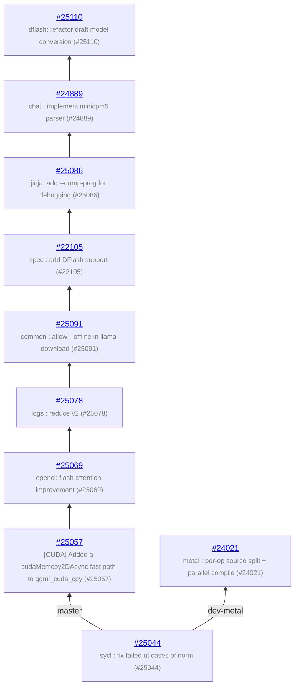

# llama.cpp - feature development info

Auto-generated on 2026-06-28 18:58:20 UTC

**Repo:** https://github.com/ggml-org/llama.cpp

**Common ancestor:** [9bebfcb](https://github.com/ggml-org/llama.cpp/commit/9bebfcb4bc8b12a316e96ae03f33671eac1e72fd)

**Branches:** 2

## Branch Diagram

