# llama.cpp - feature development info

Auto-generated on 2026-07-06 09:42:49 UTC

**Repo:** https://github.com/ggml-org/llama.cpp

**Common ancestor:** [9bebfcb](https://github.com/ggml-org/llama.cpp/commit/9bebfcb4bc8b12a316e96ae03f33671eac1e72fd)

**Branches:** 2

## Branch Diagram

```mermaid
graph BT
    COMMON["<a href='https://github.com/ggml-org/llama.cpp/pull/25044'>#25044</a><br/><span style='font-size:smaller;color:gray'>sycl : fix failed ut cases of norm (#25044)</span>"]
    COMMON -->|master| C_0ed235e
    C_0ed235e["<a href='https://github.com/ggml-org/llama.cpp/pull/25057'>#25057</a><br/><span style='font-size:smaller;color:gray'>[CUDA] Added a cudaMemcpy2DAsync fast path to ggml_cuda_cpy (#25057)</span>"]
    C_0ed235e --> C_ebd048f
    C_ebd048f["<a href='https://github.com/ggml-org/llama.cpp/pull/25069'>#25069</a><br/><span style='font-size:smaller;color:gray'>opencl: flash attention improvement (#25069)</span>"]
    C_ebd048f --> C_27c8bb4
    C_27c8bb4["<a href='https://github.com/ggml-org/llama.cpp/pull/25078'>#25078</a><br/><span style='font-size:smaller;color:gray'>logs : reduce v2 (#25078)</span>"]
    C_27c8bb4 --> C_c1a1c8e
    C_c1a1c8e["<a href='https://github.com/ggml-org/llama.cpp/pull/25091'>#25091</a><br/><span style='font-size:smaller;color:gray'>common : allow --offline in llama download (#25091)</span>"]
    C_c1a1c8e --> C_d1b3425
    C_d1b3425["<a href='https://github.com/ggml-org/llama.cpp/pull/22105'>#22105</a><br/><span style='font-size:smaller;color:gray'>spec : add DFlash support (#22105)</span>"]
    C_d1b3425 --> C_f68a788
    C_f68a788["<a href='https://github.com/ggml-org/llama.cpp/pull/25086'>#25086</a><br/><span style='font-size:smaller;color:gray'>jinja: add --dump-prog for debugging (#25086)</span>"]
    C_f68a788 --> C_c818263
    C_c818263["<a href='https://github.com/ggml-org/llama.cpp/pull/24889'>#24889</a><br/><span style='font-size:smaller;color:gray'>chat : implement minicpm5 parser (#24889)</span>"]
    C_c818263 --> C_fa72bc6
    C_fa72bc6["<a href='https://github.com/ggml-org/llama.cpp/pull/25110'>#25110</a><br/><span style='font-size:smaller;color:gray'>dflash: refactor draft model conversion (#25110)</span>"]
    C_fa72bc6 --> C_7cb8576
    C_7cb8576["<a href='https://github.com/ggml-org/llama.cpp/pull/25084'>#25084</a><br/><span style='font-size:smaller;color:gray'>ui: fix stop and reasoning skip in single-model mode (#25084)</span>"]
    C_7cb8576 --> C_dbdaece
    C_dbdaece["<a href='https://github.com/ggml-org/llama.cpp/pull/24727'>#24727</a><br/><span style='font-size:smaller;color:gray'>Revert 'ui: fix accessibility for hover-gated interactive elements assisted by claude(in debugging and tests) (#24727)' (#25098)</span>"]
    C_dbdaece --> C_b3fed31
    C_b3fed31["<a href='https://github.com/ggml-org/llama.cpp/pull/25105'>#25105</a><br/><span style='font-size:smaller;color:gray'>jinja, chat: add --reasoning-preserve flag (#25105)</span>"]
    C_b3fed31 --> C_277a105
    C_277a105["<a href='https://github.com/ggml-org/llama.cpp/pull/25118'>#25118</a><br/><span style='font-size:smaller;color:gray'>common : remove unused regex-partial (#25118)</span>"]
    C_277a105 --> C_6cb18b2
    C_6cb18b2["<a href='https://github.com/ggml-org/llama.cpp/pull/24879'>#24879</a><br/><span style='font-size:smaller;color:gray'>tools/ui: restore Tailwind scanning in ignored worktrees (#24879)</span>"]
    C_6cb18b2 --> C_8c146a8
    C_8c146a8["<a href='https://github.com/ggml-org/llama.cpp/pull/24162'>#24162</a><br/><span style='font-size:smaller;color:gray'>DeepSeek V4  (#24162)</span>"]
    C_8c146a8 --> C_25a1d63
    C_25a1d63["<a href='https://github.com/ggml-org/llama.cpp/pull/25005'>#25005</a><br/><span style='font-size:smaller;color:gray'>vulkan: use flops instead of weight tensor size for submission heuristic (#25005)</span>"]
    C_25a1d63 --> C_6f4f53f
    C_6f4f53f["<a href='https://github.com/ggml-org/llama.cpp/pull/25131'>#25131</a><br/><span style='font-size:smaller;color:gray'>common : dedup preset and cached model entries in /v1/models (#25131)</span>"]
    C_6f4f53f --> C_86b9470
    C_86b9470["<a href='https://github.com/ggml-org/llama.cpp/pull/20793'>#20793</a><br/><span style='font-size:smaller;color:gray'>Revert 'sched : reintroduce less synchronizations during split compute (#20793)' (#25138)</span>"]
    C_86b9470 --> C_6c5de1c
    C_6c5de1c["<a href='https://github.com/ggml-org/llama.cpp/pull/25143'>#25143</a><br/><span style='font-size:smaller;color:gray'>ggml-webgpu: add support for NVFP4 (#25143)</span>"]
    C_6c5de1c --> C_d9df110
    C_d9df110["<a href='https://github.com/ggml-org/llama.cpp/pull/24588'>#24588</a><br/><span style='font-size:smaller;color:gray'>HIP: use hipBLAS for dense prefill on gfx900, keep MMQ for MoE (#24588)</span>"]
    C_d9df110 --> C_f708a5b
    C_f708a5b["<a href='https://github.com/ggml-org/llama.cpp/pull/24663'>#24663</a><br/><span style='font-size:smaller;color:gray'>vulkan: roll bk loop in matmul for asahi linux (#24663)</span>"]
    C_f708a5b --> C_e495d1e
    C_e495d1e["<a href='https://github.com/ggml-org/llama.cpp/pull/25148'>#25148</a><br/><span style='font-size:smaller;color:gray'>CUDA: fix Gemma E4B MTP FlashAttention (#25148)</span>"]
    C_e495d1e --> C_931eb37
    C_931eb37["<a href='https://github.com/ggml-org/llama.cpp/pull/25103'>#25103</a><br/><span style='font-size:smaller;color:gray'>CUDA: fix get_rows_back for tables with more than 65535 rows (grid-y clamp + stride) (#25103)</span>"]
    C_931eb37 --> C_799fcc0
    C_799fcc0["<a href='https://github.com/ggml-org/llama.cpp/pull/25140'>#25140</a><br/><span style='font-size:smaller;color:gray'>common,server: handle bracketed IPv6 literals in URL authority (#25140)</span>"]
    C_799fcc0 --> C_4f31eed
    C_4f31eed["<a href='https://github.com/ggml-org/llama.cpp/pull/25141'>#25141</a><br/><span style='font-size:smaller;color:gray'>model : register t_layer_inp for qwen3next (#25141)</span>"]
    C_4f31eed --> C_0eca4d4
    C_0eca4d4["<a href='https://github.com/ggml-org/llama.cpp/pull/24945'>#24945</a><br/><span style='font-size:smaller;color:gray'>cuda : prevent integer truncation and overflow errors when using KQ mask strides in flash_attn_mask_to_KV_max kernel (#24945)</span>"]
    C_0eca4d4 --> C_fd1a057
    C_fd1a057["<a href='https://github.com/ggml-org/llama.cpp/pull/25160'>#25160</a><br/><span style='font-size:smaller;color:gray'>opencl: initial q1_0 support (#25160)</span>"]
    C_fd1a057 --> C_7af4279
    C_7af4279["<a href='https://github.com/ggml-org/llama.cpp/pull/25174'>#25174</a><br/><span style='font-size:smaller;color:gray'>ui: Remove PWA navigate fallback to prevent caching API endpoint requests (#25174)</span>"]
    C_7af4279 --> C_9d88e7c
    C_9d88e7c["<a href='https://github.com/ggml-org/llama.cpp/pull/25177'>#25177</a><br/><span style='font-size:smaller;color:gray'>ui Prevent tool messages from incorrectly appending to other conversations (#25177)</span>"]
    C_9d88e7c --> C_6dbc117
    C_6dbc117["<a href='https://github.com/ggml-org/llama.cpp/pull/23961'>#23961</a><br/><span style='font-size:smaller;color:gray'>ggml-cpu: add AVX2 optimization for nvfp4 dot product and use UE4M3 LUT (#23961)</span>"]
    C_6dbc117 --> C_b820cc8
    C_b820cc8["<a href='https://github.com/ggml-org/llama.cpp/pull/25185'>#25185</a><br/><span style='font-size:smaller;color:gray'>CUDA: consistent use of __restrict__ + PDL for FA (#25185)</span>"]
    C_b820cc8 --> C_13e6738
    C_13e6738["<a href='https://github.com/ggml-org/llama.cpp/pull/25085'>#25085</a><br/><span style='font-size:smaller;color:gray'>hexagon: flash attention rework (optimizations, accuracy improvements, etc) (#25085)</span>"]
    C_13e6738 --> C_a6647b1
    C_a6647b1["<a href='https://github.com/ggml-org/llama.cpp/pull/25194'>#25194</a><br/><span style='font-size:smaller;color:gray'>common : use hf primary split as model path (#25194)</span>"]
    C_a6647b1 --> C_4fc4ec5
    C_4fc4ec5["<a href='https://github.com/ggml-org/llama.cpp/pull/23042'>#23042</a><br/><span style='font-size:smaller;color:gray'>opencl: allow loading precompiled binary kernels from library (#23042)</span>"]
    C_4fc4ec5 --> C_fdb1db8
    C_fdb1db8["<a href='https://github.com/ggml-org/llama.cpp/pull/25134'>#25134</a><br/><span style='font-size:smaller;color:gray'>llama : add llama_model_ftype_name() (#25134)</span>"]
    C_fdb1db8 --> C_c8ae9a7
    C_c8ae9a7["<a href='https://github.com/ggml-org/llama.cpp/pull/25218'>#25218</a><br/><span style='font-size:smaller;color:gray'>vendor : update cpp-httplib to 0.49.0 (#25218)</span>"]
    C_c8ae9a7 --> C_5a460de
    C_5a460de["<a href='https://github.com/ggml-org/llama.cpp/pull/23940'>#23940</a><br/><span style='font-size:smaller;color:gray'>Remove redundant CUDA copies after gated_delta_net. (#23940)</span>"]
    C_5a460de --> C_9487528
    C_9487528["<a href='https://github.com/ggml-org/llama.cpp/pull/25239'>#25239</a><br/><span style='font-size:smaller;color:gray'>ui: Add MCP Servers Opt-In for first time visitors (#25239)</span>"]
    C_9487528 --> C_b5315e1
    C_b5315e1["<a href='https://github.com/ggml-org/llama.cpp/pull/25241'>#25241</a><br/><span style='font-size:smaller;color:gray'>server + ui: ping silent SSE streams every 1s and kick only after 3s so slow prefill never drops healthy connections (#25241)</span>"]
    C_b5315e1 --> C_067de93
    C_067de93["<a href='https://github.com/ggml-org/llama.cpp/pull/25242'>#25242</a><br/><span style='font-size:smaller;color:gray'>ui: align persisted config with strict server schema and enable thinking by default (#25242)</span>"]
    C_067de93 --> C_75a48a9
    C_75a48a9["<a href='https://github.com/ggml-org/llama.cpp/pull/25267'>#25267</a><br/><span style='font-size:smaller;color:gray'>cuda: enable topk-moe fusion for 288 experts (#25267)</span>"]
    C_75a48a9 --> C_152d337
    C_152d337["<a href='https://github.com/ggml-org/llama.cpp/pull/25246'>#25246</a><br/><span style='font-size:smaller;color:gray'>spec: support spec-draft-p-min in DFlash (#25246)</span>"]
    C_152d337 --> C_f113e02
    C_f113e02["<a href='https://github.com/ggml-org/llama.cpp/pull/25137'>#25137</a><br/><span style='font-size:smaller;color:gray'>ui: strip path and weight extension from model id in single model mode (#25137)</span>"]
    C_f113e02 --> C_d4cff11
    C_d4cff11["<a href='https://github.com/ggml-org/llama.cpp/pull/25225'>#25225</a><br/><span style='font-size:smaller;color:gray'>ui: Improve performance when streaming (#25225)</span>"]
    C_d4cff11 --> C_2d97363
    C_2d97363["<a href='https://github.com/ggml-org/llama.cpp/pull/25238'>#25238</a><br/><span style='font-size:smaller;color:gray'>chat: trim messages sent to StepFun parser (fixes long reasoning loops) (#25238)</span>"]
    C_2d97363 --> C_ef2d770
    C_ef2d770["<a href='https://github.com/ggml-org/llama.cpp/pull/25247'>#25247</a><br/><span style='font-size:smaller;color:gray'>ggml : fix broken CPU concat implementation for quantized types (#25247)</span>"]
    C_ef2d770 --> C_6658925
    C_6658925["<a href='https://github.com/ggml-org/llama.cpp/pull/25132'>#25132</a><br/><span style='font-size:smaller;color:gray'>ui: add sync blocks so display/behavior settings can be set via --ui-config-file (#25132)</span>"]
    C_6658925 --> C_a410713
    C_a410713["<a href='https://github.com/ggml-org/llama.cpp/pull/25215'>#25215</a><br/><span style='font-size:smaller;color:gray'>llama : add guard for K/V rotation input when buffer is unallocated (#25215)</span>"]
    C_a410713 --> C_78d2f52
    C_78d2f52["<a href='https://github.com/ggml-org/llama.cpp/pull/25303'>#25303</a><br/><span style='font-size:smaller;color:gray'>cuda : concat implementation for quantized types (#25303)</span>"]
    C_78d2f52 --> C_7a63fde
    C_7a63fde["<a href='https://github.com/ggml-org/llama.cpp/pull/24491'>#24491</a><br/><span style='font-size:smaller;color:gray'>ggml: Update VMM Pool allocation ggml-cuda.cu - Turing P2P access fix (fixes #24489) (#24491)</span>"]
    C_7a63fde --> C_4b2a0cd
    C_4b2a0cd["<a href='https://github.com/ggml-org/llama.cpp/pull/25028'>#25028</a><br/><span style='font-size:smaller;color:gray'>ggml : fix tensor-parallel + -ncmoe crash on MoE models (#25028)</span>"]
    C_4b2a0cd --> C_3e5036f
    C_3e5036f["<a href='https://github.com/ggml-org/llama.cpp/pull/25276'>#25276</a><br/><span style='font-size:smaller;color:gray'>abort if we see a multi buffer (#25276)</span>"]
    C_3e5036f --> C_2da6686
    C_2da6686["<a href='https://github.com/ggml-org/llama.cpp/pull/24814'>#24814</a><br/><span style='font-size:smaller;color:gray'>Fix stale tensor-split params for draft models (#24814)</span>"]
    C_2da6686 --> C_72874f5
    C_72874f5["<a href='https://github.com/ggml-org/llama.cpp/pull/25310'>#25310</a><br/><span style='font-size:smaller;color:gray'>ggml-cuda: optimize conv_transpose_1d indexing (#25310)</span>"]
    C_72874f5 --> C_898b088
    C_898b088["<a href='https://github.com/ggml-org/llama.cpp/pull/25298'>#25298</a><br/><span style='font-size:smaller;color:gray'>ui: fake 200 for proxy DELETE req (#25298)</span>"]
    C_898b088 --> C_d06ddd3
    C_d06ddd3["<a href='https://github.com/ggml-org/llama.cpp/pull/23862'>#23862</a><br/><span style='font-size:smaller;color:gray'>ggml-hip: enable -ffast-math for HIP builds (#23862)</span>"]
    C_d06ddd3 --> C_4871961
    C_4871961["<a href='https://github.com/ggml-org/llama.cpp/pull/25280'>#25280</a><br/><span style='font-size:smaller;color:gray'>scripts : use HF_TOKEN when downloading UI assets (#25280)</span>"]
    C_4871961 --> C_d80e878
    C_d80e878["<a href='https://github.com/ggml-org/llama.cpp/pull/25307'>#25307</a><br/><span style='font-size:smaller;color:gray'>ui: restore Ctrl+B sidebar toggle shortcut (#25307)</span>"]
    C_d80e878 --> C_86961ef
    C_86961ef["<a href='https://github.com/ggml-org/llama.cpp/pull/25245'>#25245</a><br/><span style='font-size:smaller;color:gray'>vulkan: fix 32-bit integer overflow in CEIL_DIV (#25245)</span>"]
    COMMON -->|dev-metal| C_f7c1df6
    C_f7c1df6["<a href='https://github.com/ggml-org/llama.cpp/pull/24021'>#24021</a><br/><span style='font-size:smaller;color:gray'>metal : per-op source split + parallel compile (#24021)</span>"]
```

