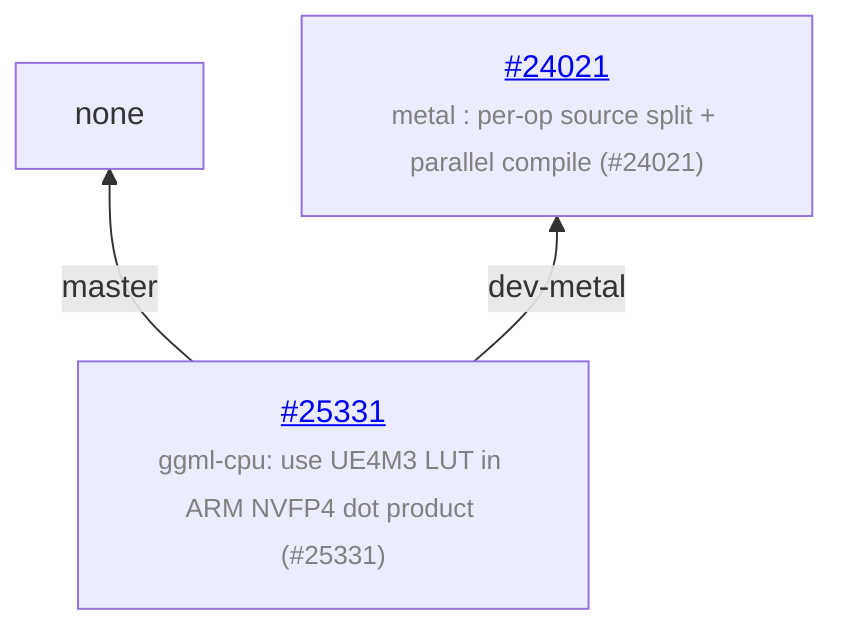

# llama.cpp - feature development info

Auto-generated on 2026-07-06 13:12:25 UTC

**Repo:** https://github.com/ggml-org/llama.cpp

**Common ancestor:** [20a04b2](https://github.com/ggml-org/llama.cpp/commit/20a04b22063020cd0f29b7781f5352d7a6abf786)

**Branches:** 2

## Branch Diagram

