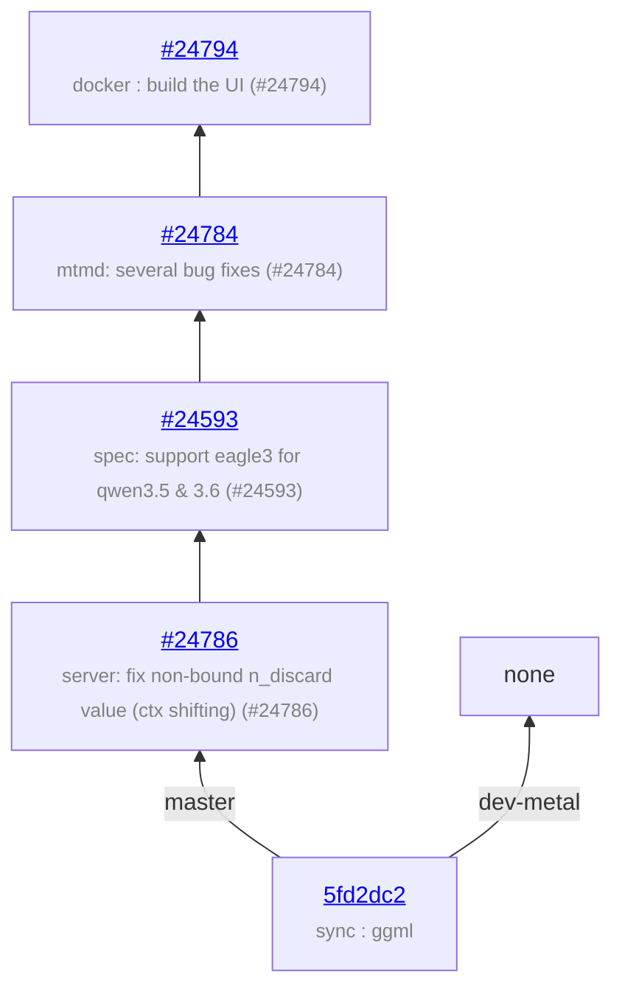

# llama.cpp - feature development info

Auto-generated on 2026-06-19 14:04:49 UTC

**Repo:** https://github.com/ggml-org/llama.cpp

**Common ancestor:** [5fd2dc2](https://github.com/ggml-org/llama.cpp/commit/5fd2dc2c41c342a75c26f9756ca6b1814ed05fb4)

**Branches:** 2

## Branch Diagram

