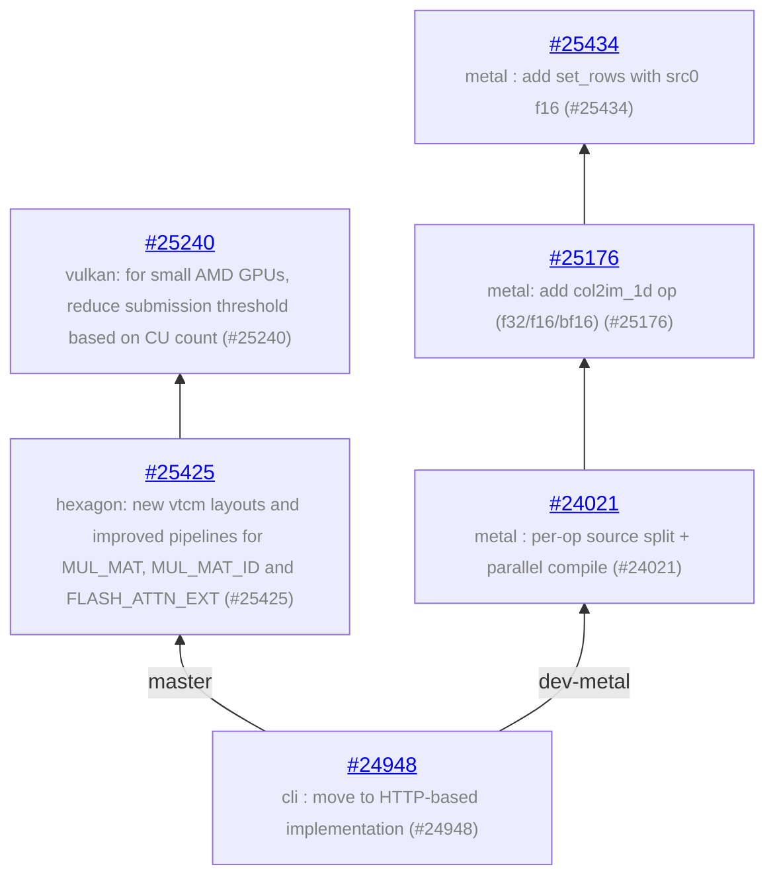

# llama.cpp - feature development info

Auto-generated on 2026-07-08 16:18:15 UTC

**Repo:** https://github.com/ggml-org/llama.cpp

**Common ancestor:** [c264f65](https://github.com/ggml-org/llama.cpp/commit/c264f65ff9d8f592a590e3221f712a8883b7dd81)

**Branches:** 2

## Branch Diagram

