# llama.cpp - feature development info

Auto-generated on 2026-07-11 10:47:53 UTC

**Repo:** https://github.com/ggml-org/llama.cpp

**Common ancestor:** [0badc06](https://github.com/ggml-org/llama.cpp/commit/0badc06ab53a8eb96e01242b92ec1365c4465a2a)

**Branches:** 2

## Branch Diagram

```mermaid
graph BT
    COMMON["<a href='https://github.com/ggml-org/llama.cpp/commit/0badc06ab53a8eb96e01242b92ec1365c4465a2a'>0badc06</a><br/><span style='font-size:smaller;color:gray'>sync : ggml</span>"]
    COMMON -->|master| C_a935fbf
    C_a935fbf["<a href='https://github.com/ggml-org/llama.cpp/pull/25500'>#25500</a><br/><span style='font-size:smaller;color:gray'>server: remove loading.html (#25500)</span>"]
    C_a935fbf --> C_9f623c6
    C_9f623c6["<a href='https://github.com/ggml-org/llama.cpp/pull/24874'>#24874</a><br/><span style='font-size:smaller;color:gray'>ui: use server modalities in non-router mode (#24874)</span>"]
    C_9f623c6 --> C_07d9378
    C_07d9378["<a href='https://github.com/ggml-org/llama.cpp/pull/25492'>#25492</a><br/><span style='font-size:smaller;color:gray'>feat: pre-select models in the webui using alias (#25492)</span>"]
    C_07d9378 --> C_3e706dd
    C_3e706dd["<a href='https://github.com/ggml-org/llama.cpp/pull/24717'>#24717</a><br/><span style='font-size:smaller;color:gray'>mtmd: deepseek-ocr v1 multi-tile (#24717)</span>"]
    C_3e706dd --> C_22b69b6
    C_22b69b6["<a href='https://github.com/ggml-org/llama.cpp/pull/25527'>#25527</a><br/><span style='font-size:smaller;color:gray'>arg: prevent duplicate spec model downloads (#25527)</span>"]
    C_22b69b6 --> C_67776ea
    C_67776ea["<a href='https://github.com/ggml-org/llama.cpp/pull/25512'>#25512</a><br/><span style='font-size:smaller;color:gray'>hexagon: improve ARGSORT performance for small tensors (#25512)</span>"]
    C_67776ea --> C_c749cb0
    C_c749cb0["<a href='https://github.com/ggml-org/llama.cpp/pull/24710'>#24710</a><br/><span style='font-size:smaller;color:gray'>llama : make tensor-split regex patterns static (#24710)</span>"]
    C_c749cb0 --> C_4f37f51
    C_4f37f51["<a href='https://github.com/ggml-org/llama.cpp/pull/25538'>#25538</a><br/><span style='font-size:smaller;color:gray'>server: accept null sampling params (#25538)</span>"]
    C_4f37f51 --> C_1d1d9a9
    C_1d1d9a9["<a href='https://github.com/ggml-org/llama.cpp/pull/25537'>#25537</a><br/><span style='font-size:smaller;color:gray'>opencl: add int8 dp4 dense and MoE prefill optimization for Adreno GPUs (#25537)</span>"]
    C_1d1d9a9 --> C_76f2798
    C_76f2798["<a href='https://github.com/ggml-org/llama.cpp/pull/24877'>#24877</a><br/><span style='font-size:smaller;color:gray'>Vulkan: route large matmuls to medium tile on Adreno (#24877)</span>"]
    C_76f2798 --> C_00f5442
    C_00f5442["<a href='https://github.com/ggml-org/llama.cpp/pull/24231'>#24231</a><br/><span style='font-size:smaller;color:gray'>ggml : add GGML_OP_LIGHTNING_INDEXER that implements DeepSeek V3.2/V4 lightning indexer (#24231)</span>"]
    C_00f5442 --> C_ea1f7bb
    C_ea1f7bb["<a href='https://github.com/ggml-org/llama.cpp/pull/25541'>#25541</a><br/><span style='font-size:smaller;color:gray'>server: refactor server_stream (#25541)</span>"]
    C_ea1f7bb --> C_c92e806
    C_c92e806["<a href='https://github.com/ggml-org/llama.cpp/pull/25526'>#25526</a><br/><span style='font-size:smaller;color:gray'>server: allow stream for exec_shell_command (#25526)</span>"]
    COMMON -->|dev-metal| C_3835214
    C_3835214["<a href='https://github.com/ggml-org/llama.cpp/pull/24021'>#24021</a><br/><span style='font-size:smaller;color:gray'>metal : per-op source split + parallel compile (#24021)</span>"]
    C_3835214 --> C_de75555
    C_de75555["<a href='https://github.com/ggml-org/llama.cpp/pull/25176'>#25176</a><br/><span style='font-size:smaller;color:gray'>metal: add col2im_1d op (f32/f16/bf16) (#25176)</span>"]
    C_de75555 --> C_e3ea5de
    C_e3ea5de["<a href='https://github.com/ggml-org/llama.cpp/pull/25434'>#25434</a><br/><span style='font-size:smaller;color:gray'>metal : add set_rows with src0 f16 (#25434)</span>"]
    C_e3ea5de --> C_65dd913
    C_65dd913["<a href='https://github.com/ggml-org/llama.cpp/pull/21565'>#21565</a><br/><span style='font-size:smaller;color:gray'>metal : add CONV_2D_DW (depthwise convolution) support (#21565)</span>"]
```

