# llama.cpp - feature development info

Auto-generated on 2026-06-27 08:11:15 UTC

**Repo:** https://github.com/ggml-org/llama.cpp

**Common ancestor:** [f8cc15f](https://github.com/ggml-org/llama.cpp/commit/f8cc15f163e784c58fe13aee58ebc03055bb0c40)

**Branches:** 2

## Branch Diagram

```mermaid
graph BT
    COMMON["<a href='https://github.com/ggml-org/llama.cpp/pull/24838'>#24838</a><br/><span style='font-size:smaller;color:gray'>[SYCL] support bf16 on bin_bcast OP and unary OPs (#24838)</span>"]
    COMMON -->|master| C_099b579
    C_099b579["<a href='https://github.com/ggml-org/llama.cpp/pull/24878'>#24878</a><br/><span style='font-size:smaller;color:gray'>ui: model status and load progress via /models/sse feed (#24878)</span>"]
    C_099b579 --> C_6ee0f65
    C_6ee0f65["<a href='https://github.com/ggml-org/llama.cpp/pull/24299'>#24299</a><br/><span style='font-size:smaller;color:gray'>server: refactor/generalize input file schema (#24299)</span>"]
    C_6ee0f65 --> C_721354f
    C_721354f["<a href='https://github.com/ggml-org/llama.cpp/pull/24834'>#24834</a><br/><span style='font-size:smaller;color:gray'>server: (router) move model downloading to dedicated process (#24834)</span>"]
    C_721354f --> C_9c0ac88
    C_9c0ac88["<a href='https://github.com/ggml-org/llama.cpp/pull/24766'>#24766</a><br/><span style='font-size:smaller;color:gray'>ui: Prioritize favorite models in model selection (#24766)</span>"]
    C_9c0ac88 --> C_dec5ca5
    C_dec5ca5["<a href='https://github.com/ggml-org/llama.cpp/pull/24882'>#24882</a><br/><span style='font-size:smaller;color:gray'>server : Add id to tool call responses api (#24882)</span>"]
    C_dec5ca5 --> C_23ee879
    C_23ee879["<a href='https://github.com/ggml-org/llama.cpp/pull/24923'>#24923</a><br/><span style='font-size:smaller;color:gray'>opencl: q8_0 gemv precision improvement (#24923)</span>"]
    C_23ee879 --> C_73618f2
    C_73618f2["<a href='https://github.com/ggml-org/llama.cpp/pull/24176'>#24176</a><br/><span style='font-size:smaller;color:gray'>server: improve user message detection and create checkpoints at every user message (#24176)</span>"]
    C_73618f2 --> C_035cd8f
    C_035cd8f["<a href='https://github.com/ggml-org/llama.cpp/pull/24930'>#24930</a><br/><span style='font-size:smaller;color:gray'>codeowners: add yomaytk to ggml-webgpu (#24930)</span>"]
    C_035cd8f --> C_7c90850
    C_7c90850["<a href='https://github.com/ggml-org/llama.cpp/pull/24811'>#24811</a><br/><span style='font-size:smaller;color:gray'>ggml-webgpu: improve MTP inference by using mat-vec path for small batches (#24811)</span>"]
    C_7c90850 --> C_a3900a6
    C_a3900a6["<a href='https://github.com/ggml-org/llama.cpp/pull/24818'>#24818</a><br/><span style='font-size:smaller;color:gray'>model: Granite Speech Plus (#24818)</span>"]
    C_a3900a6 --> C_c926ad0
    C_c926ad0["<a href='https://github.com/ggml-org/llama.cpp/pull/24444'>#24444</a><br/><span style='font-size:smaller;color:gray'>vulkan: link ggml-cpu when GGML_VULKAN_CHECK_RESULTS / RUN_TESTS are enabled (#24444)</span>"]
    C_c926ad0 --> C_75ad0b2
    C_75ad0b2["<a href='https://github.com/ggml-org/llama.cpp/pull/24938'>#24938</a><br/><span style='font-size:smaller;color:gray'>server: fix remote preset handling, add test (#24938)</span>"]
    C_75ad0b2 --> C_0eb874d
    C_0eb874d["<a href='https://github.com/ggml-org/llama.cpp/pull/24689'>#24689</a><br/><span style='font-size:smaller;color:gray'>vulkan: make mul_mm ALIGNED a spec constant (#24689)</span>"]
    C_0eb874d --> C_c560636
    C_c560636["<a href='https://github.com/ggml-org/llama.cpp/pull/24612'>#24612</a><br/><span style='font-size:smaller;color:gray'>vulkan: support CONV_3D (#24612)</span>"]
    C_c560636 --> C_92e854a
    C_92e854a["<a href='https://github.com/ggml-org/llama.cpp/pull/24883'>#24883</a><br/><span style='font-size:smaller;color:gray'>vulkan: Support GET_ROWS_BACK (#24883)</span>"]
    C_92e854a --> C_72a9269
    C_72a9269["<a href='https://github.com/ggml-org/llama.cpp/pull/24582'>#24582</a><br/><span style='font-size:smaller;color:gray'>vulkan: support all backend tests for SQR/SQRT/SIN/COS/CLAMP/LEAKY_RELU/NORM (#24582)</span>"]
    C_72a9269 --> C_be4a6a6
    C_be4a6a6["<a href='https://github.com/ggml-org/llama.cpp/pull/24922'>#24922</a><br/><span style='font-size:smaller;color:gray'>server : check draft context creation error (#24922)</span>"]
    C_be4a6a6 --> C_ac4105d
    C_ac4105d["<a href='https://github.com/ggml-org/llama.cpp/pull/24909'>#24909</a><br/><span style='font-size:smaller;color:gray'>vulkan: Apply bias before softmax in FA, to avoid overflow (#24909)</span>"]
    C_ac4105d --> C_88636e1
    C_88636e1["<a href='https://github.com/ggml-org/llama.cpp/pull/24913'>#24913</a><br/><span style='font-size:smaller;color:gray'>model : Add LFM2.5-ColBERT-350M and LFM2.5-Embedding-350M (#24913)</span>"]
    C_88636e1 --> C_ef9c13d
    C_ef9c13d["<a href='https://github.com/ggml-org/llama.cpp/pull/24897'>#24897</a><br/><span style='font-size:smaller;color:gray'>ui: New Logo + Navigation cleanup & Mobile UI/UX improvements (#24897)</span>"]
    C_ef9c13d --> C_00139b6
    C_00139b6["<a href='https://github.com/ggml-org/llama.cpp/pull/24931'>#24931</a><br/><span style='font-size:smaller;color:gray'>ui: loading bar below the model picker (#24931)</span>"]
    C_00139b6 --> C_1191758
    C_1191758["<a href='https://github.com/ggml-org/llama.cpp/pull/24450'>#24450</a><br/><span style='font-size:smaller;color:gray'>vulkan: fail the build when a shader fails to compile (#24450)</span>"]
    C_1191758 --> C_51eae8c
    C_51eae8c["<a href='https://github.com/ggml-org/llama.cpp/pull/24872'>#24872</a><br/><span style='font-size:smaller;color:gray'>vulkan: allow reducing the graph submission batches to avoid timeouts (#24872)</span>"]
    C_51eae8c --> C_fb40104
    C_fb40104["<a href='https://github.com/ggml-org/llama.cpp/pull/24968'>#24968</a><br/><span style='font-size:smaller;color:gray'>common: remove unused json-partial (#24968)</span>"]
    C_fb40104 --> C_894bb27
    C_894bb27["<a href='https://github.com/ggml-org/llama.cpp/pull/24969'>#24969</a><br/><span style='font-size:smaller;color:gray'>mtmd: model: unlimited-ocr: converter + parity test (#24969)</span>"]
    C_894bb27 --> C_8be759e
    C_8be759e["<a href='https://github.com/ggml-org/llama.cpp/pull/24954'>#24954</a><br/><span style='font-size:smaller;color:gray'>hexagon: MUL_MAT and MUL_MAT_ID rework : 32x32 tiled weight repack, kernel-params, cached graphs (#24954)</span>"]
    C_8be759e --> C_09cedfd
    C_09cedfd["<a href='https://github.com/ggml-org/llama.cpp/pull/24973'>#24973</a><br/><span style='font-size:smaller;color:gray'>chat: harden caps check (#24973)</span>"]
    C_09cedfd --> C_fdb2c11
    C_fdb2c11["<a href='https://github.com/ggml-org/llama.cpp/pull/24965'>#24965</a><br/><span style='font-size:smaller;color:gray'>opencl: support non-contig rows in norm (#24965)</span>"]
    C_fdb2c11 --> C_9c10954
    C_9c10954["<a href='https://github.com/ggml-org/llama.cpp/pull/24900'>#24900</a><br/><span style='font-size:smaller;color:gray'>sycl : fix the failed UT cases of conv_3d (#24900)</span>"]
    C_9c10954 --> C_e9fb3b3
    C_e9fb3b3["<a href='https://github.com/ggml-org/llama.cpp/pull/24152'>#24152</a><br/><span style='font-size:smaller;color:gray'>sycl : support --split-mode tensor (#24152)</span>"]
    C_e9fb3b3 --> C_b3ce5ce
    C_b3ce5ce["<a href='https://github.com/ggml-org/llama.cpp/pull/24986'>#24986</a><br/><span style='font-size:smaller;color:gray'>quant : fix quantizing moe with mtp (#24986)</span>"]
    C_b3ce5ce --> C_e12a012
    C_e12a012["<a href='https://github.com/ggml-org/llama.cpp/pull/21935'>#21935</a><br/><span style='font-size:smaller;color:gray'>build: include libmtmd in Apple XCFramework (#21935)</span>"]
    C_e12a012 --> C_fdbd6ab
    C_fdbd6ab["<a href='https://github.com/ggml-org/llama.cpp/pull/24935'>#24935</a><br/><span style='font-size:smaller;color:gray'>tests : synchronize contexts at end of test-thread-safety (#24935)</span>"]
    C_fdbd6ab --> C_3e61ea0
    C_3e61ea0["<a href='https://github.com/ggml-org/llama.cpp/pull/24979'>#24979</a><br/><span style='font-size:smaller;color:gray'>ui: fix always-show-sidebar-on-desktop setting after navigation refactor (#24979)</span>"]
    C_3e61ea0 --> C_f728ada
    C_f728ada["<a href='https://github.com/ggml-org/llama.cpp/pull/24706'>#24706</a><br/><span style='font-size:smaller;color:gray'>ggml : address integer overflows in binary ops CUDA implementation (#24706)</span>"]
    C_f728ada --> C_683b04c
    C_683b04c["<a href='https://github.com/ggml-org/llama.cpp/pull/24982'>#24982</a><br/><span style='font-size:smaller;color:gray'>app : add the llama download subcommand (#24982)</span>"]
    C_683b04c --> C_e8ecce5
    C_e8ecce5["<a href='https://github.com/ggml-org/llama.cpp/pull/24977'>#24977</a><br/><span style='font-size:smaller;color:gray'>docs : Eagle3 qwen3 draft model support (#24977)</span>"]
    C_e8ecce5 --> C_60bc886
    C_60bc886["<a href='https://github.com/ggml-org/llama.cpp/pull/24980'>#24980</a><br/><span style='font-size:smaller;color:gray'>common: refactor model handling (#24980)</span>"]
    C_60bc886 --> C_099bf06
    C_099bf06["<a href='https://github.com/ggml-org/llama.cpp/pull/24920'>#24920</a><br/><span style='font-size:smaller;color:gray'>misc: update lables (#24920)</span>"]
    C_099bf06 --> C_e9d1b76
    C_e9d1b76["<a href='https://github.com/ggml-org/llama.cpp/pull/24970'>#24970</a><br/><span style='font-size:smaller;color:gray'>server: use status code 403 for disabled features (#24970)</span>"]
    C_e9d1b76 --> C_c7cddef
    C_c7cddef["<a href='https://github.com/ggml-org/llama.cpp/pull/25012'>#25012</a><br/><span style='font-size:smaller;color:gray'>misc: fix labeler (#25012)</span>"]
    C_c7cddef --> C_1ec44d1
    C_1ec44d1["<a href='https://github.com/ggml-org/llama.cpp/pull/25000'>#25000</a><br/><span style='font-size:smaller;color:gray'>CUDA: Various fixes to `cpy.cu` (#25000)</span>"]
    C_1ec44d1 --> C_9d5d882
    C_9d5d882["<a href='https://github.com/ggml-org/llama.cpp/pull/25008'>#25008</a><br/><span style='font-size:smaller;color:gray'>model : Add label for LFM2.5-230M (#25008)</span>"]
    C_9d5d882 --> C_beac530
    C_beac530["<a href='https://github.com/ggml-org/llama.cpp/pull/25018'>#25018</a><br/><span style='font-size:smaller;color:gray'>xcframework : disable mtmd video on i/tv/visionos (#25018)</span>"]
    C_beac530 --> C_5c7c22c
    C_5c7c22c["<a href='https://github.com/ggml-org/llama.cpp/pull/25016'>#25016</a><br/><span style='font-size:smaller;color:gray'>opencl: flush profiling batch at shutdown for incomplete batches (#25016)</span>"]
    C_5c7c22c --> C_960d628
    C_960d628["<a href='https://github.com/ggml-org/llama.cpp/pull/23082'>#23082</a><br/><span style='font-size:smaller;color:gray'>mamba2: remove hardcoded 2x expansion factor and invalid d_inner % d_state check (#23082)</span>"]
    C_960d628 --> C_f818065
    C_f818065["<a href='https://github.com/ggml-org/llama.cpp/pull/24426'>#24426</a><br/><span style='font-size:smaller;color:gray'>CUDA: batch out_prod broadcast (dps2>1) path with cublasSgemmBatched (#24426)</span>"]
    C_f818065 --> C_b11f7c1
    C_b11f7c1["<a href='https://github.com/ggml-org/llama.cpp/pull/25013'>#25013</a><br/><span style='font-size:smaller;color:gray'>mtmd: add more validations (#25013)</span>"]
    C_b11f7c1 --> C_e7e3f35
    C_e7e3f35["<a href='https://github.com/ggml-org/llama.cpp/pull/24941'>#24941</a><br/><span style='font-size:smaller;color:gray'>sycl : clamp softmax input to avoid underflow (#24941)</span>"]
    C_e7e3f35 --> C_1a87dcd
    C_1a87dcd["<a href='https://github.com/ggml-org/llama.cpp/pull/23226'>#23226</a><br/><span style='font-size:smaller;color:gray'>server + ui: SSE Replay Buffer (#23226)</span>"]
    C_1a87dcd --> C_c16c35b
    C_c16c35b["<a href='https://github.com/ggml-org/llama.cpp/pull/24699'>#24699</a><br/><span style='font-size:smaller;color:gray'>ggml-cpu: fix SVE leftover path in ggml_vec_dot_f32 (#24699)</span>"]
    C_c16c35b --> C_2f18fe1
    C_2f18fe1["<a href='https://github.com/ggml-org/llama.cpp/pull/25033'>#25033</a><br/><span style='font-size:smaller;color:gray'>CUDA: add cublasSgemmBatched mapping for HIP/MUSA vendor headers (#25033)</span>"]
    C_2f18fe1 --> C_9df0680
    C_9df0680["<a href='https://github.com/ggml-org/llama.cpp/pull/24924'>#24924</a><br/><span style='font-size:smaller;color:gray'>vulkan: Workaround compiler bug in conv2d coopmat2 path (#24924)</span>"]
    C_9df0680 --> C_ded1561
    C_ded1561["<a href='https://github.com/ggml-org/llama.cpp/pull/24727'>#24727</a><br/><span style='font-size:smaller;color:gray'>ui: fix accessibility for hover-gated interactive elements assisted by claude(in debugging and tests) (#24727)</span>"]
    C_ded1561 --> C_5a6a0dd
    C_5a6a0dd["<a href='https://github.com/ggml-org/llama.cpp/pull/24404'>#24404</a><br/><span style='font-size:smaller;color:gray'>vulkan: add INTEL_XE1 arch enum and enable coopmat1 on Intel Xe-LPG Plus (#24404)</span>"]
    C_5a6a0dd --> C_487a6cc
    C_487a6cc["<a href='https://github.com/ggml-org/llama.cpp/pull/22933'>#22933</a><br/><span style='font-size:smaller;color:gray'>vulkan: opt mul_mat_vecq for mi50 (#22933)</span>"]
    C_487a6cc --> C_96183e9
    C_96183e9["<a href='https://github.com/ggml-org/llama.cpp/commit/96183e9'>96183e9</a><br/><span style='font-size:smaller;color:gray'>ggml : bump version to 0.15.3 (ggml/1550)</span>"]
    C_96183e9 --> C_e7ea94a
    C_e7ea94a["<a href='https://github.com/ggml-org/llama.cpp/commit/e7ea94a'>e7ea94a</a><br/><span style='font-size:smaller;color:gray'>sync : ggml</span>"]
    C_e7ea94a --> C_5397c36
    C_5397c36["<a href='https://github.com/ggml-org/llama.cpp/pull/24974'>#24974</a><br/><span style='font-size:smaller;color:gray'>openvino: Update to OV 2026.2.1, self-contained release packages, operator improvements (#24974)</span>"]
    C_5397c36 --> C_024930c
    C_024930c["<a href='https://github.com/ggml-org/llama.cpp/pull/25043'>#25043</a><br/><span style='font-size:smaller;color:gray'>arg: fix handling --spec-draft-hf and --hf-repo-v (#25043)</span>"]
    C_024930c --> C_5d8ccdf
    C_5d8ccdf["<a href='https://github.com/ggml-org/llama.cpp/pull/25035'>#25035</a><br/><span style='font-size:smaller;color:gray'>devops : add llama in all docker images (#25035)</span>"]
    C_5d8ccdf --> C_3fc4e10
    C_3fc4e10["<a href='https://github.com/ggml-org/llama.cpp/pull/20793'>#20793</a><br/><span style='font-size:smaller;color:gray'>sched : reintroduce less synchronizations during split compute (#20793)</span>"]
    C_3fc4e10 --> C_050ee92
    C_050ee92["<a href='https://github.com/ggml-org/llama.cpp/pull/25054'>#25054</a><br/><span style='font-size:smaller;color:gray'>app : allow --version, --licenses & --help (#25054)</span>"]
    C_050ee92 --> C_83d385b
    C_83d385b["<a href='https://github.com/ggml-org/llama.cpp/pull/25075'>#25075</a><br/><span style='font-size:smaller;color:gray'>tests : fix test-chat-template --no-common option (#25075)</span>"]
    C_83d385b --> C_0275c0f
    C_0275c0f["<a href='https://github.com/ggml-org/llama.cpp/pull/25022'>#25022</a><br/><span style='font-size:smaller;color:gray'>ci : add windows-openvino to check-release (#25022)</span>"]
    C_0275c0f --> C_c299a92
    C_c299a92["<a href='https://github.com/ggml-org/llama.cpp/pull/25045'>#25045</a><br/><span style='font-size:smaller;color:gray'>binaries : Improve rpc-server and export-graph-ops names. (#25045)</span>"]
    COMMON -->|dev-metal| C_bec3083
    C_bec3083["<a href='https://github.com/ggml-org/llama.cpp/pull/24021'>#24021</a><br/><span style='font-size:smaller;color:gray'>metal : per-op source split + parallel compile (#24021)</span>"]
```

