# llama.cpp - feature development info

Auto-generated on 2026-06-22 07:37:37 UTC

**Repo:** https://github.com/ggml-org/llama.cpp

**Common ancestor:** [5fd2dc2](https://github.com/ggml-org/llama.cpp/commit/5fd2dc2c41c342a75c26f9756ca6b1814ed05fb4)

**Branches:** 2

## Branch Diagram

```mermaid
graph BT
    COMMON["<a href='https://github.com/ggml-org/llama.cpp/commit/5fd2dc2c41c342a75c26f9756ca6b1814ed05fb4'>5fd2dc2</a><br/><span style='font-size:smaller;color:gray'>sync : ggml</span>"]
    COMMON -->|master| C_159d093
    C_159d093["<a href='https://github.com/ggml-org/llama.cpp/pull/24786'>#24786</a><br/><span style='font-size:smaller;color:gray'>server: fix non-bound n_discard value (ctx shifting) (#24786)</span>"]
    C_159d093 --> C_b14e3fb
    C_b14e3fb["<a href='https://github.com/ggml-org/llama.cpp/pull/24593'>#24593</a><br/><span style='font-size:smaller;color:gray'>spec: support eagle3 for qwen3.5 & 3.6 (#24593)</span>"]
    C_b14e3fb --> C_e2e7a9b
    C_e2e7a9b["<a href='https://github.com/ggml-org/llama.cpp/pull/24784'>#24784</a><br/><span style='font-size:smaller;color:gray'>mtmd: several bug fixes (#24784)</span>"]
    C_e2e7a9b --> C_38724ab
    C_38724ab["<a href='https://github.com/ggml-org/llama.cpp/pull/24794'>#24794</a><br/><span style='font-size:smaller;color:gray'>docker : build the UI (#24794)</span>"]
    C_38724ab --> C_8c2d6f6
    C_8c2d6f6["<a href='https://github.com/ggml-org/llama.cpp/pull/24801'>#24801</a><br/><span style='font-size:smaller;color:gray'>server: add --agent arg, remove redundant webui naming compat (#24801)</span>"]
    C_8c2d6f6 --> C_0d2d9cc
    C_0d2d9cc["<a href='https://github.com/ggml-org/llama.cpp/pull/24787'>#24787</a><br/><span style='font-size:smaller;color:gray'>vendor : update cpp-httplib to 0.48.0 (#24787)</span>"]
    C_0d2d9cc --> C_fabde3b
    C_fabde3b["<a href='https://github.com/ggml-org/llama.cpp/pull/23168'>#23168</a><br/><span style='font-size:smaller;color:gray'>arg: Add comment line support to --api-key-file (#23168)</span>"]
    C_fabde3b --> C_175147e
    C_175147e["<a href='https://github.com/ggml-org/llama.cpp/pull/24817'>#24817</a><br/><span style='font-size:smaller;color:gray'>server: remove all internal mentions about 'webui' (#24817)</span>"]
    C_175147e --> C_e475fa2
    C_e475fa2["<a href='https://github.com/ggml-org/llama.cpp/pull/24779'>#24779</a><br/><span style='font-size:smaller;color:gray'>mtmd, arg: fix utf8 handling on windows (#24779)</span>"]
    C_e475fa2 --> C_4b48a53
    C_4b48a53["<a href='https://github.com/ggml-org/llama.cpp/pull/24796'>#24796</a><br/><span style='font-size:smaller;color:gray'>server : optimize get_token_probabilities (#24796)</span>"]
    C_4b48a53 --> C_2b686a9
    C_2b686a9["<a href='https://github.com/ggml-org/llama.cpp/pull/24821'>#24821</a><br/><span style='font-size:smaller;color:gray'>server: refactor child --> router communication (#24821)</span>"]
    C_2b686a9 --> C_f449e05
    C_f449e05["<a href='https://github.com/ggml-org/llama.cpp/commit/f449e05'>f449e05</a><br/><span style='font-size:smaller;color:gray'>ggml-webgpu: add adapter toggles for F16 on Vulkan + NVIDIA</span>"]
    C_f449e05 --> C_f4043fe
    C_f4043fe["<a href='https://github.com/ggml-org/llama.cpp/pull/24833'>#24833</a><br/><span style='font-size:smaller;color:gray'>convert : more consistent handling of rope_parameters (#24833)</span>"]
    C_f4043fe --> C_37a77fb
    C_37a77fb["<a href='https://github.com/ggml-org/llama.cpp/pull/24806'>#24806</a><br/><span style='font-size:smaller;color:gray'>ggml : optimize AMX (#24806)</span>"]
    C_37a77fb --> C_796f41b
    C_796f41b["<a href='https://github.com/ggml-org/llama.cpp/pull/24770'>#24770</a><br/><span style='font-size:smaller;color:gray'>model : glm-dsa load DSA indexer tensors as optional (#24770)</span>"]
    C_796f41b --> C_67e9fd3
    C_67e9fd3["<a href='https://github.com/ggml-org/llama.cpp/pull/24829'>#24829</a><br/><span style='font-size:smaller;color:gray'>docker : prebuild web UI for s390x build [no release] (#24829)</span>"]
    C_67e9fd3 --> C_e27f308
    C_e27f308["<a href='https://github.com/ggml-org/llama.cpp/pull/24373'>#24373</a><br/><span style='font-size:smaller;color:gray'>server: avoid forwarding auth headers in CORS proxy (#24373)</span>"]
    C_e27f308 --> C_8452824
    C_8452824["<a href='https://github.com/ggml-org/llama.cpp/pull/24809'>#24809</a><br/><span style='font-size:smaller;color:gray'>release: add missing link for win opencl adreno arm64 (#24809)</span>"]
    C_8452824 --> C_75f460a
    C_75f460a["<a href='https://github.com/ggml-org/llama.cpp/pull/24826'>#24826</a><br/><span style='font-size:smaller;color:gray'>arg: try fixing test-args-parser randomly fails (#24826)</span>"]
    C_75f460a --> C_84de01a
    C_84de01a["<a href='https://github.com/ggml-org/llama.cpp/pull/24802'>#24802</a><br/><span style='font-size:smaller;color:gray'>llama : use LLM_KV for quantization_version & file_type (#24802)</span>"]
    C_84de01a --> C_4a80943
    C_4a80943["<a href='https://github.com/ggml-org/llama.cpp/pull/24470'>#24470</a><br/><span style='font-size:smaller;color:gray'>fix(hexagon): use padded stride for ssm-conv weights (#24470)</span>"]
    C_4a80943 --> C_c576070
    C_c576070["<a href='https://github.com/ggml-org/llama.cpp/pull/24835'>#24835</a><br/><span style='font-size:smaller;color:gray'>common/json-schema-to-grammar : align spacing rules with parsers (#24835)</span>"]
    C_c576070 --> C_063d9c1
    C_063d9c1["<a href='https://github.com/ggml-org/llama.cpp/pull/24839'>#24839</a><br/><span style='font-size:smaller;color:gray'>common/peg : refactor until gbnf grammar generation (#24839)</span>"]
    C_063d9c1 --> C_d789527
    C_d789527["<a href='https://github.com/ggml-org/llama.cpp/pull/24340'>#24340</a><br/><span style='font-size:smaller;color:gray'>spec : Support Step3.5/3.7 flash mtp3 (#24340)</span>"]
    C_d789527 --> C_8a118ee
    C_8a118ee["<a href='https://github.com/ggml-org/llama.cpp/pull/24862'>#24862</a><br/><span style='font-size:smaller;color:gray'>minor : clean-up whitespaces (#24862)</span>"]
    C_8a118ee --> C_d6d8995
    C_d6d8995["<a href='https://github.com/ggml-org/llama.cpp/pull/24828'>#24828</a><br/><span style='font-size:smaller;color:gray'>server: real-time model load progress tracking via /models/sse (#24828)</span>"]
    C_d6d8995 --> C_bfa3219
    C_bfa3219["<a href='https://github.com/ggml-org/llama.cpp/pull/24864'>#24864</a><br/><span style='font-size:smaller;color:gray'>server: add 'verbose' field to schema (#24864)</span>"]
    C_bfa3219 --> C_2f89acc
    C_2f89acc["<a href='https://github.com/ggml-org/llama.cpp/pull/24865'>#24865</a><br/><span style='font-size:smaller;color:gray'>mtmd: add load progress callback (#24865)</span>"]
    C_2f89acc --> C_bf53382
    C_bf53382["<a href='https://github.com/ggml-org/llama.cpp/pull/24847'>#24847</a><br/><span style='font-size:smaller;color:gray'>jinja : implement call statement (#24847)</span>"]
    C_bf53382 --> C_0d135df
    C_0d135df["<a href='https://github.com/ggml-org/llama.cpp/pull/24867'>#24867</a><br/><span style='font-size:smaller;color:gray'>mtmd: fix mtmd_get_memory_usage (#24867)</span>"]
    C_0d135df --> C_bddfd2b
    C_bddfd2b["<a href='https://github.com/ggml-org/llama.cpp/pull/24843'>#24843</a><br/><span style='font-size:smaller;color:gray'>server: refactor batch construction (#24843)</span>"]
    C_bddfd2b --> C_7c082bc
    C_7c082bc["<a href='https://github.com/ggml-org/llama.cpp/pull/24870'>#24870</a><br/><span style='font-size:smaller;color:gray'>server: fix report progress for loading spec models, add 'stages' list (#24870)</span>"]
    C_7c082bc --> C_52b3df0
    C_52b3df0["<a href='https://github.com/ggml-org/llama.cpp/pull/24869'>#24869</a><br/><span style='font-size:smaller;color:gray'>common/peg : implement ac parser for stricter grammar generation (#24869)</span>"]
    C_52b3df0 --> C_0ef6f06
    C_0ef6f06["<a href='https://github.com/ggml-org/llama.cpp/pull/21812'>#21812</a><br/><span style='font-size:smaller;color:gray'>docs/android.md: Add dependency `libandroid-spawn` for building in termux (#21812)</span>"]
    COMMON -->|dev-metal| C_5d3eb99
    C_5d3eb99["<a href='https://github.com/ggml-org/llama.cpp/pull/24021'>#24021</a><br/><span style='font-size:smaller;color:gray'>metal : per-op source split + parallel compile (#24021)</span>"]
```

